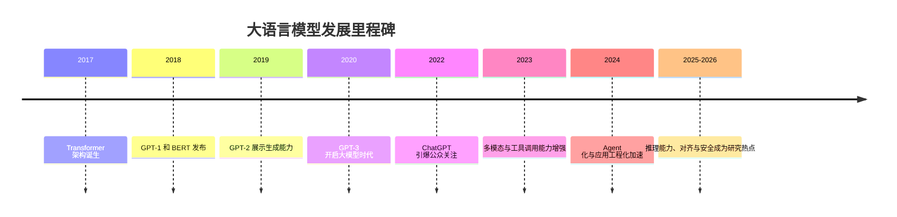

## 1.1 大语言模型概述

大语言模型（Large Language Model，简称 LLM）是一类基于深度学习技术构建的自然语言处理系统，通过在海量文本数据上进行预训练，习得语言的统计规律和知识表征，从而具备理解和生成人类语言的能力。

### 1.1.1 什么是大语言模型

从技术角度看，LLM 的核心是 Transformer 架构及其变体。Transformer 于 2017 年由 Google 团队提出，其自注意力机制使模型能够有效捕捉文本中的长距离依赖关系。在此基础上，研究者们不断扩大模型规模、丰富训练数据，最终催生了如今广为人知的各类 LLM。

LLM 的“大”主要体现在三个维度：

| 维度 | 说明 | 典型量级 |
|------|------|----------|
| 参数规模 | 模型内部可学习的权重数量 | 数十亿至数万亿参数 |
| 训练数据 | 用于预训练的文本语料规模 | 数万亿 Token |
| 计算资源 | 训练所需的算力投入 | 数千至数万 GPU 日 |

这种规模化带来了涌现能力（Emergent Abilities），即模型在某个规模阈值后突然展现出小规模模型所不具备的能力，如复杂推理、代码生成、多步规划等。

### 1.1.2 发展简史

LLM 的发展可划分为以下几个重要阶段：

> 说明：下图为概念性时间线示意；不同平台对 Mermaid 的支持程度不一，若无法渲染可直接阅读下方文字。

图 1-1：大语言模型发展里程碑时间线

**预训练时代奠基（2017-2019）**：Transformer 的提出为 LLM 奠定了技术基础。Google 的 BERT 采用双向编码器架构，在自然语言理解任务上取得突破；OpenAI 的 GPT 系列则采用单向解码器架构，专注于文本生成能力。

**规模化探索（2020-2021）**：**GPT-3** 以 1750 亿参数的规模震惊业界，展示了少样本学习（Few-shot Learning）和上下文学习（In-context Learning）能力。这一时期，"规模法则"（Scaling Laws）成为共识——更大的模型、更多的数据往往带来更好的性能。

**应用爆发（2022-2023）**：ChatGPT 的发布标志着 LLM 从实验室走向大众。OpenAI、Anthropic、Google 等公司相继推出商业化产品，LLM 开始深度融入搜索、办公、编程等场景。

**Agent 与多模态（2024-2026）**：LLM 的能力边界持续扩展。模型被赋予调用外部工具、执行复杂任务的能力，形成自主智能体（Agent）；同时，多模态能力使模型能够理解和生成图像、音频等多种媒介内容。

**推理与对齐成为重点（2025-2026）**：更强的推理能力、更长的上下文、更复杂的工具链集成，使得 LLM 系统更像“可执行的软件系统”，这也让对齐与安全成为持续的研究热点与工程挑战。

### 1.1.3 核心技术特点

理解 LLM 的技术特点，有助于把握其安全边界。LLM 具有以下关键特征：

**概率生成本质**：LLM 通过预测下一个 Token 的概率分布来生成文本。这意味着模型的输出具有随机性，相同的输入可能产生不同的输出。这种概率性使得模型行为难以完全预测，为安全防护带来挑战。

**上下文依赖性**：模型的输出高度依赖输入的上下文。这既是 LLM 强大能力的来源，也是提示注入等攻击的突破口——攻击者可以通过精心构造的上下文来影响模型行为。

**知识固化与幻觉**：预训练使模型习得了大量知识，但这些知识在训练结束后即被“冻结”。模型可能生成与事实不符的内容（即“幻觉”），且无法自主获取新知识。

**黑箱特性**：尽管可以观察模型的输入和输出，但其内部决策过程难以解释。这种不透明性给安全审计和漏洞排查带来困难。

### 1.1.4 主流模型与应用场景

当前市场上的主流 LLM 可粗略分为闭源与开源两大阵营。由于产品迭代速度极快，本节仅用“系列/生态”的方式概览，不对具体版本号做静态列举。

**闭源模型（按厂商系列）**：
- OpenAI：GPT 系列
- Anthropic：Claude 系列
- Google：Gemini 系列
- 国内厂商：各类商业化大模型服务

**开源模型（按社区生态）**：
- Meta：LLaMA 系列
- Mistral：Mistral 系列
- 其他开源与研究模型：Qwen、GLM、Aquila 等生态

这些模型被广泛应用于：

- **智能客服与对话系统**：提供 7×24 小时的自动化客户服务
- **内容创作与辅助写作**：生成营销文案、新闻稿件、技术文档
- **代码生成与开发辅助**：自动补全代码、解释程序逻辑、修复漏洞
- **知识问答与检索增强**：结合企业知识库提供专业解答
- **数据分析与报告生成**：自动化处理数据并生成分析报告
- **Agent 与自动化工作流**：串联多个工具完成复杂任务

随着应用场景的拓展，LLM 正在触及越来越多的敏感领域，这使得安全问题变得愈发紧迫。理解 LLM 的能力边界和技术特点，是开展安全研究的第一步。

### 1.1.5 从技术特性到安全风险的映射

为了把“模型特性”与“安全问题”关联起来，可以用下表建立直观映射：

| 技术特性 | 典型风险/攻击面 | 工程含义 |
|---|---|---|
| 上下文依赖、指令/数据同编码 | 提示注入、间接注入、策略绕过 | 需要分层提示、内容来源标注与隔离 |
| 概率性输出与非确定性 | 结果不可重复、难以穷举测试 | 需要分级响应、监控与回放评估 |
| 幻觉与不可靠事实性 | 错误信息、业务欺骗、合规风险 | 需要事实校验、检索增强与引用约束 |
| 工具调用/Agent 化 | 越权操作、数据外带、链式滥用 | 需要最小权限、工具网关与审计 |
