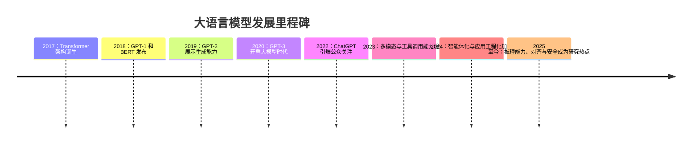

## 1.1 大语言模型概述

大语言模型（Large Language Model，简称 LLM）通过在海量文本数据上预训练，习得语言的统计规律和知识表征，从而具备理解和生成语言的能力。它的安全风险既来自生成机制，也来自应用赋予它的数据访问和操作权限。

### 1.1.1 什么是大语言模型

从技术角度看，LLM 的核心是 [Transformer](https://arxiv.org/abs/1706.03762) 架构及其变体。Transformer 于 2017 年由 Google 团队在论文 *Attention Is All You Need* 中提出，其自注意力机制使模型能够有效捕捉文本中的长距离依赖关系。在此基础上，研究者们不断扩大模型规模、丰富训练数据，最终催生了如今广为人知的各类 LLM。

LLM 的“大”主要体现在三个维度：

| 维度 | 说明 | 典型量级 |
|------|------|----------|
| 参数规模 | 模型内部可学习的权重数量 | 数十亿至数万亿参数 |
| 训练数据 | 用于预训练的文本语料规模 | 数万亿 Token |
| 计算资源 | 训练所需的算力投入 | 数千至上百万 GPU 日 |

这种规模化带来了**涌现能力**（Emergent Abilities），即模型在某个规模阈值后突然展现出小规模模型所不具备的能力，如复杂推理、代码生成、多步规划等。

### 1.1.2 发展简史

从语言建模到多模态、工具调用与推理能力的发展，见图 1-1。

```mermaid
timeline
    title 大语言模型发展里程碑
    2017：Transformer 架构诞生
    2018：GPT-1 和 BERT 发布
    2019：GPT-2 展示生成能力
    2020：GPT-3 开启大模型时代
    2022：ChatGPT 引爆公众关注
    2023：多模态与工具调用能力增强
    2024：智能体化与应用工程化加速
    2025 至今：推理能力、对齐与安全成为研究热点
```
图 1-1：大语言模型发展里程碑时间线

早期路线分别侧重语言理解与生成：BERT 采用双向编码器，GPT 系列采用单向解码器。GPT-3 以 1750 亿参数展示了少样本学习（Few-shot Learning）和上下文学习（In-context Learning）能力。随着多模态、长上下文和工具调用进入应用，安全分析的对象也从模型回答扩展到外部内容、工具权限和多步任务。

### 1.1.3 应用场景与安全对象

LLM 已进入客服、写作、编程、问答、数据分析和自动化工作流。判断安全风险时，需要考察模型在场景中接触哪些数据，以及输出会产生什么后果：

| 应用场景 | 模型承担的任务 | 需要检查的安全对象 |
|----------|----------------|--------------------|
| 智能客服与对话 | 回答产品与服务问题 | 用户信息、回答内容 |
| 内容创作与辅助写作 | 生成文案和文档 | 输入素材、发布内容 |
| 代码生成与开发辅助 | 补全、解释和修改代码 | 代码与执行环境 |
| 知识问答与检索增强 | 根据企业知识库回答问题 | 检索来源、知识库访问权限 |
| 数据分析与报告生成 | 处理数据并生成分析结果 | 原始数据、计算结果 |
| 智能体与自动化工作流 | 串联工具完成多步任务 | 工具权限、调用参数和操作后果 |

### 1.1.4 核心技术特点

- 概率生成本质：LLM 通过预测下一个 Token 的概率分布来生成文本。这意味着模型的输出具有随机性，相同的输入可能产生不同的输出。这种概率性使得模型行为难以完全预测，为安全防护带来挑战。
- 上下文依赖性：模型的输出高度依赖输入的上下文。这既是 LLM 强大能力的来源，也是提示注入等攻击的突破口：攻击者可以通过精心构造的上下文来影响模型行为。
- 知识固化与幻觉：预训练使模型习得了大量知识，但这些知识在训练结束后即被“冻结”。模型可能生成与事实不符的内容（即“幻觉”），且无法自主获取新知识。
- 黑箱特性：尽管可以观察模型的输入和输出，但其内部决策过程难以解释。这种不透明性给安全审计和漏洞排查带来困难。

### 1.1.5 从技术特性到安全风险的映射

每项技术特性都对应一类攻击面和一项工程要求，下表列出对应关系：

| 技术特性 | 典型风险/攻击面 | 工程含义 |
|---|---|---|
| 上下文依赖、指令/数据同编码 | 提示注入、间接注入、策略绕过 | 需要分层提示、内容来源标注与隔离 |
| 概率性输出与非确定性 | 结果不可重复、难以穷举测试 | 需要分级响应、监控与回放评估 |
| 幻觉与不可靠事实性 | 错误信息、业务欺骗、合规风险 | 需要事实校验、检索增强与引用约束 |
| 工具调用/智能体化 | 越权操作、数据外带、链式滥用 | 需要最小权限、工具网关与审计 |
