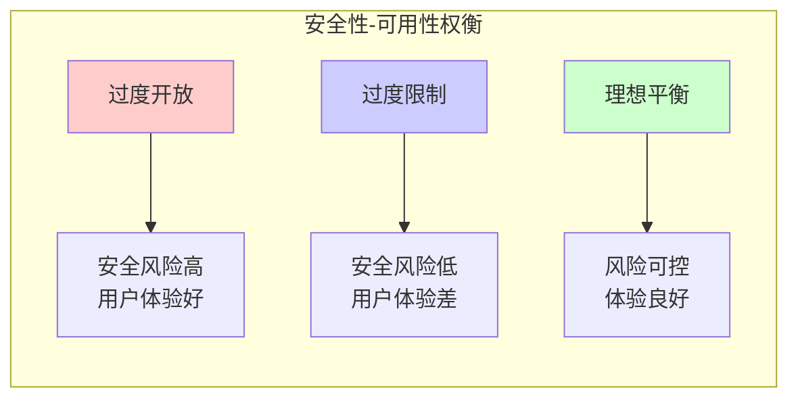

## 1.2 为什么安全如此重要

当 LLM 被部署到生产环境中，它不再只是一个有趣的技术演示，而是成为承载着商业价值和社会责任的关键系统。理解 LLM 安全的重要性，是建立安全意识的起点。

### 1.2.1 从实验室到生产环境的跨越

在实验室阶段，LLM 的"错误"往往只是研究者茶余饭后的谈资。然而，当模型被部署到面向真实用户的产品中时，每一个安全漏洞都可能导致严重后果。

2023 年以来，LLM 的商业化部署呈现爆发式增长：

- 超过 80% 的财富 500 强企业已在内部试用或部署 LLM 应用
- 全球 LLM API 调用量以每季度翻番的速度增长
- 基于 LLM 的应用程序数量突破数十万

这种快速普及意味着攻击面也在急剧扩大。根据安全研究机构的统计，2026 年针对 LLM 的恶意提示数量较 2025 年增长了近 150%（数据来源：OWASP、Gartner 等行业报告综合估算）。攻击者已经意识到，LLM 是一个值得投入精力的高价值目标。

### 1.2.2 安全事件的商业影响

LLM 安全事件可能造成的商业影响是多维度的：

**直接经济损失**：
- 敏感数据泄露可能导致巨额赔偿和罚款
- 服务中断影响业务连续性
- 恶意滥用 API 造成计算资源被盗用

**品牌与声誉损害**：
- 模型生成不当内容可能引发公关危机
- 用户信任度下降导致客户流失
- 负面舆情持续发酵影响企业形象

**法律与合规风险**：
- 违反数据保护法规面临监管处罚
- 知识产权侵权引发诉讼
- 未尽安全义务承担法律责任

以下是一些真实的安全事件案例：

| 时间 | 事件 | 影响 |
|------|------|------|
| 2023 年 3 月 | 某 LLM 因漏洞导致用户对话历史泄露 | 数百万用户数据暴露，服务临时下线 |
| 2024 年 | 多个企业级 LLM 应用遭受提示注入攻击 | 内部系统指令被提取，敏感信息泄露 |
| 2025 年 1 月 | 通过日历邀请触发间接提示注入 | 主流 LLM 产品紧急修复漏洞 |
| 2026 年 2 月 | 开源推理模型 R1 变体被植入隐蔽思维链后门 | 数千个下游应用在特定触发词下输出恶意代码 |

这些事件表明，LLM 安全不是理论上的担忧，而是正在发生的现实威胁。

### 1.2.3 安全性与可用性的平衡

LLM 安全的一个核心挑战在于平衡安全性与可用性。过度的安全限制会导致模型变得"过度拒绝"（Over-refusal），即对正常请求也予以拒绝，从而影响用户体验和产品价值。

```mermaid
graph LR
    subgraph "安全性-可用性权衡"
    A["过度开放"] --> B["安全风险高<br/>用户体验好"]
    C["过度限制"] --> D["安全风险低<br/>用户体验差"]
    E["理想平衡"] --> F["风险可控<br/>体验良好"]
    end
    
    style A fill:#ffcccc
    style C fill:#ccccff
    style E fill:#ccffcc
```
图 1-2：安全性与可用性的平衡

实现这种平衡需要：

- **细粒度的安全策略**：针对不同场景和风险等级采取差异化措施
- **上下文感知的安全机制**：根据请求的具体内容和来源动态调整安全强度
- **持续的评估与优化**：通过红队测试和用户反馈不断改进安全策略

### 1.2.4 安全作为竞争优势

在 LLM 市场日趋激烈的竞争中，安全正在成为重要的差异化因素。企业客户在采购 LLM 服务时，越来越重视供应商的安全能力：

**合规门槛提高**：金融、医疗、政务等行业对 AI 系统有严格的安全合规要求。不具备相应安全能力的产品难以进入这些高价值市场。

**安全认证成为标配**：SOC 2、ISO 27001 等安全认证正在成为企业级 LLM 产品的标准配置。

**安全透明度受重视**：企业客户希望了解 LLM 供应商的安全措施、漏洞响应机制和数据处理方式。

因此，投资于 LLM 安全不仅是防御性的风险管理，更是进攻性的商业策略。那些能够在安全性和可用性之间取得良好平衡的企业，将在市场竞争中占据优势地位。

### 1.2.5 社会责任与伦理考量

超越商业层面，LLM 安全还关乎更广泛的社会责任：

**防止有害内容传播**：不安全的 LLM 可能被滥用于生成虚假信息、仇恨言论或其他有害内容，对社会舆论环境造成负面影响。

**保护弱势群体**：LLM 的偏见和歧视可能对特定群体造成伤害，安全对齐需要关注公平性问题。

**维护公众信任**：频繁的安全事件可能导致公众对 AI 技术的信任度下降，不利于整个行业的健康发展。

作为 LLM 的开发者和使用者，有责任确保这项强大的技术被安全、负责任地使用。这不仅是商业上的明智选择，也是对社会应尽的义务。
