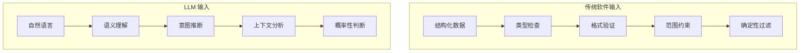

## 1.3 大语言模型安全与传统安全的异同

对于具有传统软件安全背景的读者来说，理解 LLM 安全与传统安全的异同，有助于更快地建立正确的思维模型。LLM 安全既继承了传统安全的部分原则，又面临着独特的新挑战。

### 1.3.1 相似之处：安全原则的延续

尽管 LLM 是一种新型技术，但许多经典的安全原则仍然适用：

**纵深防御（Defense in Depth）**：单一的安全措施难以抵御所有攻击。LLM 安全同样需要在多个层面部署防护机制，包括输入验证、模型对齐、输出过滤、监控告警等。

**最小权限原则（Principle of Least Privilege）**：LLM 应该只被授予完成其任务所必需的最小权限。这一原则对于具备工具调用能力的 Agent 系统尤为重要。

**安全设计（Security by Design）**：安全应该从设计阶段就被纳入考量，而非事后补救。LLM 应用的架构设计需要充分考虑安全需求。

**持续监控与响应**：部署后的持续监控和快速响应能力是安全运营的基础，这对 LLM 系统同样适用。

### 1.3.2 独特挑战：LLM 安全的特殊性

然而，LLM 的特性也带来了传统安全范式难以应对的新挑战：

**模糊的输入边界**：传统软件的输入通常有明确的格式和类型，可以通过严格的验证规则进行过滤。LLM 的输入是自然语言，语义丰富、形式多变，难以用确定性规则进行完全约束。

图 1-3：传统软件与 LLM 输入处理对比

**指令与数据的混淆**：传统软件中，程序逻辑（指令）和用户数据是清晰分离的。SQL 注入之所以危险，正是因为攻击者将恶意指令伪装成数据注入。LLM 面临的提示注入问题本质上类似，但问题更加严重——因为 LLM 本身就是通过自然语言接收指令，指令和数据天然使用相同的"编码方式"。

**概率性输出**：传统软件的行为通常是确定性的，给定相同输入必然产生相同输出。LLM 的输出具有随机性，这使得安全测试和行为预测变得更加困难。即使通过了某次测试，也无法保证后续请求不会触发危险行为。

**黑箱特性**：现代 LLM 的内部机制极其复杂，即使是模型的创建者也难以完全理解其决策过程。这种不透明性使得传统的代码审计、逻辑分析等方法难以直接应用。

**涌现行为**：随着模型规模增大，可能突然出现训练时未预期的行为。这种涌现特性使得安全评估更加困难——无法简单地通过代码检查来发现潜在风险。

### 1.3.3 新型攻击面分析

LLM 引入了传统软件中不存在的新型攻击面：

| 攻击面 | 描述 | 传统软件类比 |
|--------|------|--------------|
| 提示层 | 通过精心构造的提示影响模型行为 | 类似 SQL 注入，但更难防御 |
| 训练数据 | 通过污染训练数据植入后门 | 类似供应链攻击 |
| 对齐机制 | 绕过安全对齐触发有害输出 | 类似绕过访问控制 |
| 上下文窗口 | 利用长上下文隐藏指令、进行提示污染或跨轮操控 | 无直接类比 |
| 涌现能力 | 利用模型未预期的能力 | 无直接类比 |

**提示层攻击**：这是 LLM 最独特的攻击面。攻击者通过精心设计的提示词，尝试改变模型的行为或提取敏感信息。这类攻击利用的是 LLM 对自然语言指令的"服从性"。

**训练数据攻击**：通过在训练数据中植入恶意样本，可以影响模型的行为。这类攻击发生在模型训练阶段，效果持久且难以检测。

**对齐绕过**：安全对齐试图让模型拒绝有害请求，但攻击者不断发现新的绕过方法。这是一场持续的攻防博弈。

### 1.3.4 防御范式的演进

面对这些新挑战，LLM 安全需要发展新的防御范式：

**从规则驱动到 AI 驱动**：传统安全依赖人工编写的规则，如正则表达式、黑名单等。LLM 安全越来越多地采用机器学习方法，用模型来检测模型的异常行为。

**从确定性到概率性**：接受 LLM 行为的不确定性，采用概率性的风险评估和分级响应策略，而非追求绝对的安全保证。

**从静态到动态**：传统安全评估往往是一次性的审计。LLM 安全需要持续的监控、评估和改进，因为模型行为可能随时间变化，攻击技术也在不断演进。

**从单点到系统**：LLM 安全不能仅关注模型本身，需要从系统整体角度思考，包括输入预处理、输出后处理、外部工具调用、人工审核等多个环节。

理解这些异同，有助于安全从业者将已有的知识和经验迁移到 LLM 安全领域，同时保持对新挑战的警觉。在后续章节中，将深入探讨各类具体的攻击技术和防御措施。
