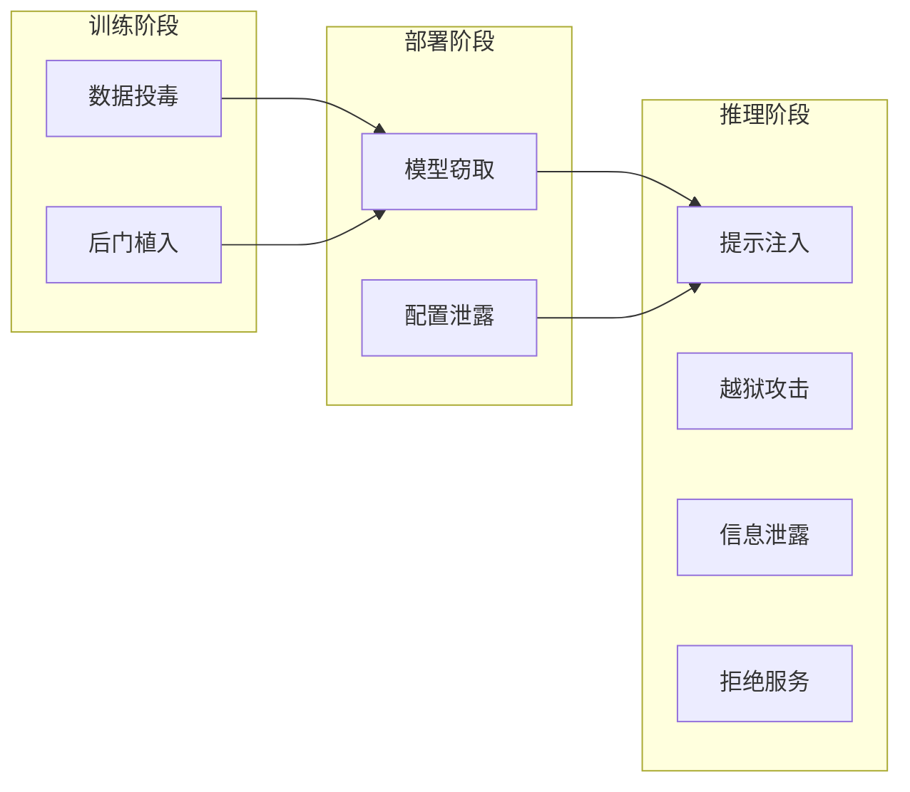
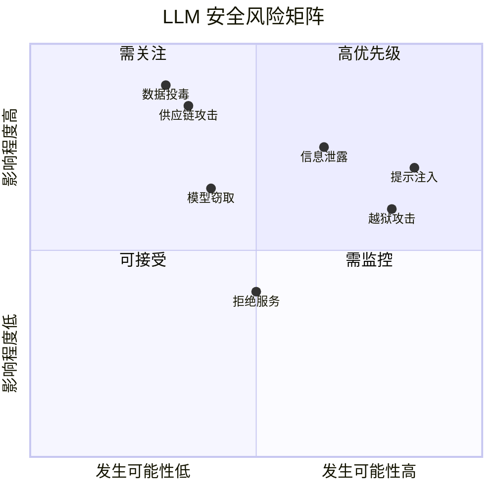

## 1.4 大语言模型安全威胁全景图

在深入研究具体的攻击技术之前，有必要先建立对 LLM 安全威胁的整体认知。本节将从威胁类型、攻击者画像和风险分级三个维度，描绘 LLM 安全的威胁全景。

### 1.4.1 威胁分类框架

LLM 面临的安全威胁可以从多个维度进行分类：

**按攻击阶段分类**：

图 1-4：LLM 威胁分类流程图

- **训练阶段威胁**：发生在模型训练过程中，如数据投毒、后门植入
- **部署阶段威胁**：发生在模型部署过程中，如模型窃取、配置泄露
- **推理阶段威胁**：发生在模型运行时，如提示注入、越狱攻击

**按攻击目标分类**：

| 目标类型 | 具体目标 | 代表性攻击 |
|----------|----------|------------|
| 机密性 | 获取敏感数据或模型信息 | 提示泄露、隐私提取、模型窃取 |
| 完整性 | 操纵模型输出或行为 | 提示注入、数据投毒、后门攻击 |
| 可用性 | 破坏模型正常服务 | 资源耗尽、Token 洪泛 |
| 安全性 | 突破安全限制 | 越狱攻击、对抗样本 |

**按攻击向量分类**：

- **直接攻击**：攻击者直接与 LLM 交互，如直接提示注入
- **间接攻击**：通过第三方渠道传递恶意内容，如间接提示注入
- **供应链攻击**：攻击模型的依赖组件，如恶意数据集、被污染的开源模型

### 1.4.2 OWASP LLM Top 10 概览

开放网络应用安全项目（OWASP）发布的 LLM Top 10 是业界广泛采用的 LLM 安全风险清单。本节条目对齐 OWASP 2025 版风险类别；该清单会持续迭代，后续请以 OWASP 官方页面为准。

1. **LLM01: 提示注入**（Prompt Injection）
   - 通过恶意输入操纵 LLM 行为
   - 包括直接注入和间接注入两种形式

2. **LLM02: 敏感信息泄露**（Sensitive Information Disclosure）
   - LLM 无意中暴露隐私数据、系统信息或机密内容

3. **LLM03: 供应链风险**（Supply Chain）
   - 训练数据、模型组件或部署平台中的漏洞

4. **LLM04: 数据与模型投毒**（Data and Model Poisoning）
   - 通过污染训练/检索数据或模型工件影响系统行为

5. **LLM05: 不当输出处理**（Improper Output Handling）
   - 未经验证的 LLM 输出导致下游系统漏洞

6. **LLM06: 过度自主权**（Excessive Agency）
   - LLM 被授予过多权限导致风险操作

7. **LLM07: 系统提示泄露**（System Prompt Leakage）
   - 内部系统指令被暴露

8. **LLM08: 向量与嵌入弱点**（Vector and Embedding Weaknesses）
   - RAG 系统中的向量存储和检索漏洞

9. **LLM09: 错误信息**（Misinformation）
   - 模型生成虚假但看似可信的内容

10. **LLM10: 无边界消耗**（Unbounded Consumption）
    - 资源耗尽导致服务降级或成本激增

这份清单将在[第三章](../03_frameworks/3.1_owasp_top10.md)中进行详细解读。

### 1.4.3 攻击者画像

了解潜在攻击者有助于制定更有针对性的防御策略：

**好奇探索者**：
- 动机：技术好奇心，探索 LLM 的边界
- 能力：入门级，主要尝试公开的越狱技术
- 威胁等级：低
- 典型行为：测试通用越狱提示，观察模型反应

**恶意用户**：
- 动机：获取特定的有害内容或服务
- 能力：中等，能够改编和组合攻击技术
- 威胁等级：中
- 典型行为：尝试绕过内容限制，获取禁止的信息

**竞争对手**：
- 动机：商业利益，窃取模型或数据
- 能力：较高，具备专业安全知识
- 威胁等级：中高
- 典型行为：模型提取、训练数据推断、系统提示窃取

**安全研究员**：
- 动机：发现漏洞，推动安全改进
- 能力：高，具备深厚的技术背景
- 威胁等级：取决于披露方式
- 典型行为：系统性的安全评估，负责任披露

**网络犯罪分子**：
- 动机：经济利益
- 能力：高，可能有组织化运作
- 威胁等级：高
- 典型行为：大规模滥用、勒索、数据窃取

**国家级威胁行为者**：
- 动机：情报收集、影响力操作
- 能力：最高，资源充沛
- 威胁等级：最高
- 典型行为：高级持续性威胁、供应链攻击、训练数据投毒

### 1.4.4 风险评估矩阵

不同威胁的风险程度取决于其发生可能性和潜在影响。以下是一个简化的风险评估矩阵：

图 1-5：LLM 安全风险矩阵图

> 说明：图中的坐标为教学示意，用于表达“相对优先级”，并非行业统计结论；在实际项目中应结合业务场景、数据资产与攻击可达性进行评估。

**高优先级威胁**（高可能性 + 高影响）：
- 提示注入：最常见且影响广泛
- 敏感信息泄露：可能导致严重的合规和声誉问题

**需关注威胁**（低可能性 + 高影响）：
- 数据投毒：虽然难以执行，但后果严重
- 供应链攻击：影响范围可能极广

**需监控威胁**（高可能性 + 低影响）：
- 越狱攻击：频繁发生但通常可控
- 资源耗尽：需要成本管控

### 1.4.5 防御思路概述

面对复杂的威胁全景，有效的防御需要采用系统化的方法：

**预防（Prevent）**：
- 安全架构设计
- 输入验证与过滤
- 权限最小化
- 安全对齐训练

**检测（Detect）**：
- 实时监控
- 异常检测
- 日志审计
- 红队测试

**响应（Respond）**：
- 自动化阻断
- 事件响应流程
- 根因分析
- 漏洞修复

**恢复（Recover）**：
- 服务恢复
- 模型回滚
- 事后复盘
- 持续改进

这些防御措施将在本书的第三部分（防御篇）中详细展开。建立对威胁全景的整体认知后，接下来的章节将逐层深入，帮助读者掌握具体的攻防技术。
