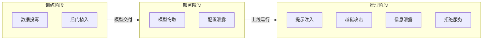
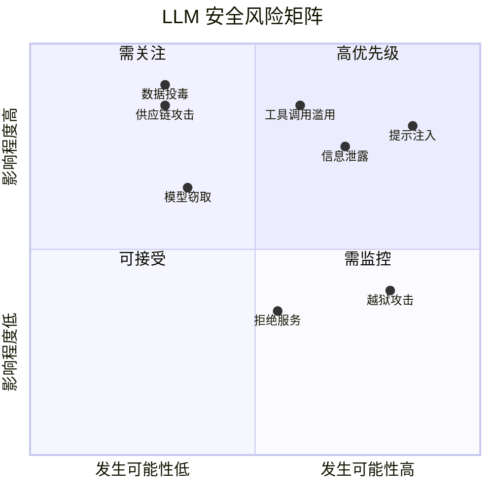

## 1.4 大语言模型安全威胁全景图

在深入研究具体的攻击技术之前，有必要先建立对 LLM 安全威胁的整体认知。本节将从威胁类型、攻击者画像和风险分级三个维度，描绘 LLM 安全的威胁全景。

### 1.4.1 威胁分类框架

LLM 面临的安全威胁可以从多个维度进行分类：

**按攻击阶段分类**

```mermaid
flowchart LR
    subgraph "训练阶段"
    A1["数据投毒"]
    A2["后门植入"]
    end

    subgraph "部署阶段"
    B1["模型窃取"]
    B2["配置泄露"]
    end

    subgraph "推理阶段"
    C1["提示注入"]
    C2["越狱攻击"]
    C3["信息泄露"]
    C4["拒绝服务"]
    end

    训练阶段 -->|模型交付| 部署阶段 -->|上线运行| 推理阶段
```
图 1-4：LLM 威胁按攻击阶段分类

- **训练阶段威胁**：发生在模型训练过程中，如数据投毒、后门植入
- **部署阶段威胁**：发生在模型部署过程中，如模型窃取、配置泄露
- **推理阶段威胁**：发生在模型运行时，如提示注入、越狱攻击

**按安全目标分类**
| 目标类型 | 具体目标 | 代表性攻击 |
|----------|----------|------------|
| 机密性 | 获取敏感数据或模型信息 | 提示泄露、隐私提取、模型窃取 |
| 完整性 | 操纵模型输出或行为 | 提示注入、数据投毒、后门攻击 |
| 可用性 | 破坏模型正常服务 | 资源耗尽、Token 洪泛 |

像越狱、对抗样本、系统提示泄露等问题，更适合放在“攻击路径 / 控制失效方式”中分析，而不是与 CIA 三元目标并列成第四类目标。

**按攻击向量分类**
- **直接攻击**：攻击者直接与 LLM 交互，如直接提示注入
- **间接攻击**：通过第三方渠道传递恶意内容，如间接提示注入
- **供应链攻击**：攻击模型的依赖组件，如恶意数据集、被污染的开源模型
- **工具调用攻击**：利用 MCP 等工具协议和函数调用接口，诱导模型执行越权操作或调用恶意工具（详见[第七章](../07_agent_rag_security/7.3_tool_security.md)）

### 1.4.2 OWASP LLM Top 10 概览

**为什么是这十个风险？选择标准是什么？**

OWASP 在评选 LLM Top 10 时采用了多维度的评估标准，而非简单的“广泛程度”或“热度”：

1. **采纳度**：该风险已被多个真实的 LLM 应用证实存在
2. **可测试性**：该风险可以通过自动化或人工测试来验证
3. **可缓解性**：存在已知的、可实施的防御措施
4. **攻击面宽度**：从初创公司到大型企业，都存在这个风险
5. **规范化程度**：该风险已被安全社区广泛讨论和记录

与此相对，OWASP 并未试图把所有“模型出错”都直接纳入 Top 10。例如“AI 幻觉导致错误医学建议”若只停留在单次错误回答层面，更接近具体业务应用风险；而 `LLM09:2025 Misinformation` 关注的是 **模型生成错误信息在系统层面造成可扩散、可放大的安全与治理风险**。两者相关，但不完全等同。

这十个风险覆盖了 LLM 生命周期的各个环节（训练→部署→推理→运营），形成了一个相对完整的“安全框架”。下面是官方清单：

开放网络应用安全项目（OWASP）发布的 LLM Top 10 是业界广泛采用的 LLM 安全风险清单。本节条目对齐 OWASP 2025 版风险类别；该清单会持续迭代，后续请以 OWASP 官方页面为准。

1. **LLM01：提示注入**（Prompt Injection）
 - 通过恶意输入操纵 LLM 行为
 - 包括直接注入和间接注入两种形式

2. **LLM02：敏感信息泄露**（Sensitive Information Disclosure）
 - LLM 无意中暴露隐私数据、系统信息或机密内容

3. **LLM03：供应链风险**（Supply Chain）
 - 训练数据、模型组件或部署平台中的漏洞

4. **LLM04：数据与模型投毒**（Data and Model Poisoning）
 - 通过污染训练/检索数据或模型工件影响系统行为

5. **LLM05：不当输出处理**（Improper Output Handling）
 - 未经验证的 LLM 输出导致下游系统漏洞

6. **LLM06：过度自主权**（Excessive Agency）
 - LLM 被授予过多权限导致风险操作

7. **LLM07：系统提示泄露**（System Prompt Leakage）
 - 内部系统指令被暴露

8. **LLM08：向量与嵌入弱点**（Vector and Embedding Weaknesses）
 - RAG 系统中的向量存储和检索漏洞

9. **LLM09：错误信息**（Misinformation）
 - 模型生成虚假但看似可信的内容

10. **LLM10：无边界消耗**（Unbounded Consumption）
 - 资源耗尽导致服务降级或成本激增

这份清单将在[第三章](../03_frameworks/3.1_owasp_top10.md)中进行详细解读。

### 1.4.3 攻击者画像

了解潜在攻击者有助于制定更有针对性的防御策略：

**好奇探索者**
- 动机：技术好奇心，探索 LLM 的边界
- 能力：入门级，主要尝试公开的越狱技术
- 威胁等级：低
- 典型行为：测试通用越狱提示，观察模型反应

**恶意用户**
- 动机：获取特定的有害内容或服务
- 能力：中等，能够改编和组合攻击技术
- 威胁等级：中
- 典型行为：尝试绕过内容限制，获取禁止的信息

**竞争对手**
- 动机：商业利益，窃取模型或数据
- 能力：较高，具备专业安全知识
- 威胁等级：中高
- 典型行为：模型提取、训练数据推断、系统提示窃取

**安全研究员**
- 动机：发现漏洞，推动安全改进
- 能力：高，具备深厚的技术背景
- 威胁等级：取决于披露方式
- 典型行为：系统性的安全评估，负责任披露

**网络犯罪分子**
- 动机：经济利益
- 能力：高，可能有组织化运作
- 威胁等级：高
- 典型行为：大规模滥用、勒索、数据窃取

**国家级威胁行为者**
- 动机：情报收集、影响力操作
- 能力：最高，资源充沛
- 威胁等级：最高
- 典型行为：高级持续性威胁、供应链攻击、训练数据投毒

### 1.4.4 风险评估矩阵

不同威胁的风险程度取决于其发生可能性和潜在影响。以下是一个简化的风险评估矩阵：

```mermaid
quadrantChart
    title LLM 安全风险矩阵
    x-axis "发生可能性低" --> "发生可能性高"
    y-axis "影响程度低" --> "影响程度高"
    quadrant-1 "高优先级"
    quadrant-2 "需关注"
    quadrant-3 "可接受"
    quadrant-4 "需监控"
    "提示注入": [0.85, 0.8]
    "信息泄露": [0.7, 0.75]
    "越狱攻击": [0.8, 0.4]
    "工具调用滥用": [0.6, 0.85]
    "数据投毒": [0.3, 0.9]
    "模型窃取": [0.35, 0.65]
    "拒绝服务": [0.55, 0.35]
    "供应链攻击": [0.3, 0.85]
```
图 1-5：LLM 安全风险矩阵图

> 说明：图中的坐标为教学示意，用于表达“相对优先级”，并非行业统计结论；在实际项目中应结合业务场景、数据资产与攻击可达性进行评估。

**高优先级威胁**（高可能性 + 高影响）：
- 提示注入：最常见且影响最广泛的攻击方式
- 敏感信息泄露：可能导致严重的合规和声誉问题
- 工具调用滥用：随着 MCP 等工具协议普及，权限失控的破坏力急剧上升

**需关注威胁**（低可能性 + 高影响）：
- 数据投毒：虽然难以执行，但后果严重且难以检测
- 供应链攻击：影响范围可能极广，参见 [4.4.8 Clinejection 案例](../04_prompt_injection/4.4_case_studies.md)

**需监控威胁**（高可能性 + 低影响）：
- 越狱攻击：频繁发生但单次影响通常可控
- 资源耗尽：需要成本管控机制

### 1.4.5 防御思路概述

面对复杂的威胁全景，有效的防御需要采用系统化的方法。下表将四大防御阶段与本书的详细章节做了映射，便于读者按需深入：

| 防御阶段 | 关键措施 | 详细章节 |
|----------|----------|----------|
| **预防（Prevent）** | 安全架构设计、输入验证与过滤、权限最小化、安全对齐训练 | [第八章 安全架构设计](../08_architecture/README.md)、[9.1 输入验证](../09_io_protection/9.1_input_validation.md)、[2.4 安全对齐](../02_fundamentals/2.4_alignment_intro.md) |
| **检测（Detect）** | 实时监控、异常检测、日志审计、红队测试 | [第十章 安全运营与监控](../10_operations/README.md)、[10.4 红队演练](../10_operations/10.4_red_teaming.md) |
| **响应（Respond）** | 自动化阻断、事件响应流程、根因分析、漏洞修复 | [10.3 事件响应](../10_operations/10.3_incident_response.md)、[10.5 服务降级](../10_operations/10.5_fallback_strategy.md) |
| **恢复（Recover）** | 服务恢复、模型回滚、事后复盘、持续改进 | [11.4 安全成熟度模型](../11_governance/11.4_maturity_model.md)、[8.4 安全开发生命周期](../08_architecture/8.4_security_sdlc.md) |

### 1.4.6 从威胁全景到工程落地

导论阶段的重点不是把所有工程模板一次讲完，而是先建立一个稳定的风险视角：**资产是什么、信任边界在哪里、攻击者能接触哪些输入与工具、最高风险链路是什么**。当团队进入架构设计和上线评审阶段时，再把这些问题转化为正式的威胁建模表格和上线检查清单会更合适。

对多数 LLM 应用来说，至少应回答以下四个问题：

1. **核心资产是什么**：系统真正要保护的是用户数据、系统提示、工具凭据，还是高价值业务流程？
2. **信任边界在哪里**：哪些输入来自用户、网页、邮件、检索结果或第三方工具返回值？
3. **模型能做什么**：模型是否具备读取敏感数据、调用工具、发送邮件、执行命令等能力？
4. **最高风险场景是什么**：最值得优先防御的是数据泄露、越权操作、内容操纵，还是资源耗尽？

这些问题将在后续架构和运营章节中展开为完整的工程实践模板。

### 1.4.7 Agent 系统带来的新增攻击面

相比单体 LLM 应用，智能体系统会把风险进一步放大，因为模型不再只是“回答问题”，而是开始调用外部工具、读取更多上下文、执行多步任务。导论阶段至少要意识到三类新增攻击面：

1. **工具链权限提升**：多个低权限工具组合后，可能形成高风险操作路径。
2. **工具返回值注入**：网页、邮件、检索文档或工具输出中嵌入的恶意内容，可能被模型误当成新指令。
3. **连接器与协议风险**：MCP Server、插件、集成组件或凭据代理本身也可能成为供应链和权限边界的薄弱点。

进入生产前，团队通常还需要做更系统的红队测试、权限边界测试和故障注入测试，但这些属于后续工程实践范畴；本章的目标是先让读者建立“LLM 风险会沿着工具链扩散”的整体认知。
