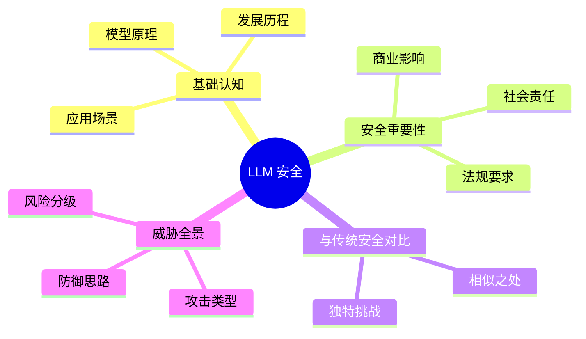

# 第一章：大语言模型安全导论

大语言模型（Large Language Model，LLM）正在重塑人类与计算机交互的方式。从智能客服到代码生成，从内容创作到知识问答，LLM 的应用场景日益丰富。然而，伴随着技术能力的提升，安全风险也在不断演化。本章将带领读者走进 LLM 安全的世界，建立对这一新兴领域的整体认知。

本章作为全书的开篇，旨在帮助读者建立 LLM 安全的基础认知框架。主要内容包括：

- **1.1 大语言模型概述**：介绍 LLM 的基本概念、发展历程和技术特点
- **1.2 为什么大语言模型安全至关重要**：阐述 LLM 安全的必要性和紧迫性
- **1.3 大语言模型安全与传统安全的异同**：对比分析两种安全范式的特点
- **1.4 大语言模型安全威胁全景图**：概览 LLM 面临的主要安全威胁类型

通过本章的学习，读者将能够理解 LLM 安全的独特性，认识到这一领域所面临的挑战，并为后续章节的深入学习奠定基础。

图 1-0：第一章思维导图

