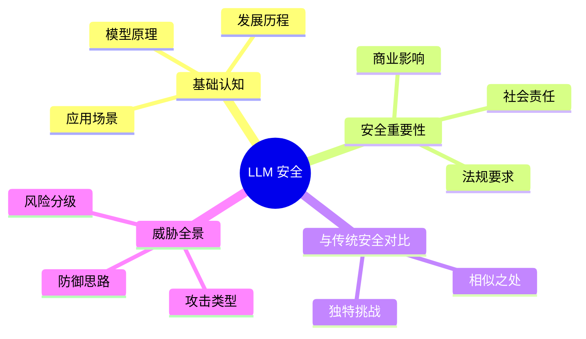

# 第一章 大语言模型安全导论

大语言模型（Large Language Model，LLM）已进入客服、编程、内容创作、知识问答等生产场景，安全风险也随能力提升而不断演化。本章是全书的开篇，回答三个问题：LLM 是什么，它为什么需要专门的安全工作，它面临哪些威胁。本章建立的认知框架是后续各章的起点：第二章深入模型架构、训练与推理的技术细节，第三章用 OWASP、NIST 等框架系统化地组织本章列出的威胁。

## 学习目标

读完本章，读者应能：

1. 说明 LLM 的四项核心技术特点（概率生成、上下文依赖、知识固化与幻觉、黑箱特性），并指出它们分别对应哪些安全风险。
2. 结合真实事故与漏洞披露，说明 LLM 安全事件的经济、声誉、法律和社会影响，以及安全性与可用性之间的取舍。
3. 区分 LLM 安全中沿用的传统安全原则（纵深防御、最小权限等）与 LLM 特有的挑战（模糊的输入边界、指令与数据混淆、概率性输出等）。
4. 从攻击阶段、安全目标和攻击向量三个维度对 LLM 威胁分类，并说出 OWASP LLM Top 10 的十个风险类别。
5. 针对一个 LLM 应用回答威胁建模的四个问题：核心资产是什么、信任边界在哪里、模型能做什么、最高风险场景是什么。

## 本章结构

- [1.1](1.1_llm_overview.md) 大语言模型概述：LLM 是什么，它的哪些技术特点决定了安全边界？
- [1.2](1.2_why_security_matters.md) 为什么大语言模型安全至关重要：LLM 进入生产环境后，安全问题会造成哪些后果，落实安全又难在哪里？
- [1.3](1.3_llm_vs_traditional.md) 大语言模型安全与传统安全的异同：哪些传统安全经验可以沿用，哪些挑战需要新方法？
- [1.4](1.4_threat_landscape.md) 大语言模型安全威胁全景图：LLM 面临哪些威胁、来自谁、哪些最优先，防御如何组织？

四节按“认识对象 → 说明为何要保护 → 对照已有安全知识 → 系统梳理威胁”的顺序展开：先讲清 LLM 本身，再论证安全的必要性，然后说明 LLM 安全与传统安全的异同，最后给出威胁全景和防御思路。下图概括了本章的知识点。

```mermaid
mindmap
  root((LLM 安全))
    基础认知
      模型原理
      发展历程
      应用场景
    安全重要性
      商业影响
      社会责任
      法规要求
    与传统安全对比
      相似之处
      独特挑战
    威胁全景
      攻击类型
      风险分级
      防御思路
```
