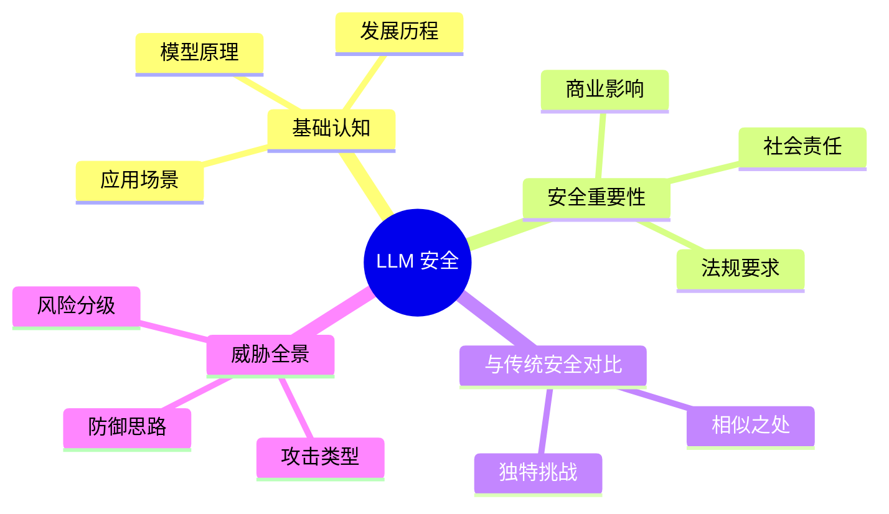

# 第一章 大语言模型安全导论

大语言模型（Large Language Model，LLM）正在重塑人类与计算机交互的方式。从智能客服到代码生成，从内容创作到知识问答，LLM 的应用场景日益丰富。然而，伴随着技术能力的提升，安全风险也在不断演化。

本章是全书的开篇，建立 LLM 安全的基础认知框架，主要内容包括：

- **[1.1](1.1_llm_overview.md) 大语言模型概述**：介绍 LLM 的基本概念、发展历程和技术特点
- **[1.2](1.2_why_security_matters.md) 为什么大语言模型安全至关重要**：阐述 LLM 安全的必要性和紧迫性
- **[1.3](1.3_llm_vs_traditional.md) 大语言模型安全与传统安全的异同**：对比分析两种安全范式的特点
- **[1.4](1.4_threat_landscape.md) 大语言模型安全威胁全景图**：概览 LLM 面临的主要安全威胁类型

```mermaid
mindmap
  root((LLM 安全))
    基础认知
      模型原理
      发展历程
      应用场景
    安全重要性
      商业影响
      社会责任
      法规要求
    与传统安全对比
      相似之处
      独特挑战
    威胁全景
      攻击类型
      风险分级
      防御思路
```
