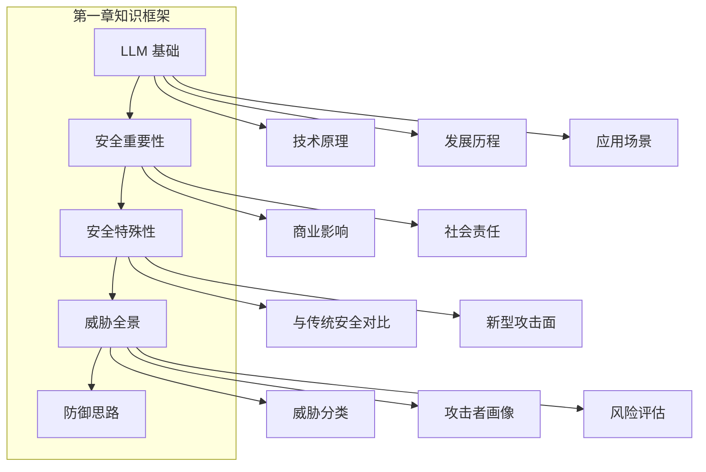

## 本章小结

本章作为全书的开篇，介绍了大语言模型安全的基础知识，为后续深入学习奠定了基础。

### 核心要点回顾

**大语言模型概述**：LLM 是基于 Transformer 架构的深度学习系统，通过在海量数据上预训练获得语言理解和生成能力。其核心特点包括概率生成、上下文依赖、知识固化和黑箱特性。

**安全的重要性**：随着 LLM 从实验室走向生产环境，安全问题变得日益紧迫。安全事件可能导致直接经济损失、品牌声誉损害和法律风险。同时，安全也是竞争差异化的重要因素。

**与传统安全的异同**：LLM 安全继承了纵深防御、最小权限等经典原则，但也面临模糊输入边界、指令数据混淆、概率性输出等独特挑战。需要发展从规则驱动到 AI 驱动、从确定性到概率性的新防御范式。

**威胁全景**：LLM 面临的威胁涵盖训练、部署、推理全生命周期，包括提示注入、越狱攻击、数据投毒、信息泄露等多种类型。OWASP LLM Top 10 提供了权威的风险清单。

### 知识框架

为了帮助读者更好地梳理本章内容，我们整理了如下的知识框架图，概括了第一章的核心逻辑结构。

图 1-6：第一章知识框架架构图

### 延伸思考

1. 随着 LLM 能力的不断提升，安全威胁会如何演变？
2. 如何在不影响模型实用性的前提下提升安全性？
3. 对于您所在的组织，哪些 LLM 安全风险最为紧迫？

### 下章预告

第二章将深入探讨 LLM 安全的基础知识，包括模型架构与安全边界、训练与推理阶段的安全考量，以及安全对齐技术的入门知识。这将为理解后续的攻击与防御技术提供必要的技术背景。
