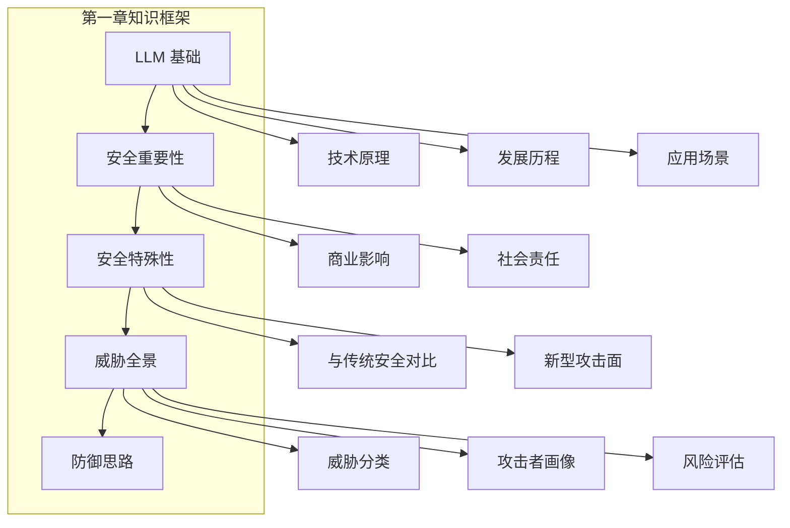

## 本章小结

本章说明了 LLM 是什么、为什么需要专门的安全工作、它与传统安全有何异同，以及它面临的威胁全景。

### 1. 核心要点

- 大语言模型概述（1.1）：LLM 是基于 Transformer 架构、在海量数据上预训练的深度学习系统。它的概率生成、上下文依赖、知识固化与幻觉、黑箱特性分别对应特定的攻击面。
- 安全的重要性（1.2）：LLM 进入生产环境后，安全事件会造成直接经济损失、品牌声誉损害和法律风险，真实事故表明威胁已在现实中发生。安全也是竞争差异化的重要因素，落实时要兼顾可用性和多语言覆盖。
- 与传统安全的异同（1.3）：纵深防御、最小权限等经典原则仍然适用，但模糊的输入边界、指令与数据混淆、概率性输出是 LLM 特有的挑战。模型侧检测只能降低频率，可承诺的安全边界要放在模型之外的确定性机制上。
- 威胁全景（1.4）：威胁涵盖训练、部署、推理全生命周期，包括提示注入、越狱攻击、数据投毒、信息泄露等类型，OWASP LLM Top 10 提供了权威的风险清单。智能体使 LLM 风险沿着工具链扩散。

### 2. 知识框架

```mermaid
graph TB
    subgraph "第一章知识框架"
    A["LLM 基础"] --> B["安全重要性"]
    B --> C["安全特殊性"]
    C --> D["威胁全景"]
    D --> E["防御思路"]
    end

    A --> A1["技术原理"]
    A --> A2["发展历程"]
    A --> A3["应用场景"]

    B --> B1["商业影响"]
    B --> B2["社会责任"]

    C --> C1["与传统安全对比"]
    C --> C2["新型攻击面"]

    D --> D1["威胁分类"]
    D --> D2["攻击者画像"]
    D --> D3["风险评估"]
```
图 1-8：[第一章](README.md)知识框架架构图

### 3. 延伸思考

1. 随着 LLM 能力的不断提升，安全威胁会如何演变？
2. 如何在不影响模型实用性的前提下提升安全性？
3. 对于您所在的组织，哪些 LLM 安全风险最为紧迫？

## 与后续章节的关联

- 后续章节深化：[第 2 章](../02_fundamentals/README.md)深入技术细节，包括模型架构与安全边界、训练与推理阶段的安全考量，以及安全对齐技术入门，为理解后续的攻击与防御技术提供技术基础
- 框架指导：[第 3 章](../03_frameworks/README.md)提供 OWASP/NIST 等框架标准，系统化地组织本章威胁
- 架构映射：[第 8 章](../08_architecture/README.md)将威胁映射为防御架构，实现从认知到设计的转化

---

> 📝 **发现错误或有改进建议？** 欢迎提交 [Issue](https://github.com/yeasy/ai_security_guide/issues) 或 [PR](https://github.com/yeasy/ai_security_guide/pulls)。
