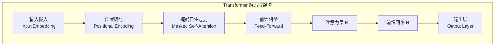

## 2.1 大语言模型架构与安全边界

要理解 LLM 的安全问题，首先需要了解其底层架构。Transformer 架构是现代 LLM 的技术基石，其设计特点深刻影响着模型的安全特性。

### 2.1.1 Transformer 架构解析

Transformer 架构由 Google 团队于 2017 年在论文《Attention Is All You Need》中提出，其核心创新是自注意力机制（Self-Attention），使模型能够在处理序列数据时考虑全局上下文。

**架构核心组件**：



图 2-1：Transformer 架构解析架构图

- **词嵌入层（Embedding Layer）**：将输入的 Token 转换为高维向量表示
- **位置编码（Positional Encoding）**：注入序列位置信息，使模型能够感知 Token 顺序
- **自注意力层（Self-Attention Layer）**：计算序列中每个 Token 与其他 Token 的关联强度
- **前馈网络（Feed-Forward Network）**：对注意力输出进行非线性变换
- **层归一化与残差连接**：稳定训练过程，提升梯度流动

**GPT 类模型的特点**：

大多数主流 LLM（如 GPT 系列、LLaMA 系列）采用仅解码器（Decoder-only）架构，使用因果掩码（Causal Mask）确保每个 Token 只能"看到"其之前的 Token。这种设计适合自回归生成任务，模型通过逐个预测下一个 Token 来生成文本。

### 2.1.2 上下文窗口与安全边界

上下文窗口（Context Window）是 LLM 的一个关键参数，定义了模型在单次推理中能够处理的最大 Token 数量。

| 类别/示例 | 上下文窗口大小 |
|------|----------------|
| 早期大模型 | 数千 Token |
| 常见商用模型 | 数万至十万级 Token |
| 长上下文模型 | 十万至百万级 Token |

> 说明：不同厂商、不同版本的上下文窗口会随时间快速变化，本表仅用于说明“窗口长度量级”这一安全边界概念。

**安全影响**：

上下文窗口既是能力的来源，也是安全的边界：

- **信息混淆**：在长上下文中，恶意指令可能被隐藏在大量正常内容之间，增加检测难度
- **注意力稀释**：当上下文过长时，模型对早期内容（如系统提示）的注意力可能减弱，攻击者可利用此特性
- **上下文溢出**：超出窗口限制的内容会被截断，可能导致关键安全指令丢失

### 2.1.3 注意力机制与信息流动

自注意力机制使模型中的每个 Token 都能"关注"输入序列中的所有其他 Token。这种全局信息流动是 LLM 强大能力的来源，但也带来安全隐患。

**注意力分数计算**：

注意力机制通过 Query（查询）、Key（键）、Value（值）三个矩阵计算：

$$
\text{Attention}(Q, K, V) = \text{softmax}\left(\frac{QK^T}{\sqrt{d_k}}\right)V
$$

其中 $d_k$ 是键向量的维度，用于缩放防止数值过大。

**安全影响**：

- **上下文污染**：恶意内容一旦进入上下文，其影响可能通过注意力机制扩散到模型的整个输出
- **信息泄露路径**：注意力机制创造了从敏感信息位置到输出位置的信息流动通道
- **提示注入基础**：攻击者正是利用注意力机制，使恶意指令被模型"关注"并执行

### 2.1.4 Token 化与安全边界

Token 化（Tokenization）是将文本转换为模型可处理的离散单元的过程。主流 LLM 采用子词（Subword）分词策略，如 BPE（Byte Pair Encoding）和 SentencePiece。

**Token 化示例**：

```
输入文本: "Hello, how are you?"
Token 序列: ["Hello", ",", " how", " are", " you", "?"]
Token ID: [15496, 11, 703, 527, 499, 30]
```

**安全影响**：

- **Token 边界攻击**：攻击者可以利用 Token 化的特性，构造在 Token 边界处产生意外效果的输入
- **编码绕过**：某些字符编码或组合可能被 Token 化为意外的序列，被用于绕过基于关键词的过滤器
- **跨语言攻击**：不同语言的 Token 化方式不同，可能导致安全机制在某些语言上失效

### 2.1.5 模型参数与信息承载

LLM 的模型参数（权重）是通过训练“学习”得到的，承载着从训练数据中提取的知识和模式。

**参数规模**：

现代 LLM 的参数规模已达到令人惊叹的量级：

- 7B（70 亿）参数：入门级开源模型
- 70B（700 亿）参数：高能力开源模型
- 100B+（千亿级）参数：早期超大规模模型量级
- >1T（超过 1 万亿）参数：前沿闭源模型

**安全影响**：

- **知识内化风险**：训练数据中的敏感信息可能被"记忆"在模型参数中
- **后门持久性**：通过训练植入的后门难以检测和移除
- **模型窃取价值**：海量训练成本使模型参数本身具有极高的商业价值

理解这些架构特点，有助于识别 LLM 系统中的潜在攻击面和防御点。在后续章节中，将详细探讨如何针对这些特点设计攻击和防御策略。
