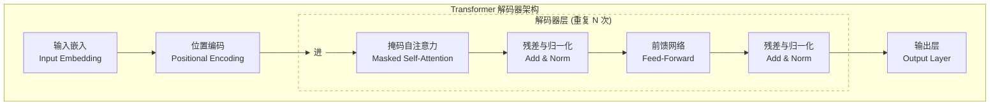

## 2.1 大语言模型架构与安全边界

要理解 LLM 的安全问题，首先需要了解其底层架构。Transformer 架构是现代 LLM 的技术基石，其设计特点深刻影响着模型的安全特性。

### 2.1.1 Transformer 架构解析

Transformer 架构由 Google 团队于 2017 年在论文《Attention Is All You Need》中提出，其核心创新是自注意力机制（Self-Attention），使模型能够在处理序列数据时考虑全局上下文。


```mermaid
flowchart TB
    subgraph "Transformer 解码器架构"
        Input["输入嵌入<br/>Input Embedding"] --> PE["位置编码<br/>Positional Encoding"]

        PE --> BlockTop

        subgraph DecoderBlock ["解码器层 (重复 N 次)"]
            direction TB
            BlockTop(("进")) --> SA["掩码自注意力<br/>Masked Self-Attention"]
            SA --> AddNorm1["残差与归一化<br/>Add & Norm"]
            AddNorm1 --> FF["前馈网络<br/>Feed-Forward"]
            FF --> AddNorm2["残差与归一化<br/>Add & Norm"]
        end

        AddNorm2 --> Output["输出层<br/>Output Layer"]
    end

    style DecoderBlock stroke-dasharray: 5 5, fill:none
    style BlockTop display:none

```

图 2-1：Transformer 核心架构

- **词嵌入层（Embedding Layer）**：将输入的 Token 转换为高维向量表示
- **位置编码（Positional Encoding）**：注入序列位置信息，使模型能够感知 Token 顺序
- **自注意力层（Self-Attention Layer）**：计算序列中每个 Token 与其他 Token 的关联强度
- **前馈网络（Feed-Forward Network）**：对注意力输出进行非线性变换
- **层归一化与残差连接**：稳定训练过程，提升梯度流动

大多数主流 LLM（如 GPT 系列、LLaMA 系列）采用仅解码器（Decoder-only）架构，使用 **因果掩码（Causal Mask）** 确保每个 Token 只能“看到”其之前的 Token。这种设计适合自回归生成任务，模型通过逐个预测下一个 Token 来生成文本。

> [!NOTE]
> **注意：因果掩码的本质与局限性**
>
> 因果掩码是自回归生成的架构必需，而非安全防线。它仅防止模型在生成时“偷看”未来 Token，但无法阻止通过上下文窗口进行的提示注入、越狱等攻击。
>
> 在直觉上，因果掩码似乎能防止未来文本影响当前的生成。但在典型的 LLM 交互中，用户的输入（可能包含恶意注入）总是位于模型生成的回答 **之前**。由于因果掩码允许当前 Token 关注序列中所有 **在它之前** 的 Token，一旦恶意指令进入了上下文窗口，它就处于模型当前生成 Token 的“过去”（即可见范围）。因此，因果掩码无法阻挡模型“看到”并被前置的恶意指令（如提示注入）所影响。
>
> **常见误解**：将因果掩码视为安全机制是不准确的。它是解决技术问题（自回归生成中的信息泄露），而非解决安全问题（恶意注入）。安全防御需要在应用层和对齐层实现。

### 2.1.2 上下文窗口与安全边界

上下文窗口（Context Window）是 LLM 的一个关键参数，定义了模型在单次推理中能够处理的最大 Token 数量。

| 类别/示例 | 上下文窗口大小 |
|------|----------------|
| 早期大模型 | 数千 Token |
| 常见商用模型 | 数万至十万级 Token |
| 长上下文模型 | 十万至百万级 Token |

> 说明：不同厂商、不同版本的上下文窗口会随时间快速变化，本表仅用于说明“窗口长度量级”这一安全边界概念。

**安全影响**
上下文窗口既是能力的来源，也是安全的边界：

- **信息混淆**：在长上下文中，恶意指令可能被隐藏在大量正常内容之间，增加检测难度。
- **定位与检索退化**：长上下文会增加定位关键约束、证据和来源的难度；退化程度取决于模型架构、上下文位置、任务类型和检索策略，不能用固定比例（如 20%）作为通用安全阈值。
- **上下文溢出**：超出窗口限制的内容会被截断，可能导致关键安全指令丢失。

### 2.1.3 注意力机制与信息流动

自注意力机制使模型中的每个 Token 都能“关注”输入序列中的所有其他 Token。这种全局信息流动是 LLM 强大能力的来源，但也带来安全隐患。

**注意力分数计算**
注意力机制通过 Query（查询）、Key（键）、Value（值）三个矩阵计算：

$$
\text{Attention}(Q, K, V) = \text{softmax}\left(\frac{QK^T}{\sqrt{d_k}}\right)V
$$

其中 $d_k$ 是键向量的维度，用于缩放防止数值过大。

**安全含义：注意力不是权限边界**
注意力机制可以解释模型如何在可见上下文中路由信息，但它不是权限系统，也不会自动区分“指令”和“数据”。在常见的自回归解码器中，当前位置通常只能关注前文可见 Token；注意力权重反映统计相关性，不代表来源可信度、业务授权或安全优先级。

提示注入的核心问题不是某个恶意 Token 必然“劫持”了全部注意力，而是 **不可信内容与高优先级指令被放进同一个可解释上下文后，模型可能把数据误当成指令**。因此，防御重点应放在可验证的外部边界上：

1. **结构化来源**：用 API 消息角色、字段、来源 ID 和检索元数据区分系统指令、用户输入、工具返回和外部文档。
2. **权限外置**：把工具调用、数据访问和高危操作的授权放在模型外部执行，而不是依赖模型“记住”系统提示。
3. **结果校验**：对工具参数、输出格式、引用来源和敏感动作做确定性校验，并对高风险动作加入人工确认。

### 2.1.4 Token 化与安全边界

Token 化（Tokenization）是将文本转换为模型可处理的离散单元的过程。主流 LLM 采用子词（Subword）分词策略，如 BPE（Byte Pair Encoding）和 SentencePiece。

**Token 化示例**
```text
输入文本："Hello, how are you?"
Token 序列：["Hello", ",", " how", " are", " you", "?"]
Token ID: [15496, 11, 703, 527, 499, 30]
```

**安全影响：Token 边界攻击原理**
BPE 等分词算法是基于语料库中字节配对频率进行贪心合并的。这种基于频率的机械拆分创造了被攻击者利用的“盲区”：

- **特征断裂绕过（Detokenization Bypass）**：安全过滤系统（如基于正则或小模型的检测器）通常在字符层面（String）工作，而 LLM 看到的是 Token ID。如果攻击者通过插入特定的无关符号组合（如零宽字符、罕见标点），改变了局部字节组合的频率特征，可能导致原本独立的敏感词（例如 `Ignore`）在分词时被切碎，或者与前缀合并成一个全新的、模型在训练时很少见过的 Token ID。
- **跨语言同形异义攻击**：在多语言支持的模型中，字形相似的内容由于在语料和编码上的差异，其 Token 表示截然不同。例如，英文字母 `a` 与西里尔字母 `а` 外观无法区分，但在某些模型中，英文 `a` 会与其他字母正常合并为一个单词 Token（如 `make`），而混入西里尔字母 `а` 的 `mаke` 会被切成数个毫不相干的罕见子词 Token，导致基于 Token 的防御策略（如黑名单过滤或特定概念惩罚机制）彻底失效。
- **特殊控制字符解析**：模型通常有一些特殊 Token（如 `<|endoftext|>` 或 `<|im_start|>`）。如果应用层未将其正确转义，攻击者直接注入此类文本，分词器可能将其解析为真实的控制 Token ID，引发模型状态的非预期翻转。

### 2.1.5 模型参数与信息承载

LLM 的模型参数（权重）是通过训练“学习”得到的，承载着从训练数据中提取的知识和模式。

**参数规模**
现代 LLM 的参数规模已达到令人惊叹的量级：

- 7B（70 亿）参数：入门级开源模型
- 70B（700 亿）参数：高能力开源模型
- 100B+（千亿级）参数：超大规模模型量级
- 1T（超过 1 万亿）参数：前沿闭源模型

**安全影响**
- **知识内化风险**：训练数据中的敏感信息可能被“记忆”在模型参数中。
- **后门持久性**：通过训练植入的后门难以检测和移除。
- **模型窃取价值**：海量训练成本使模型参数本身具有极高的商业价值。

理解这些架构特点，有助于识别 LLM 系统中的潜在攻击面和防御点。在后续章节中，将详细探讨如何针对这些特点设计攻击和防御策略。
