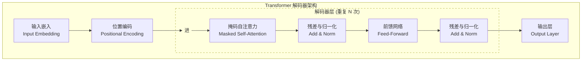

## 2.1 大语言模型架构与安全边界

Transformer 架构是现代 LLM 的技术基石，其设计特点深刻影响着模型的安全特性。

### 2.1.1 Transformer 架构解析

Transformer 架构由 Google 团队于 2017 年在论文《Attention Is All You Need》中提出，其核心创新是自注意力机制（Self-Attention），使模型能够在处理序列数据时考虑全局上下文。

```mermaid
flowchart TB
    subgraph "Transformer 解码器架构"
        Input["输入嵌入<br/>Input Embedding"] --> PE["位置编码<br/>Positional Encoding"]

        PE --> BlockTop

        subgraph DecoderBlock ["解码器层 (重复 N 次)"]
            direction TB
            BlockTop(("进")) --> SA["掩码自注意力<br/>Masked Self-Attention"]
            SA --> AddNorm1["残差与归一化<br/>Add & Norm"]
            AddNorm1 --> FF["前馈网络<br/>Feed-Forward"]
            FF --> AddNorm2["残差与归一化<br/>Add & Norm"]
        end

        AddNorm2 --> Output["输出层<br/>Output Layer"]
    end

    style DecoderBlock stroke-dasharray: 5 5, fill:none
    style BlockTop display:none

```

图 2-1：Transformer 核心架构

- **词嵌入层（Embedding Layer）**：将输入的 Token 转换为高维向量表示
- **位置编码（Positional Encoding）**：注入序列位置信息，使模型能够感知 Token 顺序
- **自注意力层（Self-Attention Layer）**：计算序列中每个 Token 与其他 Token 的关联强度
- **前馈网络（Feed-Forward Network）**：对注意力输出进行非线性变换
- **层归一化与残差连接**：稳定训练过程，提升梯度流动

大多数主流 LLM（如 GPT 系列、LLaMA 系列）采用仅解码器（Decoder-only）架构，使用 **因果掩码（Causal Mask）** 确保每个 Token 只能“看到”其之前的 Token。这种设计适合自回归生成任务，模型通过逐个预测下一个 Token 来生成文本。

> [!NOTE]
> **因果掩码的作用与局限性**
>
> 因果掩码是自回归生成的架构必需，用于防止生成时的信息泄露（技术问题），并非安全防线。它仅防止模型在生成时“偷看”未来 Token，无法阻止通过上下文窗口进行的提示注入、越狱等攻击。
>
> 在典型的 LLM 交互中，用户的输入（可能包含恶意注入）总是位于模型生成的回答之前。因果掩码允许当前 Token 关注序列中所有在它之前的 Token，因此恶意指令一旦进入上下文窗口，就处于当前生成 Token 的“过去”（即可见范围），模型能够“看到”并受其影响。安全防御需要在应用层和对齐层实现。

### 2.1.2 上下文窗口与安全边界

上下文窗口（Context Window）是 LLM 的一个关键参数，定义了模型在单次推理中能够处理的最大 Token 数量。

| 类别/示例 | 上下文窗口大小 |
|------|----------------|
| 早期大模型 | 数千 Token |
| 常见商用模型 | 数万至十万级 Token |
| 长上下文模型 | 十万至百万级 Token |

> 说明：各厂商、各版本的上下文窗口变化很快，本表仅示意窗口长度的量级。

**安全影响**
上下文窗口既是能力的来源，也是安全的边界：

- **信息混淆**：在长上下文中，恶意指令可能被隐藏在大量正常内容之间，增加检测难度。
- **定位与检索退化**：长上下文会增加定位关键约束、证据和来源的难度；退化程度取决于模型架构、上下文位置、任务类型和检索策略，不能用固定比例（如 20%）作为通用安全阈值。
- **上下文溢出**：超出窗口限制的内容会被截断，可能导致关键安全指令丢失。

### 2.1.3 注意力机制与信息流动

自注意力机制使模型中的每个 Token 都能“关注”输入序列中的所有其他 Token。这种全局信息流动是 LLM 强大能力的来源，但也带来安全隐患。

**注意力分数计算**
注意力机制通过 Query（查询）、Key（键）、Value（值）三个矩阵计算：

$$
\text{Attention}(Q, K, V) = \text{softmax}\left(\frac{QK^T}{\sqrt{d_k}}\right)V
$$

其中 $d_k$ 是键向量的维度，用于缩放防止数值过大。

**安全含义：注意力不是权限边界**
注意力机制可以解释模型如何在可见上下文中路由信息，但它不是权限系统，也不会自动区分“指令”和“数据”。在常见的自回归解码器中，当前位置通常只能关注前文可见 Token；注意力权重反映统计相关性，不代表来源可信度、业务授权或安全优先级。

提示注入的核心问题不是某个恶意 Token 必然“劫持”了全部注意力，而是不可信内容与高优先级指令被放进同一个可解释上下文后，模型可能把数据误当成指令。因此，防御重点应放在可验证的外部边界上：

1. **结构化来源**：用 API 消息角色、字段、来源 ID 和检索元数据区分系统指令、用户输入、工具返回和外部文档。
2. **权限外置**：把工具调用、数据访问和高危操作的授权放在模型外部执行，而不是依赖模型“记住”系统提示。
3. **结果校验**：对工具参数、输出格式、引用来源和敏感动作做确定性校验，并对高风险动作加入人工确认。

### 2.1.4 Token 化与安全边界

Token 化（Tokenization）是将文本转换为模型可处理的离散单元的过程。主流 LLM 采用子词（Subword）分词策略，如 BPE（Byte Pair Encoding）和 SentencePiece。

**固定编码示例：改变输入，不改变词表**

BPE 的合并规则在词表训练时确定；部署后的编码使用固定词表和合并优先级，不会因一次输入重新统计频率、学习新词或分配新 ID。[tiktoken 的编码实现](https://github.com/openai/tiktoken/blob/0.12.0/tiktoken/core.py) 将这些规则作为编码器配置；[Hugging Face 的编码管线](https://huggingface.co/docs/tokenizers/main/en/pipeline) 还明确区分规范化、预分词、模型编码与后处理。

为便于手算，这里固定一个教学用字节 BPE 版本 `toy-bpe-v1`：单个 UTF-8 字节的 ID 就是其十进制值，另有三条合并规则，优先级依次为 `m + a → ma`（ID 256）、`ma + k → mak`（ID 257）、`mak + e → make`（ID 258）。没有其他合并，也没有预分词。这是合成词表，不对应任何商用模型。

| 输入及关键 Unicode 码点 | 不做规范化的 ID 序列 | 先做 NFKC 后的文本与 ID |
|------|------|------|
| `make`（`a` 为 U+0061） | `[258]` | `make`，`[258]` |
| `mаke`（`а` 为西里尔字母 U+0430） | `[109, 208, 176, 107, 101]` | 保持原文，ID 不变 |
| `ma\u200bke`（`\u200b` 表示零宽空格 U+200B） | `[256, 226, 128, 139, 107, 101]` | 保留零宽空格，ID 不变 |
| `ｍａｋｅ`（全角字母 U+FF4D、U+FF41、U+FF4B、U+FF45） | `[239, 189, 141, 239, 189, 129, 239, 189, 139, 239, 189, 133]` | `make`，`[258]` |

例如，零宽空格把 `ma` 与 `ke` 隔开，使后两次合并无法发生，但所有输出 ID 仍来自原词表。[NFKC 规范化](https://www.unicode.org/reports/tr15/) 可以折叠这组全角字母，却不会自动消除上述同形字母或零宽空格。真实系统须固定 tokenizer 的名称、版本和规范化配置后再验证，不能把教学 ID 套到其他模型。

**安全影响：表示失配与控制 Token 要分开判断**

- **检测器与模型的表示失配**：若检测器检查原始字符串，而模型在另一套预处理后理解输入，插入字符可能让字面匹配失效；但分词变化本身既不证明模型仍理解原意，也不证明安全策略被绕过。应同时检查原文、规范化结果和模型实际使用的输入表示。
- **同形字符**：外观相近的字符可能具有不同码点与 ID。防御须测试具体的检测规则与语言场景，不能断言所有黑名单或概念检测都会失效。
- **特殊 Token**：文本写出 `<|endoftext|>` 不等于已经注入控制 Token。下面固定 tiktoken 0.12.0 的 `gpt2` 编码，结果取自其官方编码实现与词表配置：

| 编码调用（输入为上文的特殊 Token 文本） | 结果 |
|------|------|
| 默认 `encode` | 抛出 `ValueError`，拒绝特殊 Token 文本 |
| `encode`，`allowed_special="all"` | `[50256]`，识别为已配置的特殊 Token |
| `encode`，`disallowed_special=()`，保持默认空的 `allowed_special` | `[27, 91, 437, 1659, 5239, 91, 29]`，作为普通文本编码 |

应用应按协议限制不可信字段可使用的特殊 Token，并保留消息角色的结构化边界。即使得到特殊 ID，其实际语义也取决于模型及消息序列化协议，不能仅凭输入字符串推断发生了角色切换。[tiktoken 0.12.0 词表配置](https://github.com/openai/tiktoken/blob/0.12.0/tiktoken_ext/openai_public.py)

### 2.1.5 模型参数与信息承载

LLM 的模型参数（权重）是通过训练“学习”得到的，承载着从训练数据中提取的知识和模式。

**参数规模**
现代 LLM 的参数规模量级如下：

- 7B（70 亿）参数：入门级开源模型
- 70B（700 亿）参数：高能力开源模型
- 100B+（千亿级）参数：超大规模模型量级
- 1T（万亿级）参数：已有开放权重的 MoE 模型达到这一总参数量（如 Kimi K2）；闭源前沿模型大多不公开参数量

**安全影响**
- **知识内化风险**：训练数据中的敏感信息可能被“记忆”在模型参数中。
- **后门持久性**：通过训练植入的后门难以检测和移除。
- **模型窃取价值**：海量训练成本使模型参数本身具有极高的商业价值。

理解这些架构特点，有助于识别 LLM 系统中的潜在攻击面和防御点。
