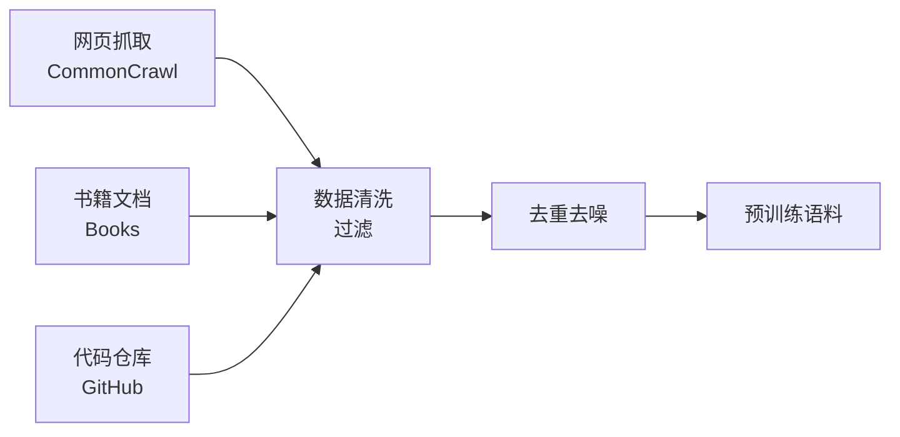
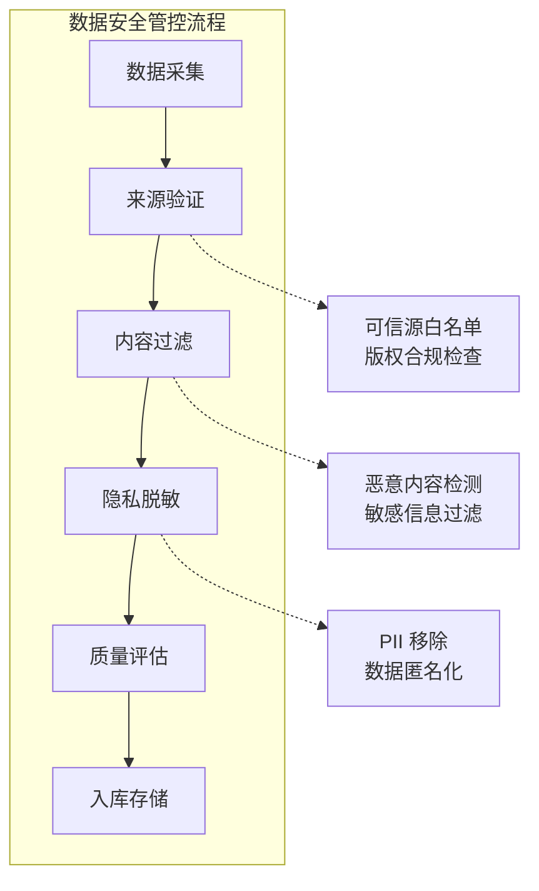

## 2.2 训练过程中的安全考量

LLM 的训练是一个复杂且资源密集的过程，涉及数据收集、预处理、模型训练和验证等多个环节。每个环节都可能引入安全风险，需要审慎对待。

### 2.2.1 预训练阶段

预训练是 LLM 能力形成的基础阶段，模型在海量无标注文本上学习语言的统计规律。

**预训练数据来源**：

图 2-1：预训练阶段流程图

典型的预训练数据来源包括：
- **网页数据**：CommonCrawl 等大规模网页抓取数据
- **书籍与出版物**：电子书、学术论文、维基百科
- **代码仓库**：GitHub 等开源代码平台
- **对话数据**：论坛、社交媒体等

**安全风险**：

1. **数据投毒**：攻击者可能在公开数据源中植入恶意内容，一旦被纳入训练数据，将影响模型行为。由于预训练数据规模巨大，逐条审核几乎不可能。

2. **隐私泄露**：训练数据中可能包含个人隐私信息（如邮箱、电话、地址），模型可能"记忆"并在后续输出中泄露这些信息。

3. **版权问题**：未经授权使用受版权保护的内容进行训练，可能导致法律风险。

4. **偏见传播**：训练数据中的偏见和歧视性内容会被模型学习，并在输出中体现。

### 2.2.2 微调阶段

微调（Fine-tuning）是在预训练模型基础上，使用特定任务或领域的数据进一步训练，使模型适应特定应用场景。

**微调方式**：

| 微调类型 | 描述 | 安全考量 |
|----------|------|----------|
| 全参数微调 | 更新所有模型参数 | 计算成本高，但控制力强 |
| LoRA/QLoRA | 仅训练低秩适配器 | 高效但可能引入新漏洞 |
| P-Tuning | 仅优化少量提示参数 | 成本低但效果有限 |
| 指令微调 | 使用指令-响应对训练 | 安全对齐的关键步骤 |

**安全风险**：

1. **后门植入**：恶意的微调数据集可能包含触发特定行为的后门样本。例如，当输入包含特定触发词时，模型输出恶意内容。

2. **对齐退化**：不当的微调可能破坏预训练模型的安全对齐，使其变得更容易产生有害输出。

3. **供应链攻击**：使用来源不明的微调模型或数据集可能引入未知风险。

### 2.2.3 数据安全管控

为降低训练阶段的安全风险，需要建立完善的数据安全管控体系：

**数据来源审核**：

图 2-2：数据安全管控流程图

- **白名单机制**：只从可信来源收集数据
- **版权合规**：确保数据使用符合法律法规
- **多层过滤**：结合规则和机器学习方法过滤有害内容

**隐私保护措施**：

- **PII 检测与移除**：使用命名实体识别等技术检测并移除个人身份信息
- **数据匿名化**：对无法完全移除的敏感信息进行匿名化处理
- **差分隐私**：在训练过程中加入噪声，降低模型记忆特定样本的风险

**数据溯源**：

- **数据血缘记录**：记录每条数据的来源、处理历史和使用情况
- **审计能力**：支持事后追溯特定输出的数据来源
- **版本控制**：管理训练数据的不同版本，支持回滚

### 2.2.4 训练过程安全

除了数据安全，训练过程本身也需要安全保障：

**计算环境安全**：

- **访问控制**：严格限制训练集群的访问权限
- **网络隔离**：训练网络与外部隔离，防止数据外泄
- **安全审计**：记录所有训练相关操作

**模型检查点保护**：

- **加密存储**：对训练中间检查点进行加密
- **完整性校验**：使用哈希确保模型文件未被篡改
- **权限管理**：控制模型文件的访问和导出权限

**供应链安全**：

- **依赖审计**：审查训练框架和库的安全性
- **环境隔离**：使用容器化技术隔离训练环境
- **更新管理**：及时修复已知安全漏洞

### 2.2.5 可复现性与透明度

安全的训练过程还需要具备可复现性和透明度：

**训练过程记录**：

- 详细记录训练超参数、数据配置、随机种子等
- 保存完整的训练日志
- 记录模型性能指标的变化曲线

**模型卡与数据表**：

借鉴 Model Card 和 Datasheet 的实践，为训练数据和模型提供详细的"说明书"：

- **训练数据描述**：数据来源、规模、时间范围、处理方式
- **模型能力边界**：明确模型擅长和不擅长的任务
- **已知风险**：披露已发现的安全风险和局限性
- **使用建议**：推荐的使用场景和不推荐的使用方式

透明的训练过程有助于建立信任，并为安全评估提供必要信息。在下一节中，将探讨模型部署后的推理阶段所面临的安全挑战。
