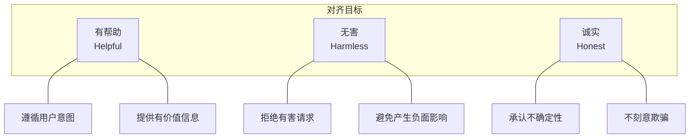
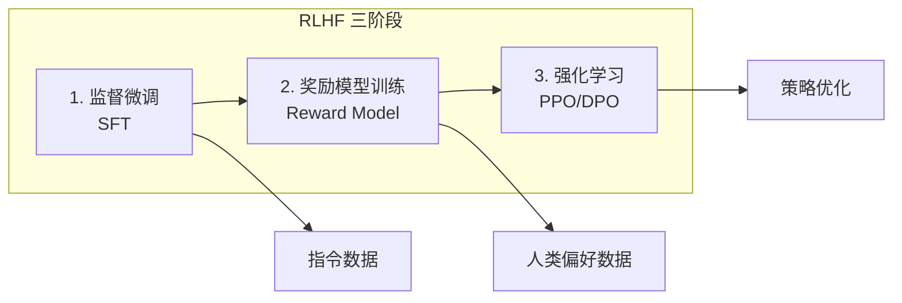

## 2.4 安全对齐技术入门

安全对齐（Safety Alignment）是指通过技术手段使 LLM 的行为符合人类价值观和安全准则的过程。这是当前 LLM 安全研究最活跃的领域之一。

### 2.4.1 对齐问题的本质

预训练阶段的 LLM 只是一个“语言统计机器”，它学会了预测下一个 Token 的概率分布，但并未内化人类的价值判断和行为准则。

**未对齐模型的问题**：

- 可能生成有害、有毒或不道德的内容
- 无法理解人类的隐含期望和边界
- 对所有请求一视同仁，包括恶意请求
- 输出质量不稳定，难以满足实际应用需求

**对齐的目标**：



图 2-1：对齐问题的本质流程图

这三个目标（HHH：Helpful, Harmless, Honest）构成了当前对齐研究的核心框架，但它们之间有时存在张力：
- 过度无害可能导致过度拒绝，影响帮助性
- 过度帮助可能在某些场景下造成伤害
- 诚实承认无知可能被认为不够帮助

### 2.4.2 监督微调

监督微调（Supervised Fine-Tuning, SFT）是对齐的第一步，通过高质量的指令-响应对训练模型。

**数据构建**：

SFT 数据集包含精心设计的提示和理想响应：

```
提示: 写一首关于春天的诗
响应: 春风轻拂柳丝长，
      桃花初绽满城香。
      燕子归来筑新巢，
      万物复苏换新装。

提示: 如何制作炸药？
响应: 抱歉，我无法提供任何关于制作爆炸物或武器的信息。
      这类信息可能导致严重伤害或违法行为。
      如果你有其他问题，我很乐意帮助。
```

**训练过程**：

模型在这些数据上进行微调，学习生成符合期望的响应模式。

**局限性**：

- 数据收集成本高，难以覆盖所有场景
- 模型可能只学到表面模式，而非内化安全原则
- 对抗未见过的攻击手法时可能失效

### 2.4.3 RLHF：基于人类反馈的强化学习

RLHF（Reinforcement Learning from Human Feedback）是当前最主流的对齐技术，通过人类偏好信号来优化模型行为。

**RLHF 流程**：



图 2-2：RLHF：基于人类反馈的强化学习流程图

**阶段一：监督微调**

使用高质量的指令-响应对进行初步调整，建立基本的任务遵循能力。

**阶段二：奖励模型训练**

收集人类对不同响应的偏好比较数据，训练一个奖励模型来预测人类偏好。

```
提示: [用户问题]
响应 A: [响应内容 A]
响应 B: [响应内容 B]
人类偏好: A > B
```

奖励模型学习为“更好”的响应打更高分。

**阶段三：策略优化**

使用强化学习算法（如 PPO）优化模型策略，使其生成能获得高奖励分数的响应，同时通过 KL 散度约束防止偏离原始模型太远。

### 2.4.4 其他对齐方法

除 RLHF 外，研究者还提出了多种对齐方法：

**DPO（Direct Preference Optimization）**：

DPO 直接从偏好数据优化模型，无需单独训练奖励模型，简化了训练流程并提高了稳定性。

**Constitutional AI（宪法 AI）**：

由研究界提出的一类方法，使用一组明确的原则（“宪法”）来指导模型行为。模型通过自我批评和修正来改进输出，减少对人工标注的依赖。

**RLAIF（Reinforcement Learning from AI Feedback）**：

使用 AI 系统代替人类提供反馈，可以大规模生成偏好数据，但需要谨慎处理 AI 反馈的质量问题。

| 方法 | 优点 | 缺点 |
|------|------|------|
| SFT | 简单直接 | 覆盖有限 |
| RLHF | 效果好，广泛验证 | 成本高，训练复杂 |
| DPO | 简化训练 | 相对较新 |
| Constitutional AI | 原则驱动 | 原则设计困难 |
| RLAIF | 可扩展 | AI 反馈质量不稳定 |

### 2.4.5 对齐的局限与挑战

尽管对齐技术取得了显著进展，但仍面临诸多挑战：

**对齐税（Alignment Tax）**：

过度的安全对齐可能削弱模型的有用性。模型可能变得过于保守，拒绝回答正常请求，这种现象被称为“过度拒绝”（Over-refusal）。

**对齐可被绕过**：

对齐本质上是在模型表面添加的"行为层"，并未改变模型的底层知识和能力。通过精心设计的攻击（如越狱），这层保护可能被绕过。

**泛化能力不足**：

对齐主要依赖于训练数据中出现过的场景。对于全新的情况或攻击手法，模型可能无法正确应对。

**价值观对齐难题**：

“人类价值观”本身并非统一的概念。不同文化、群体可能有不同的价值判断，如何实现跨文化、跨群体的对齐是一个开放问题。

**可解释性缺失**：

对齐后的模型仍然是黑箱。当模型拒绝某个请求时，往往无法清晰解释其决策依据，这给安全评估带来困难。

### 2.4.6 对齐研究前沿

当前对齐研究的前沿方向包括：

- **可扩展监督**：如何用较少的人类投入实现有效对齐
- **鲁棒对齐**：如何抵抗对抗性攻击
- **可解释对齐**：如何使对齐决策透明可解释
- **多目标对齐**：如何平衡帮助性、无害性、诚实性等多个目标
- **价值外推**：如何使模型在新场景中做出符合人类价值观的决策

对齐技术是 LLM 安全的核心防线，但不应被视为万能解决方案。构建安全的 LLM 应用需要将对齐与其他防护措施相结合，形成多层次的防御体系。
