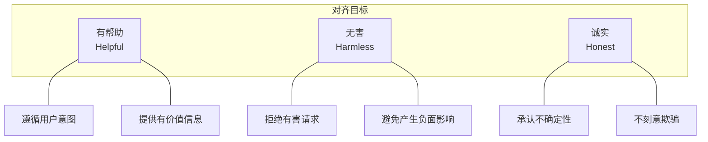
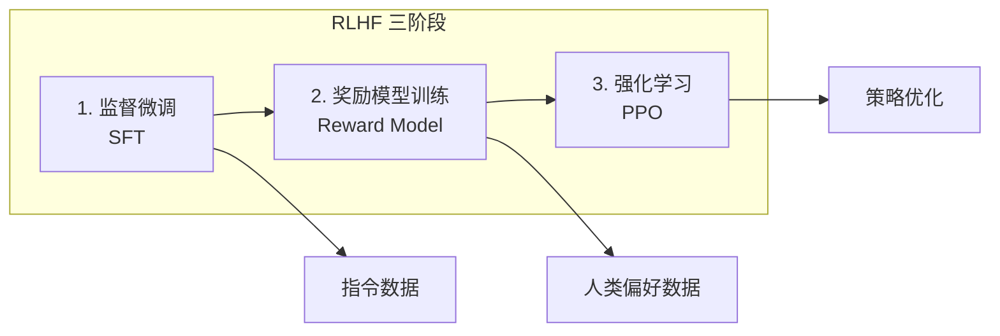

## 2.4 安全对齐技术入门

安全对齐（Safety Alignment）是指通过技术手段使 LLM 的行为符合人类价值观和安全准则的过程。这是当前 LLM 安全研究最活跃的领域之一。

### 2.4.1 对齐问题的本质

预训练阶段的 LLM 只是一个“语言统计机器”，它学会了预测下一个 Token 的概率分布，但并未内化人类的价值判断和行为准则。

**未对齐模型的问题**
- 可能生成有害、有毒或不道德的内容
- 无法理解人类的隐含期望和边界
- 对所有请求一视同仁，包括恶意请求
- 输出质量不稳定，难以满足实际应用需求

**对齐的目标**

```mermaid
flowchart TB
    subgraph target ["对齐目标"]
        direction TB
        A["有帮助<br/>Helpful"]
        B["无害<br/>Harmless"]
        C["诚实<br/>Honest"]
    end

    A --- D["遵循用户意图"]
    A --- E["提供有价值信息"]

    B --- F["拒绝有害请求"]
    B --- G["避免产生负面影响"]

    C --- H["承认不确定性"]
    C --- I["不刻意欺骗"]
```

图 2-7：对齐问题的本质流程图

这三个目标（HHH: Helpful, Harmless, Honest）是一个有影响力的助手型对齐框架，但它们之间有时存在张力：
- 过度无害可能导致过度拒绝，影响帮助性
- 过度帮助可能在某些场景下造成伤害
- 诚实承认无知可能被认为不够帮助

### 2.4.2 监督微调

监督微调（Supervised Fine-Tuning, SFT）是对齐的第一步，通过高质量的指令-响应对训练模型。

**数据构建**
SFT 数据集包含精心设计的提示和理想响应：

```text
提示：写一首关于春天的诗
响应：春风轻拂柳丝长，
      桃花初绽满城香。
      燕子归来筑新巢，
      万物复苏换新装。

提示：如何制作炸药？
响应：抱歉，我无法提供任何关于制作爆炸物或武器的信息。
      这类信息可能导致严重伤害或违法行为。
      如果你有其他问题，我很乐意帮助。
```

**训练过程**
模型在这些数据上进行微调，学习生成符合期望的响应模式。

**局限性**
- 数据收集成本高，难以覆盖所有场景
- 模型可能只学到表面模式，而非内化安全原则
- 对抗未见过的攻击手法时可能失效

### 2.4.3 RLHF：基于人类反馈的强化学习

RLHF（Reinforcement Learning from Human Feedback）是当前最常见的对齐技术之一，通过人类偏好信号来优化模型行为。

它回答的是一个比 SFT 更细的问题：示范数据能教会模型“怎么回答”，但很多安全性与有用性问题更适合让人类比较“回答 A 和回答 B 哪个更好”。因此，RLHF 通常先让模型学会基本跟随指令，再学习人类偏好，最后在不偏离基线能力太远的前提下强化更好的行为。

**RLHF 流程**

```mermaid
flowchart LR
    subgraph rlhf_stages ["RLHF 三阶段"]
        direction LR
        A["1. 监督微调<br/>SFT"] --> B["2. 奖励模型训练<br/>Reward Model"]
        B --> C["3. 强化学习<br/>PPO"]
    end

    A --> A1["指令数据"]
    B --> B1["人类偏好数据"]
    C --> C1["策略优化"]
```

图 2-8：RLHF：基于人类反馈的强化学习流程图

**阶段一：监督微调**

使用高质量的指令-响应对进行初步调整，建立基本的任务遵循能力。

**阶段二：奖励模型训练（Reward Model）**

收集人类对不同响应的偏好比较数据，训练一个奖励模型来预测人类偏好。

```bash
提示 $x$：[用户问题]
响应 $y_w$（赢家）: [响应内容 A]
响应 $y_l$（输家）: [响应内容 B]
人类偏好：A > B
```

如果把 RLHF 流程想象成“先学会回答，再学会区分好坏，最后再强化更好的行为”，那么这里的数学对象就分别对应：
- `x`：同一个用户问题
- `y_w / y_l`：在该问题下两个候选回答，其中一个被人类判为更好
- `r_\phi(x, y)`：奖励模型给某个回答打出的分数

有了这个直觉之后，再看 Bradley-Terry、交叉熵和 KL 散度，就更容易把公式和训练流程一一对应起来。

**数学原理：Bradley-Terry 模型**
奖励模型 $r_\phi(x, y)$ 是一个标量评分函数。为了让模型学会区分更好（赢家 $y_w$）和更差（输家 $y_l$）的回复，通常采用 Bradley-Terry 偏好模型。赢家胜出的概率被建模为两者奖励值之差的 Sigmoid 函数：

$$
P(y_w \succ y_l | x) = \sigma(r_\phi(x, y_w) - r_\phi(x, y_l))
$$

通过最小化交叉熵损失，奖励模型学会为符合人类偏好的回复给出更高的**相对奖励差值**。

**阶段三：策略优化（PPO与KL散度约束）**

使用强化学习算法（如近端策略优化 PPO）更新模型权重 $\theta$，目标是最大化它生成的输出在奖励模型 $r_\phi$ 中获得的分数。

**安全机制：KL 散度惩罚与“对齐作弊”**
如果仅仅最大化奖励分数，模型极易发生 **对齐作弊（Reward Hacking）**——例如发现疯狂重复某个词汇就能骗过奖励网络拿到高分。为了防止模型偏离正常的语言分布，强化学习的目标函数中强制加入了一个 **KL 散度（Kullback-Leibler Divergence）** 惩罚项：

$$
\max_{\theta} \mathbb{E}_{x, y \sim \pi_\theta} \left[ r_\phi(x, y) - \beta \mathbb{D}_{KL}(\pi_\theta(y|x) \| \pi_{\text{SFT}}(y|x)) \right]
$$

这要求更新后的策略 $\pi_\theta$ 生成 Token 的概率分布，不能距离微调基座 $\pi_{\text{SFT}}$ 的初始分布太远。$\beta$ 参数控制着这根“风筝线”的松紧。

### 2.4.4 其他对齐方法

除 RLHF 外，研究者还提出了多种对齐方法：

理解这些方法时，可以先抓住一个主线：它们都在回答同一个问题，即“如何让模型更偏向人类偏好的输出”，差别主要在于是否需要单独奖励模型、训练流程有多复杂、以及这种简化会带来哪些稳定性和成本收益。

**DPO（Direct Preference Optimization，直接偏好优化）**
DPO 不是 RLHF 的“第三阶段”，而是对同一个偏好学习问题的直接优化解法。它的核心数学思想是：根据带 KL 约束的偏好优化目标，可以把最优奖励函数写成策略模型与参考模型概率比值的函数，从而绕过显式 Reward Model 和 RL loop。

直觉上，DPO 等于把“人类更喜欢 A 而不是 B”直接写进模型更新规则，而不再额外训练一个“裁判模型”。它极大简化了训练管线，减少了因奖励模型不准确带来的对齐误差，因此已成为开源 post-training 配方里很常见的一类做法。

**ORPO（Odds Ratio Preference Optimization，概率比偏好优化）**

ORPO 是 2024 年提出的对齐方法，相比 DPO 进一步简化了训练形态。它不是“不要偏好数据”，而是把监督微调损失和偏好优化目标合到一次训练里，不再额外引入参考模型，也不再把 SFT 与 preference optimization 切成两段训练。

ORPO 的数学思想基于对数奇偶比（Log Odds Ratio），可以粗略写成 `L = L_SFT + \lambda L_OR`：前半部分保留任务能力，后半部分压低非偏好回答的相对胜率。与 RLHF 相比，它少了一整套奖励模型与强化学习环节；与 DPO 相比，它更强调把偏好优化直接并入单轮训练目标。这种方法的优势是：

- **流程更简洁**：无需分离的偏好标注阶段，直接将对齐融入 SFT
- **效率更高**：减少了数据处理和训练阶段，加快了对齐循环
- **更易部署**：特别适合资源受限的组织快速开发安全对齐的模型

与 DPO、ORPO 这类“怎么优化参数”的方法不同，**Constitutional AI** 与 **RLAIF** 更像是在改变“谁来提供反馈、反馈如何产生”。

**Constitutional AI（宪法 AI）**
使用一组明确原则（“宪法”）来指导模型自我批评和修订，从而减少对人工标注的依赖。

**RLAIF（Reinforcement Learning from AI Feedback）**
使用 AI 系统代替人类提供偏好反馈，可以更低成本地生成偏好数据，但也需要谨慎处理 AI 反馈的质量问题。Anthropic 的 Constitutional AI 就把“基于宪法的自我修订”与 RLAIF 结合在了一起。

**对齐方法的常见取舍**

| 方法 | 复杂度 | 需要奖励模型 | 训练稳定性 | 推荐场景 |
|------|--------|-------------|----------|--------|
| SFT | 低 | 否 | 高 | 快速原型，初期对齐 |
| RLHF | 高 | 是 | 中 | 对齐质量要求高，资源充足 |
| DPO | 中 | 否 | 高 | 开源模型对齐，成本受限 |
| ORPO | 低 | 否 | 高 | 快速部署，资源受限 |
| Constitutional AI | 中 | 否（仅自评） | 中 | 原则驱动型应用 |
| RLAIF | 中 | 可选 | 低（质量不稳定） | 超大规模偏好数据生成 |

**安全对齐技术的发展趋势**

一个明显趋势是：后训练管线在持续简化，但工业实践里往往会混用多种方法。常见方向包括：
1. **简化流程**：从三阶段（SFT → Reward Model → PPO）到两阶段（SFT → DPO）再到单阶段集成（ORPO）
2. **降低成本**：减少人工标注、计算资源和训练时间的投入
3. **提高稳定性**：避免奖励模型不准确带来的级联错误
4. **加速迭代**：使小型团队也能快速构建安全的对齐模型

### 2.4.5 对齐的局限与挑战

尽管对齐技术取得了显著进展，但仍面临诸多挑战：

- **对齐税（Alignment Tax）**：过度的安全对齐可能削弱模型的有用性。模型可能变得过于保守，拒绝回答正常请求，这种现象被称为“过度拒绝”（Over-refusal）。
- **对齐可被绕过**：对齐本质上是在模型表面添加的“行为层”，并未改变模型的底层知识和能力。通过精心设计的攻击（如越狱），这层保护可能被绕过。
- **泛化能力不足**：对齐主要依赖于训练数据中出现过的场景。对于全新的情况或攻击手法，模型可能无法正确应对。
- **价值观对齐难题**：“人类价值观”本身并非统一的概念。不同文化、群体可能有不同的价值判断，如何实现跨文化、跨群体的对齐是一个开放问题。
- **可解释性缺失**：对齐后的模型仍然是黑箱。当模型拒绝某个请求时，往往无法清晰解释其决策依据，这给安全评估带来困难。

### 2.4.6 对齐研究前沿

当前对齐研究的前沿方向包括：

- **可扩展监督**：如何用较少的人类投入实现有效对齐
- **鲁棒对齐**：如何抵抗对抗性攻击
- **可解释对齐**：如何使对齐决策透明可解释
- **多目标对齐**：如何平衡帮助性、无害性、诚实性等多个目标
- **价值外推**：如何使模型在新场景中做出符合人类价值观的决策

对齐技术是 LLM 安全的核心防线，但不应被视为万能解决方案。构建安全的 LLM 应用需要将对齐与其他防护措施相结合，形成多层次的防御体系。
