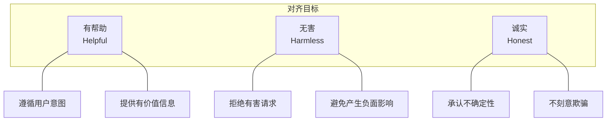
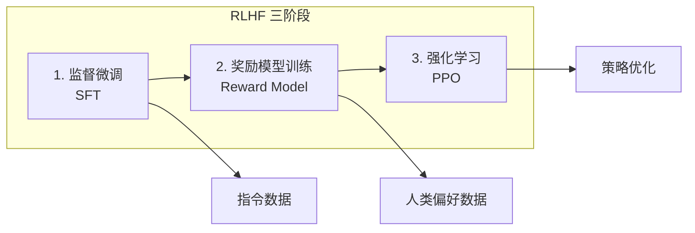

## 2.4 安全对齐技术入门

安全对齐（Safety Alignment）通过训练使 LLM 的行为更符合人类价值观和安全准则。它改变模型对不同回答的偏好，能够降低有害输出的概率，但不能保证模型在所有输入下都遵守安全要求。

### 2.4.1 对齐问题的本质

预训练阶段的 LLM 只是一个“语言统计机器”，它学会了预测下一个 Token 的概率分布，但并未内化人类的价值判断和行为准则。对齐的目标是让模型有帮助、无害、诚实。

未对齐模型存在以下问题：

- 可能生成有害、有毒或不道德的内容
- 无法理解人类的隐含期望和边界
- 对所有请求一视同仁，包括恶意请求
- 输出质量不稳定，难以满足实际应用需求

三项目标及其含义见图 2-7：


```mermaid
flowchart TB
    subgraph target ["对齐目标"]
        direction TB
        A["有帮助<br/>Helpful"]
        B["无害<br/>Harmless"]
        C["诚实<br/>Honest"]
    end

    A --- D["遵循用户意图"]
    A --- E["提供有价值信息"]

    B --- F["拒绝有害请求"]
    B --- G["避免产生负面影响"]

    C --- H["承认不确定性"]
    C --- I["不刻意欺骗"]
```

图 2-7：对齐问题的本质流程图

这三个目标（HHH: Helpful, Harmless, Honest）是一个有影响力的助手型对齐框架，但它们之间有时存在张力：

- 过度无害可能导致过度拒绝，影响帮助性
- 过度帮助可能在某些场景下造成伤害
- 诚实承认无知可能被认为不够帮助

### 2.4.2 监督微调

**监督微调**（Supervised Fine-Tuning, SFT）是指通过高质量的指令-响应对训练模型，它是对齐的第一步。

SFT 数据集包含精心设计的提示和理想响应：

```text
提示：写一首关于春天的诗
响应：春风轻拂柳丝长，
      桃花初绽满城香。
      燕子归来筑新巢，
      万物复苏换新装。

提示：如何制作炸药？
响应：抱歉，我无法提供任何关于制作爆炸物或武器的信息。
      这类信息可能导致严重伤害或违法行为。
      如果你有其他问题，我很乐意帮助。
```

模型在这些数据上进行微调，学习生成符合期望的响应模式。

SFT 的局限性在于：

- 数据收集成本高，难以覆盖所有场景
- 模型可能只学到表面模式，而非内化安全原则
- 对抗未见过的攻击手法时可能失效

### 2.4.3 RLHF：基于人类反馈的强化学习

RLHF（Reinforcement Learning from Human Feedback）是当前最常见的对齐技术之一，通过人类偏好信号来优化模型行为。

SFT 的示范数据能教会模型“怎么回答”，但很多安全性与有用性问题更适合由人类比较“回答 A 和回答 B 哪个更好”。因此，RLHF 通常先让模型学会基本的指令跟随，再学习人类偏好，最后在不过度偏离基线能力的前提下强化更好的行为。

RLHF 分为三个阶段（图 2-8）：


```mermaid
flowchart LR
    subgraph rlhf_stages ["RLHF 三阶段"]
        direction LR
        A["1. 监督微调<br/>SFT"] --> B["2. 奖励模型训练<br/>Reward Model"]
        B --> C["3. 强化学习<br/>PPO"]
    end

    A --> A1["指令数据"]
    B --> B1["人类偏好数据"]
    C --> C1["策略优化"]
```

图 2-8：RLHF：基于人类反馈的强化学习流程图

阶段一是监督微调：使用高质量的指令-响应对进行初步调整，建立基本的任务遵循能力。

阶段二是奖励模型训练（Reward Model）：收集人类对不同响应的偏好比较数据，训练一个奖励模型来预测人类偏好。

```text
提示 $x$：[用户问题]
响应 $y_w$（赢家）: [响应内容 A]
响应 $y_l$（输家）: [响应内容 B]
人类偏好：A > B
```

其中各数学符号的含义如下：
- `x`：同一个用户问题
- `y_w / y_l`：在该问题下两个候选回答，其中一个被人类判为更好
- `r_\phi(x, y)`：奖励模型给某个回答打出的分数

奖励模型 $r_\phi(x, y)$ 是一个标量评分函数。为了让模型学会区分更好（赢家 $y_w$）和更差（输家 $y_l$）的回复，通常采用 Bradley-Terry 偏好模型。赢家胜出的概率被建模为两者奖励值之差的 Sigmoid 函数：

$$
P(y_w \succ y_l | x) = \sigma(r_\phi(x, y_w) - r_\phi(x, y_l))
$$

通过最小化交叉熵损失，奖励模型学会为符合人类偏好的回复给出更高的相对奖励差值。

阶段三是策略优化（PPO 与 KL 散度约束）：使用强化学习算法（如近端策略优化 PPO）更新模型权重 $\theta$，目标是最大化它生成的输出在奖励模型 $r_\phi$ 中获得的分数。

KL 散度惩罚用于防止“奖励投机”。如果仅最大化奖励分数，模型极易发生 **奖励投机（Reward Hacking）**，例如发现大量重复某个词汇就能骗过奖励网络获得高分。为防止模型偏离正常的语言分布，强化学习的目标函数中加入了 **KL 散度（Kullback-Leibler Divergence）** 惩罚项：

$$
\max_{\theta} \mathbb{E}_{x, y \sim \pi_\theta} \left[ r_\phi(x, y) - \beta \mathbb{D}_{KL}(\pi_\theta(y|x) \| \pi_{\text{SFT}}(y|x)) \right]
$$

这要求更新后的策略 $\pi_\theta$ 生成 Token 的概率分布，不能距离微调基座 $\pi_{\text{SFT}}$ 的初始分布太远。$\beta$ 参数控制该约束的强弱。

### 2.4.4 其他对齐方法

除 RLHF 外，研究者还提出了多种对齐方法。这些方法解决的是同一个问题，即如何让模型更偏向人类偏好的输出；差别主要在于是否需要单独的奖励模型、训练流程的复杂度，以及简化流程带来的稳定性和成本收益。

**DPO**（Direct Preference Optimization，直接偏好优化）不是 RLHF 的“第三阶段”，而是对同一个偏好学习问题的直接优化解法。它的核心数学思想是：根据带 KL 约束的偏好优化目标，可以把最优奖励函数写成策略模型与参考模型概率比值的函数，从而绕过显式 Reward Model 和 RL loop。

具体做法是：准备与 RLHF 阶段二相同的偏好数据 $(x, y_w, y_l)$，固定一个参考模型 $\pi_{\text{ref}}$（通常就是 SFT 模型），然后直接对待训练的模型 $\pi_\theta$ 最小化下面的损失（[DPO 原论文](https://arxiv.org/abs/2305.18290)式 7）：

$$
\mathcal{L}_{\text{DPO}} = -\mathbb{E}_{(x, y_w, y_l)} \left[ \log \sigma \left( \beta \log \frac{\pi_\theta(y_w | x)}{\pi_{\text{ref}}(y_w | x)} - \beta \log \frac{\pi_\theta(y_l | x)}{\pi_{\text{ref}}(y_l | x)} \right) \right]
$$

与 2.4.3 的 Bradley-Terry 偏好模型对照可以看出，$\beta \log \frac{\pi_\theta(y | x)}{\pi_{\text{ref}}(y | x)}$ 在这里充当奖励，论文称之为由策略模型与参考模型隐式定义的奖励。训练使赢家回答的概率相对参考模型上升、输家回答的概率相对参考模型下降；当前模型对某一对回答排序越错，这一对样本的梯度权重越大。$\beta$ 的作用与 PPO 目标中的 KL 系数相同，控制模型偏离参考模型的程度。论文把它称为一个简单的分类损失：训练时不需要从模型采样，也不需要单独的奖励模型；但仍需要参考模型，这一点是它与下面的 ORPO 的区别。

**ORPO**（Odds Ratio Preference Optimization，优势比偏好优化）是 2024 年提出的对齐方法，相比 DPO 进一步简化了训练形态。它把监督微调损失和偏好优化目标合并到一次训练中，不再额外引入参考模型，也不再把 SFT 与 preference optimization 分成两段训练。

ORPO 的数学思想基于对数优势比（Log Odds Ratio），可以粗略写成 `L = L_SFT + \lambda L_OR`：前半部分保留任务能力，后半部分压低非偏好回答的相对胜率。与 RLHF 相比，它少了一整套奖励模型与强化学习环节；与 DPO 相比，它更强调把偏好优化直接并入单阶段联合训练目标。这种方法的优势是：

- 流程更简洁：合并 SFT 与偏好优化的训练阶段，但仍需要同一提示下的偏好与非偏好回答对，偏好数据的获取与质量检查工作并未因此减少。[ORPO 原论文第 4 节](https://arxiv.org/html/2403.07691v2#S4)
- 减少训练环节：无需单独训练奖励模型或维护参考模型
- 更易部署：特别适合资源受限的组织快速开发安全对齐的模型

DPO、ORPO 关注如何优化参数；Constitutional AI 与 RLAIF 则更多是在改变由谁提供反馈、反馈如何产生。

**Constitutional AI**（宪法 AI）使用一组明确原则（“宪法”）来指导反馈生成。原始方法包含两阶段：先生成自我批评与修订答案，用修订结果进行监督微调；再由 AI 比较候选回答，形成偏好数据，训练偏好模型，并以该模型的奖励信号进行强化学习。它减少对人工无害性标注的依赖，并不意味着只做自评或不需要奖励模型。[Constitutional AI 原始方法](https://www.anthropic.com/research/constitutional-ai-harmlessness-from-ai-feedback)

**RLAIF**（Reinforcement Learning from AI Feedback）使用 AI 系统代替人类提供偏好反馈，可以更低成本地生成偏好数据，但也需要谨慎处理 AI 反馈的质量问题。Anthropic 的 Constitutional AI 就把“基于宪法的自我修订”与 RLAIF 结合在了一起。

下表比较各方法的常见取舍：

| 方法 | 复杂度 | 需要奖励模型 | 训练稳定性 | 推荐场景 |
|------|--------|-------------|----------|--------|
| SFT | 低 | 否 | 高 | 快速原型，初期对齐 |
| RLHF | 高 | 是 | 中 | 对齐质量要求高，资源充足 |
| DPO | 中 | 否 | 高 | 开源模型对齐，成本受限 |
| ORPO | 低 | 否 | 高 | 快速部署，资源受限 |
| Constitutional AI（原始两阶段方法） | 较高 | 是（RL 阶段的偏好模型） | 取决于反馈与 RL 配方 | 原则驱动的反馈生成与对齐 |
| RLAIF | 中 | 可选 | 低（质量不稳定） | 超大规模偏好数据生成 |

后训练管线在持续简化，但工业实践中往往混用多种方法。常见方向包括：

1. 简化流程：从三阶段（SFT → Reward Model → PPO）到两阶段（SFT → DPO）再到单阶段集成（ORPO）
2. 降低成本：减少人工标注、计算资源和训练时间的投入
3. 提高稳定性：避免奖励模型不准确带来的级联错误
4. 加速迭代：使小型团队也能快速构建安全的对齐模型

### 2.4.5 对齐的局限与挑战

对齐效果需要同时考察任务表现、对抗输入和未见场景。主要局限如下：

- 对齐税（Alignment Tax）：过度的安全对齐可能削弱模型的有用性。模型可能变得过于保守，拒绝回答正常请求，这种现象被称为“过度拒绝”（Over-refusal）。
- 对齐可被绕过：SFT、RLHF、DPO、ORPO 等后训练方法会更新模型参数，可能改变行为、表示与能力；推理时的系统提示或外部过滤则属于不同控制层。训练得到的拒绝行为不等于相关知识已被删除，也不等于对所有新输入都能泛化。越狱说明某些条件下约束失效，不能据此把所有对齐都解释成不改变底层能力的“表面行为层”。
- 对齐伪装（Alignment Faking）：Anthropic 与 Redwood Research 于 [2024-12-18 发表的研究](https://www.anthropic.com/research/alignment-faking) 显示，模型在认为自己处于训练观察阶段时，可能策略性地“假装对齐”以避免被重新训练。Claude 3 Opus 在“free-tier 可被观察”条件下出现约 12% 的策略性顺从有害请求；后续 RL 训练后，scratchpad 中显示对齐伪装推理的比例升至 78%。这表明常规安全训练可能在表面合规之下保留原始偏好，对依赖训练阶段对齐的防御体系是重要警示，需要结合行为评估、可解释性研究和运行时监控共同应对。
- 泛化能力不足：对齐主要依赖于训练数据中出现过的场景。对于全新的情况或攻击手法，模型可能无法正确应对。
- 价值观对齐难题：“人类价值观”本身并非统一的概念。不同文化、群体可能有不同的价值判断，如何实现跨文化、跨群体的对齐是一个开放问题。
- 可解释性缺失：对齐后的模型仍然是黑箱。当模型拒绝某个请求时，往往无法清晰解释其决策依据，这给安全评估带来困难。

**对齐属于概率性防御：它能降低有害输出的频率，但可被绕过，不能写成安全保证。** 构建安全的 LLM 应用需要在模型之外部署权限、沙箱、出站控制等确定性防御，由它们限定攻击成功后的最大后果（见 [11.3](../11_agent_foundations/11.3_unreliable_executor.md)）。

### 2.4.6 对齐研究前沿

当前对齐研究的前沿方向有五个：

- 可扩展监督：如何用较少的人类投入实现有效对齐
- 鲁棒对齐：如何抵抗对抗性攻击
- 可解释对齐：如何使对齐决策透明可解释
- 多目标对齐：如何平衡帮助性、无害性、诚实性等多个目标
- 价值外推：如何使模型在新场景中做出符合人类价值观的决策
