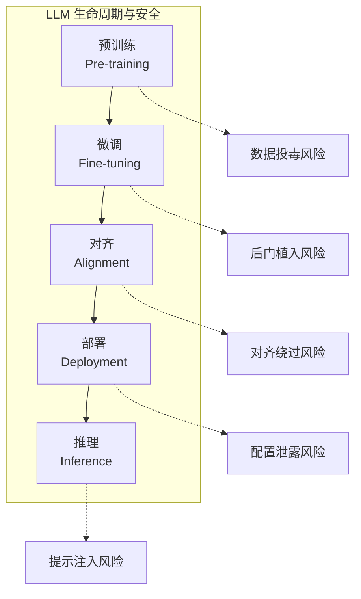

# 第二章：大语言模型安全基础

理解 LLM 的内部机制和工作原理，是开展安全研究的必要前提。本章将从技术角度深入剖析 LLM 的架构特点、训练过程和推理阶段，揭示其中蕴含的安全边界与潜在风险。同时，介绍安全对齐技术的基本概念，为后续章节的攻防技术学习奠定理论基础。

本章聚焦于 LLM 安全的技术基础，主要内容包括：

- **2.1 大语言模型架构与安全边界**：解析 Transformer 架构的核心组件，识别潜在的安全边界
- **2.2 训练过程中的安全考量**：分析预训练和微调阶段的安全风险
- **2.3 推理阶段的安全挑战**：探讨模型运行时面临的安全问题
- **2.4 安全对齐技术入门**：介绍 RLHF 等主流对齐方法的原理

通过本章的学习，读者将能够从技术层面理解 LLM 安全问题的根源，建立起攻防研究所需的理论框架。

