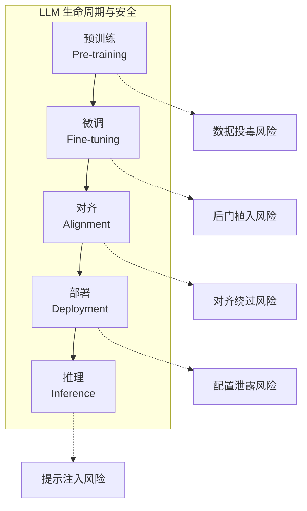

# 第二章 大语言模型安全基础

理解 LLM 的内部机制和工作原理，是开展安全研究的必要前提。本章从技术角度回答一个问题：LLM 的架构、训练、推理和对齐各环节分别有哪些安全边界与潜在风险。第一章给出了威胁全景，本章说明这些威胁的技术成因；后续各章的攻击与防御技术都以本章为基础。

## 学习目标

读完本章，读者应能：

1. 解释因果掩码和注意力机制为何都不构成安全边界，说明 Token 化带来的表示失配与特殊 Token 风险，并说明防御应落在哪些模型外部的边界上。
2. 列出预训练和微调阶段的主要风险（数据投毒与后门、隐私泄露、对齐退化、供应链攻击等），并把它们对应到相应的数据安全管控措施。
3. 描述一次推理请求的处理流程，指出提示词构建、Token 化、输出生成和资源消耗等环节的风险以及推理安全架构中的防护层。
4. 比较 SFT、RLHF、DPO、ORPO、Constitutional AI 和 RLAIF 的差异，并说明为什么对齐属于概率性防御、不能写成安全保证。
5. 判断部署推理模型时应检查哪几项：平台暴露何种推理内容、推理预算与失败路径如何控制、开放权重本地部署有哪些软件包装器无法消除的风险。

## 本章结构

- [2.1](2.1_architecture_boundary.md) 大语言模型架构与安全边界：Transformer 的哪些组件与安全有关，它们能否构成安全边界？
- [2.2](2.2_training_security.md) 训练过程中的安全考量：预训练和微调会引入哪些风险，如何管控训练数据与训练过程？
- [2.3](2.3_inference_security.md) 推理阶段的安全挑战：模型运行时面临哪些攻击，推理安全架构如何分层？
- [2.4](2.4_alignment_intro.md) 安全对齐技术入门：RLHF 等主流对齐方法如何工作，对齐能做到什么程度？
- [2.5](2.5_reasoning_model_security.md) 推理模型安全深度分析：OpenAI o 系列、DeepSeek-R1 等推理模型带来了哪些独特的安全挑战，如何控制？

各节的先后逻辑是：2.1 先讲模型结构这一静态基础；2.2、2.3 分别讨论训练与推理两个阶段的风险；2.4 介绍在模型内部起作用的安全对齐技术及其局限；2.5 以推理模型为专题，把前四节的概念用到一类新模型上。下图把各环节的典型风险放在 LLM 生命周期上。

```mermaid
flowchart TB
    subgraph "LLM 生命周期与安全"
    A["预训练<br/>Pre-training"] --> B["微调<br/>Fine-tuning"]
    B --> C["对齐<br/>Alignment"]
    C --> D["部署<br/>Deployment"]
    D --> E["推理<br/>Inference"]
    end

    A -.-> A1["数据投毒风险"]
    B -.-> B1["后门植入风险"]
    C -.-> C1["对齐绕过风险"]
    D -.-> D1["配置泄露风险"]
    E -.-> E1["提示注入风险"]
```
