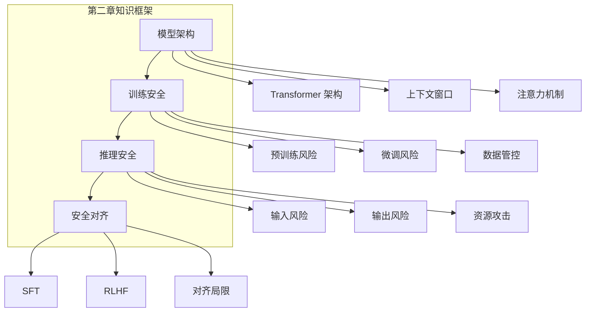

## 本章小结

本章深入探讨了 LLM 安全的技术基础，从模型架构到训练过程，从推理阶段到安全对齐，建立了理解 LLM 安全问题的技术框架。

### 核心要点回顾

**模型架构与安全边界**：Transformer 架构的自注意力机制是 LLM 能力的基础，但也创造了信息泄露和上下文污染的通道。上下文窗口、Token 化方式和模型参数都可能成为攻击面。

**训练安全**：预训练和微调阶段面临数据投毒、后门植入、隐私泄露等风险。需要建立完善的数据安全管控体系，包括来源审核、内容过滤、隐私保护和过程审计。

**推理安全**：推理阶段是攻击最集中的战场。系统提示可能泄露，用户输入可能包含恶意指令，模型输出可能违反安全策略。需要多层防护架构来应对这些挑战。

**安全对齐**：RLHF 等技术试图使模型行为符合人类价值观和安全准则。虽然取得了显著成效，但对齐仍存在可被绕过、泛化不足、过度拒绝等局限。

### 知识框架

图 2-1：知识框架架构图

### 安全要点速查

| 阶段 | 主要风险 | 关键防护 |
|------|----------|----------|
| 模型架构 | 信息泄露通道、上下文污染 | 理解边界、谨慎设计 |
| 预训练 | 数据投毒、隐私泄露 | 数据审核、隐私保护 |
| 微调 | 后门植入、对齐退化 | 数据验证、对齐维护 |
| 推理 | 提示注入、有害输出 | 输入输出过滤、监控 |
| 对齐 | 绕过攻击、过度拒绝 | 持续优化、多层防护 |

### 延伸思考

1. 随着模型规模的增长，安全边界会如何变化？
2. 如何在保护隐私的同时利用高质量数据进行训练？
3. 对齐技术的下一个突破方向可能是什么？

### 下章预告

第三章将介绍 LLM 安全领域的重要框架和标准，包括 OWASP LLM Top 10 的详细解读、NIST AI 风险管理框架，以及行业安全最佳实践。这些框架为安全评估和防护提供了系统化的指导。
