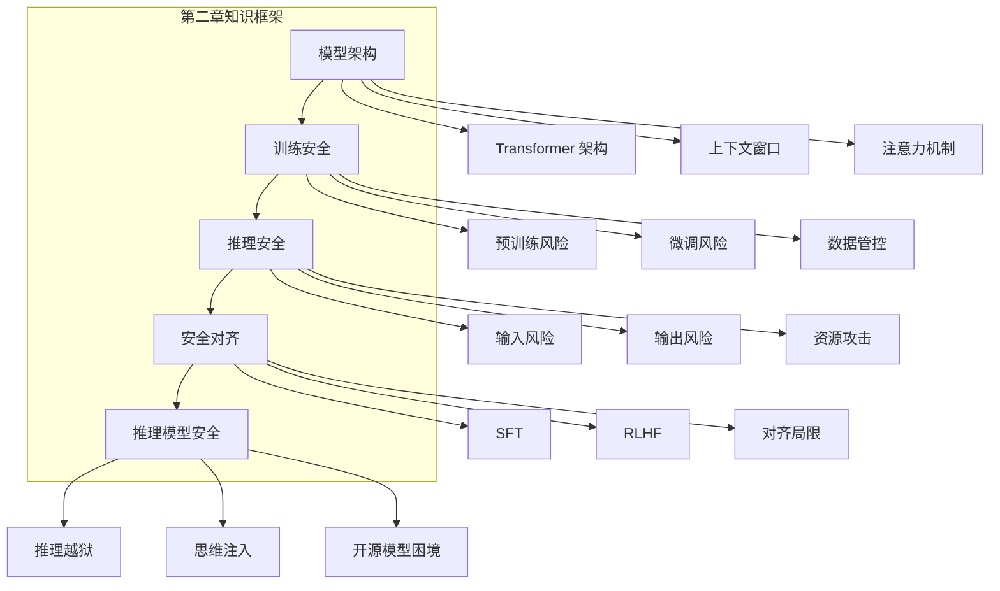

## 本章小结

本章深入探讨了 LLM 安全的技术基础，从模型架构到训练过程，从推理阶段到安全对齐，建立了理解 LLM 安全问题的技术框架。

### 核心要点回顾

**模型架构与安全边界**：Transformer 架构的自注意力机制是 LLM 能力的基础，但也创造了信息泄露和上下文污染的通道。上下文窗口、Token 化方式和模型参数都可能成为攻击面。

**训练安全**：预训练和微调阶段面临数据投毒、后门植入、隐私泄露等风险。需要建立完善的数据安全管控体系，包括来源审核、内容过滤、隐私保护和过程审计。

**推理安全**：推理阶段是攻击最集中的战场。系统提示可能泄露，用户输入可能包含恶意指令，模型输出可能违反安全策略。需要多层防护架构来应对这些挑战。

**安全对齐**：RLHF 等技术试图使模型行为符合人类价值观和安全准则。虽然取得了显著成效，但对齐仍存在可被绕过、泛化不足、过度拒绝等局限。

**推理模型安全**：以 OpenAI o 系列和 DeepSeek-R1 为代表的推理模型通过扩展推理链提升能力，但也引入了思维注入、推理链破坏、预算耗尽等新型攻击向量。开源推理模型的本地部署更面临权重篡改和安全包装被绕过的根本困境，需要法律与技术的组合防御。

### 知识框架

```mermaid
graph TB
    subgraph "第二章知识框架"
    A["模型架构"] --> B["训练安全"]
    B --> C["推理安全"]
    C --> D["安全对齐"]
    D --> E["推理模型安全"]
    end

    A --> A1["Transformer 架构"]
    A --> A2["上下文窗口"]
    A --> A3["注意力机制"]

    B --> B1["预训练风险"]
    B --> B2["微调风险"]
    B --> B3["数据管控"]

    C --> C1["输入风险"]
    C --> C2["输出风险"]
    C --> C3["资源攻击"]

    D --> D1["SFT"]
    D --> D2["RLHF"]
    D --> D3["对齐局限"]

    E --> E1["推理越狱"]
    E --> E2["思维注入"]
    E --> E3["开源模型困境"]
```

图 2-15：知识框架架构图

### 安全要点速查

| 阶段 | 主要风险 | 关键防护 |
|------|----------|----------|
| 模型架构 | 信息泄露通道、上下文污染 | 理解边界、谨慎设计 |
| 预训练 | 数据投毒、隐私泄露 | 数据审核、隐私保护 |
| 微调 | 后门植入、对齐退化 | 数据验证、对齐维护 |
| 推理 | 提示注入、有害输出 | 输入输出过滤、监控 |
| 对齐 | 绕过攻击、过度拒绝 | 持续优化、多层防护 |
| 推理模型 | 思维注入、推理链破坏、预算耗尽 | 推理监控、预算管理、联邦推理 |

### 延伸思考

1. 随着模型规模的增长，安全边界会如何变化？
2. 如何在保护隐私的同时利用高质量数据进行训练？
3. 对齐技术的下一个突破方向可能是什么？
4. 推理模型的推理链透明性是安全优势还是新的攻击面？

## 与其他章节的关联

- **攻击展开**：第 4-5 章展开提示注入和越狱攻击的具体细节，验证本章架构边界的脆弱性
- **对齐实践**：第 2.4 节对齐技术在第 5 章越狱防御中得到实践应用
- **架构防御**：第 8 章将模型架构边界转化为防御设计，落地本章的理论知识

### 下章预告

[第三章](../03_frameworks/README.md)将介绍 LLM 安全领域的重要框架和标准，包括 OWASP LLM Top 10 的详细解读、NIST AI 风险管理框架，以及行业安全最佳实践。这些框架为安全评估和防护提供了系统化的指导。

---

> 📝 **发现错误或有改进建议？** 欢迎提交 [Issue](https://github.com/yeasy/ai_security_guide/issues) 或 [PR](https://github.com/yeasy/ai_security_guide/pulls)。
