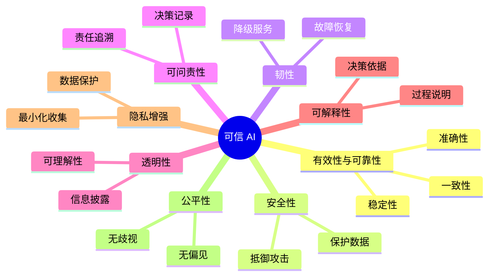
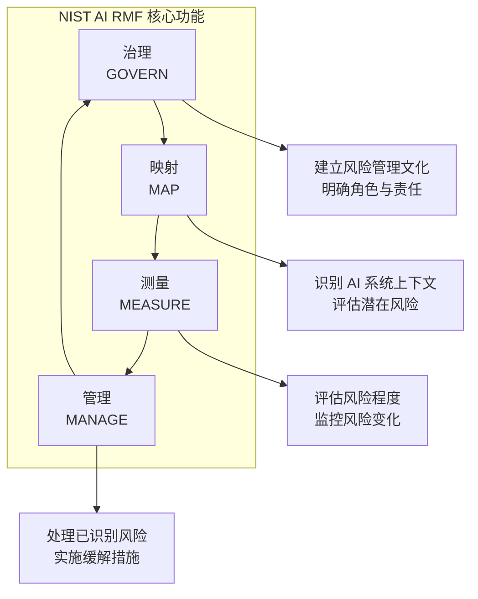

## 3.2 NIST AI 风险管理框架

美国国家标准与技术研究院（NIST）发布的《AI 风险管理框架》（AI RMF）为组织管理 AI 系统风险提供了全面的指导。本节将介绍该框架的核心内容及其在 LLM 安全中的应用。

### 3.2.1 NIST AI RMF 概述

NIST AI RMF 于 2023 年 1 月正式发布，是美国政府推动负责任 AI 发展的重要举措。该框架旨在帮助组织以结构化的方式识别、评估和管理 AI 系统的风险。  
在生成式 AI 方面，NIST 又发布了 **GenAI Profile（NIST AI 600-1）**，用于把 RMF 原则具体化到 GenAI 场景（见附录 C-37）。

**框架特点**：

- **自愿性**：非强制性标准，可根据组织需求灵活采用
- **技术中立**：适用于各类 AI 技术，包括 LLM
- **全生命周期**：覆盖 AI 系统的设计、开发、部署和运营
- **风险导向**：以风险管理为核心思想

### 3.2.2 可信 AI 的特征

NIST AI RMF 定义了可信 AI 系统应具备的八项特征：

图 3-1：可信 AI 的特征思维导图

**八项特征说明**：

| 特征 | 描述 | LLM 相关考量 |
|------|------|--------------|
| 有效性与可靠性 | 系统按预期运行并产生可靠输出 | 减少幻觉，保持输出质量 |
| 安全性 | 保护系统免受攻击和滥用 | 防御提示注入、越狱等攻击 |
| 韧性 | 在异常情况下保持功能 | 优雅降级，故障恢复 |
| 可问责性 | 明确责任归属 | 日志记录，审计追踪 |
| 透明性 | 向利益相关者提供适当信息 | 披露 AI 使用，说明局限性 |
| 可解释性 | 使决策过程可理解 | 解释模型输出的依据 |
| 隐私增强 | 保护个人隐私 | 数据脱敏，访问控制 |
| 公平性 | 系统行为公平无偏见 | 检测和缓解偏见 |

### 3.2.3 AI RMF 核心功能

NIST AI RMF 定义了四项核心功能，构成了风险管理的循环流程：

图 3-2：AI RMF 核心功能流程图

**治理（GOVERN）**：

建立 AI 风险管理的组织基础：
- 制定 AI 政策和治理结构
- 明确角色、责任和权限
- 培养风险意识文化
- 确保必要的资源和能力

**映射（MAP）**：

识别和理解 AI 系统的风险上下文：
- 确定 AI 系统的用途和利益相关者
- 识别潜在的风险因素
- 评估风险的范围和影响
- 考虑社会和伦理影响

**测量（MEASURE）**：

评估和监控 AI 风险：
- 开发风险评估指标
- 建立基线和阈值
- 持续监控风险状态
- 记录和报告评估结果

**管理（MANAGE）**：

处理已识别的风险：
- 制定风险应对策略
- 实施缓解措施
- 监控措施有效性
- 持续改进风险管理过程

### 3.2.4 在 LLM 安全中的应用

将 NIST AI RMF 应用于 LLM 安全，需要结合 AI 600-1 的生成式 AI 场景化建议：

**治理层面**：

- 建立 LLM 安全团队和责任体系
- 制定 LLM 可接受使用政策
- 建立安全事件响应流程
- 定期进行安全培训

**映射层面**：

- 识别 LLM 应用的攻击面
- 评估各类攻击的可能性和影响
- 考虑监管合规要求
- 评估供应链风险

**测量层面**：

- 定义 LLM 安全评估指标
- 建立安全测试程序（如红队测试）
- 监控生产环境中的安全事件
- 追踪安全漏洞和修复情况

**管理层面**：

- 实施多层防护措施
- 制定应急响应计划
- 持续更新安全策略
- 与安全社区保持信息共享

### 3.2.5 实施路径建议

组织可以按以下步骤逐步采用 NIST AI RMF：

**阶段一：启动（1-2 个月）**
- 组建跨职能 AI 安全工作组
- 进行 AI 风险意识培训
- 盘点现有 AI/LLM 系统

**阶段二：评估（2-3 个月）**
- 对现有系统进行风险映射
- 识别高风险领域
- 差距分析：当前状态 vs. 目标状态

**阶段三：实施（持续）**
- 制定风险缓解计划
- 实施优先级措施
- 建立监控和报告机制

**阶段四：成熟（长期）**
- 持续改进风险管理过程
- 与行业最佳实践对齐
- 推动组织文化转变

NIST AI RMF 为 LLM 安全提供了系统化的思考框架。尽管其具体建议相对抽象，但与 OWASP LLM Top 10 等更具体的标准结合使用，可以构建全面的 LLM 安全管理体系。
