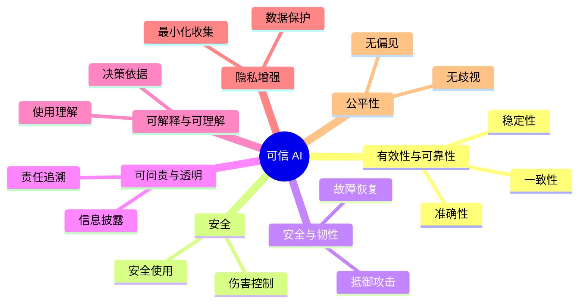
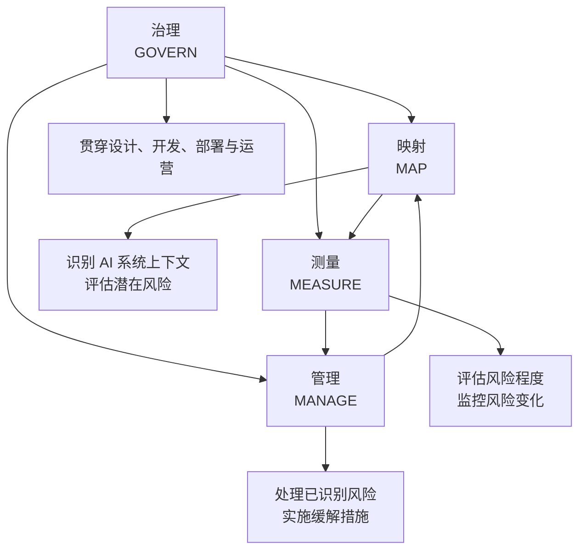

## 3.2 NIST AI 风险管理框架

美国国家标准与技术研究院（NIST）发布的《AI 风险管理框架》（AI RMF）为组织管理 AI 系统风险提供了全面的指导。本节将介绍该框架的核心内容及其在 LLM 安全中的应用。

### 3.2.1 NIST AI RMF 概述

NIST AI RMF 于 2023 年 1 月正式发布，是美国政府推动负责任 AI 发展的重要举措。该框架旨在帮助组织以结构化的方式识别、评估和管理 AI 系统的风险。
在生成式 AI 方面，NIST 又发布了 **GenAI Profile（NIST AI 600-1）**。官方将其定义为 AI RMF 1.0 的 **cross-sectoral profile** 与 companion resource，用于把 RMF 原则映射到 GenAI 场景（见附录 C-40）。

**框架特点**
- **自愿性**：非强制性标准，可根据组织需求灵活采用
- **技术中立**：适用于各类 AI 技术，包括 LLM
- **全生命周期**：覆盖 AI 系统的设计、开发、部署和运营
- **风险导向**：以风险管理为核心思想

### 3.2.2 NIST AI 600-1 GenAI Profile 要点

**NIST AI 600-1** 不是一套新的独立框架，而是 AI RMF 1.0 在生成式 AI 领域的 profile。公开文本特别强调了四类需要重点关注的 GenAI considerations：

**GenAI 特有的关键管理点**

| 重点 consideration | 公开资料中的关注点 | 对 LLM 应用的含义 |
|---------|----------------|-----------------|
| **Governance** | 组织治理、角色责任、风险容忍度 | 明确谁能上线模型、谁审批高风险功能 |
| **Content Provenance** | 内容来源、标注、可追溯性 | 处理 RAG 来源、合成内容标识、审计链 |
| **Pre-deployment Testing** | 上线前测试与评估 | 红队测试、场景化评估、越狱/泄露测试 |
| **Incident Disclosure** | 事件记录、通报与响应 | 建立生成式 AI 事故上报和响应流程 |

**Agent 和工具调用场景的补充检查项**

下面这些问题是基于 RMF / AI 600-1 思路整理出的工程化扩展，而不是 NIST 原文逐条规定的检查项：
- [ ] 工具白名单是否已明确定义并绑定到用户/任务角色？
- [ ] 高风险工具（如数据库修改、资金转账）是否启用了 HITL 审批？
- [ ] 是否定期进行“工具链权限提升”的红队测试？
- [ ] 是否建立了工具返回值注入的检测机制？
- [ ] 是否对所接入的插件、连接器和第三方组件进行了来源审查与完整性验证？

### 3.2.3 可信 AI 的特征

NIST AI RMF 定义了可信 AI 系统应具备的七组特征：

```mermaid
mindmap
  root((可信 AI))
    有效性与可靠性
      准确性
      稳定性
      一致性
    安全
      伤害控制
      安全使用
    安全与韧性
      抵御攻击
      故障恢复
    可问责与透明
      责任追溯
      信息披露
    可解释与可理解
      决策依据
      使用理解
    隐私增强
      数据保护
      最小化收集
    公平性
      无歧视
      无偏见
```

图 3-1：可信 AI 的七组特征思维导图

**七组特征说明**
| 特征 | 描述 | LLM 相关考量 |
|------|------|--------------|
| 有效性与可靠性 | 系统在预期用途下产生稳定、可信结果 | 减少误答，保持输出质量 |
| 安全 | 降低 AI 使用带来的现实伤害 | 高风险任务设置边界与人工复核 |
| 安全与韧性 | 抵御攻击、滥用和异常场景 | 防御提示注入、越狱、故障恢复 |
| 可问责与透明 | 明确责任归属并向利益相关者提供适当信息 | 日志记录、审计追踪、披露 AI 使用 |
| 可解释与可理解 | 让使用者理解系统用途、依据与局限 | 解释模型输出的依据与适用范围 |
| 隐私增强 | 保护个人隐私 | 数据脱敏，访问控制 |
| 公平性及有害偏差可管理 | 系统行为公平并管理偏差风险 | 检测和缓解偏见 |

### 3.2.4 AI RMF 核心功能

NIST AI RMF 定义了四项核心功能。需要注意的是，它们不是严格顺序执行的一次性流水线；其中 **GOVERN** 横跨全生命周期，而 `MAP / MEASURE / MANAGE` 会按具体系统和阶段反复迭代：

```mermaid
flowchart TB
    A["治理<br/>GOVERN"] --> B["映射<br/>MAP"]
    A --> C["测量<br/>MEASURE"]
    A --> D["管理<br/>MANAGE"]
    B --> C
    C --> D
    D --> B

    A --> A1["贯穿设计、开发、部署与运营"]
    B --> B1["识别 AI 系统上下文<br/>评估潜在风险"]
    C --> C1["评估风险程度<br/>监控风险变化"]
    D --> D1["处理已识别风险<br/>实施缓解措施"]
```

图 3-2：AI RMF 核心功能流程图

**治理（GOVERN）**
建立 AI 风险管理的组织基础：
- 制定 AI 政策和治理结构
- 明确角色、责任和权限
- 培养风险意识文化
- 确保必要的资源和能力

**映射（MAP）**
识别和理解 AI 系统的风险上下文：
- 确定 AI 系统的用途和利益相关者
- 识别潜在的风险因素
- 评估风险的范围和影响
- 考虑社会和伦理影响

**测量（MEASURE）**
评估和监控 AI 风险：
- 开发风险评估指标
- 建立基线和阈值
- 持续监控风险状态
- 记录和报告评估结果

**管理（MANAGE）**
处理已识别的风险：
- 制定风险应对策略
- 实施缓解措施
- 监控措施有效性
- 持续改进风险管理过程

### 3.2.5 在 LLM 安全中的应用

将 NIST AI RMF 应用于 LLM 安全，需要结合 AI 600-1 的生成式 AI 场景化建议。更直观的理解方式是：把同一个 LLM 系统依次放进 `GOVERN -> MAP -> MEASURE -> MANAGE` 这四个动作里，确认组织是否真正建立了治理、识别了风险、量化了风险，并把风险闭环处理掉。

例如，对“企业内部文档问答助手”这样一个系统：
- `GOVERN`：定义谁可以接入模型、谁审批高风险功能、哪些数据禁止进入上下文
- `MAP`：识别提示注入、跨租户泄露、供应链和错误信息等主要风险
- `MEASURE`：建立越狱成功率、敏感信息泄露率、误答率等指标
- `MANAGE`：基于这些指标调整权限、过滤策略、人工复核与事件响应流程

下面这些映射是解释性扩展，用来帮助读者把 RMF 套到 LLM 场景中，而不是 NIST 原文逐条列出的固定控制项。

**治理层面**
- 建立 LLM 安全团队和责任体系
- 制定 LLM 可接受使用政策
- 建立安全事件响应流程
- 定期进行安全培训

**映射层面**
- 识别 LLM 应用的攻击面
- 评估各类攻击的可能性和影响
- 考虑监管合规要求
- 评估供应链风险

**测量层面**
- 定义 LLM 安全评估指标
- 建立安全测试程序（如红队测试）
- 监控生产环境中的安全事件
- 追踪安全漏洞和修复情况

**管理层面**
- 实施多层防护措施
- 制定应急响应计划
- 持续更新安全策略
- 与安全社区保持信息共享

### 3.2.6 实施路径建议

下面是一条示例性的实施路径，用来帮助团队从“知道框架”走到“开始落地”；其中时间节奏是经验估计，不是 NIST 官方要求：

**阶段一：启动（1-2 个月）**
- 组建跨职能 AI 安全工作组
- 进行 AI 风险意识培训
- 盘点现有 AI/LLM 系统

**阶段二：评估（2-3 个月）**
- 对现有系统进行风险映射
- 识别高风险领域
- 差距分析：当前状态 vs. 目标状态

**阶段三：实施（持续）**
- 制定风险缓解计划
- 实施优先级措施
- 建立监控和报告机制

**阶段四：成熟（长期）**
- 持续改进风险管理过程
- 与行业最佳实践对齐
- 推动组织文化转变

NIST AI RMF 为 LLM 安全提供了系统化的思考框架。尽管其具体建议相对抽象，但与 OWASP LLM Top 10 等更具体的标准结合使用，可以构建全面的 LLM 安全管理体系。
