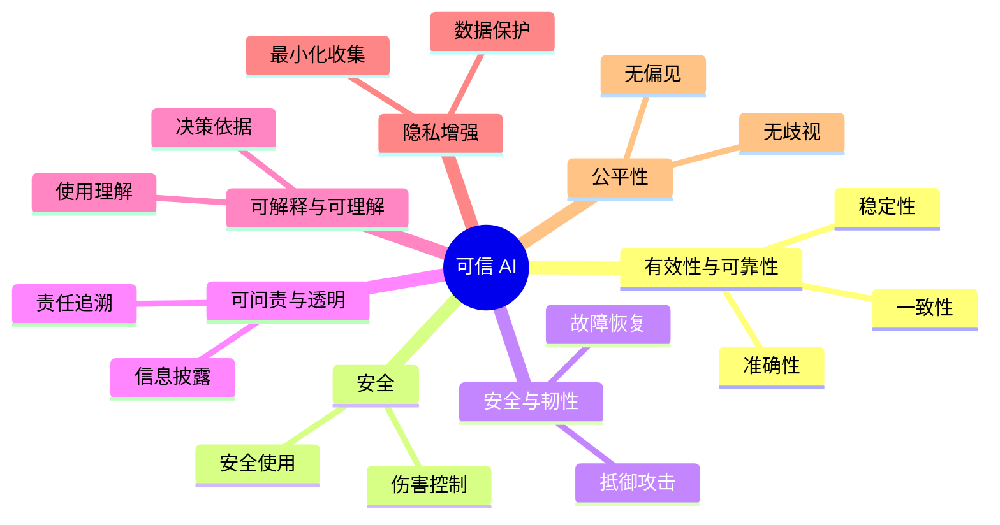
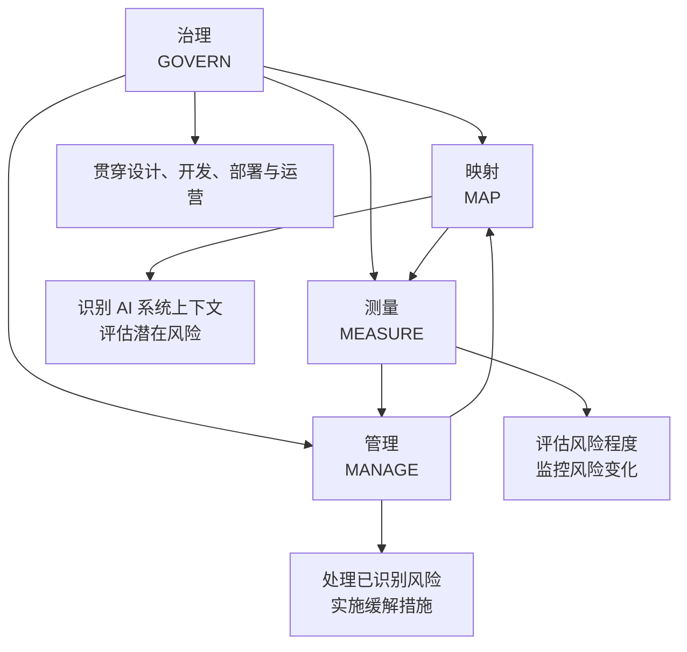

## 3.2 NIST AI 风险管理框架

美国国家标准与技术研究院（NIST）发布的《AI 风险管理框架》（AI RMF）为组织管理 AI 系统风险提供了全面的指导。本节回答“组织如何以结构化的方式治理 AI 风险”：AI RMF 用七组特征定义可信 AI 应达到的目标，用治理、映射、测量、管理四项核心功能组织风险管理活动，AI 600-1 再把这套框架落到生成式 AI 场景。其具体建议相对抽象，需与 OWASP LLM Top 10 等更具体的标准结合使用，才能构建全面的 LLM 安全管理体系。下面先概述框架（3.2.1），再依次介绍七组可信特征（3.2.2）、四项核心功能（3.2.3）和 AI 600-1（3.2.4），最后说明如何应用于 LLM 安全（3.2.5）并给出实施路径（3.2.6）。

### 3.2.1 NIST AI RMF 概述

NIST AI RMF 于 2023 年 1 月正式发布，是美国政府推动负责任 AI 发展的重要举措。该框架旨在帮助组织以结构化的方式识别、评估和管理 AI 系统的风险。

在生成式 AI 方面，NIST 于 2024 年 7 月 26 日发布了 **GenAI Profile（NIST AI 600-1）**。官方将其定义为 AI RMF 1.0 的 **cross-sectoral profile** 与 companion resource，用于把 RMF 原则映射到 GenAI 场景（见[附录 C-41](../16_appendix/C_references.md)）。

**框架特点**

- 自愿性：非强制性标准，可根据组织需求灵活采用
- 技术中立：适用于各类 AI 技术，包括 LLM
- 全生命周期：覆盖 AI 系统的设计、开发、部署和运营
- 风险导向：以风险管理为核心思想

### 3.2.2 可信 AI 的特征

NIST AI RMF 定义了可信 AI 系统应具备的七组特征：

```mermaid
mindmap
  root((可信 AI))
    有效性与可靠性
      准确性
      稳定性
      一致性
    安全
      伤害控制
      安全使用
    安全与韧性
      抵御攻击
      故障恢复
    可问责与透明
      责任追溯
      信息披露
    可解释与可理解
      决策依据
      使用理解
    隐私增强
      数据保护
      最小化收集
    公平性
      无歧视
      无偏见
```

图 3-1：可信 AI 的七组特征思维导图

**七组特征说明**

| 特征 | 描述 | LLM 相关考量 |
|------|------|--------------|
| 有效性与可靠性 | 系统在预期用途下产生稳定、可信结果 | 减少误答，保持输出质量 |
| 安全 | 降低 AI 使用带来的现实伤害 | 高风险任务设置边界与人工复核 |
| 安全与韧性 | 抵御攻击、滥用和异常场景 | 防御提示注入、越狱、故障恢复 |
| 可问责与透明 | 明确责任归属并向利益相关者提供适当信息 | 日志记录、审计追踪、披露 AI 使用 |
| 可解释与可理解 | 让使用者理解系统用途、依据与局限 | 解释模型输出的依据与适用范围 |
| 隐私增强 | 保护个人隐私 | 数据脱敏，访问控制 |
| 公平性及有害偏差可管理 | 系统行为公平并管理偏差风险 | 检测和缓解偏见 |

### 3.2.3 AI RMF 核心功能

NIST AI RMF 定义了四项核心功能。它们并非严格顺序执行的一次性流水线：GOVERN 贯穿全生命周期，`MAP / MEASURE / MANAGE` 则按具体系统和阶段反复迭代：

| 官方标识符 | 官方英文名 | 本节中文名 | 作用 |
|------------|------------|------------|------|
| GOVERN | Govern | 治理 | 建立贯穿生命周期的风险管理文化、政策与责任 |
| MAP | Map | 映射 | 建立系统、用途、利益相关者与风险上下文 |
| MEASURE | Measure | 测量 | 分析、评估、监控并记录风险 |
| MANAGE | Manage | 管理 | 排定风险优先级、实施响应并持续复核 |

> 标识符和英文名来自 NIST AIRC 发布的机器可读 Playbook；本表的版本、来源与章节绑定统一维护在 [`data/framework_crosswalk.json`](../data/framework_crosswalk.json)。

```mermaid
flowchart TB
    A["治理<br/>GOVERN"] --> B["映射<br/>MAP"]
    A --> C["测量<br/>MEASURE"]
    A --> D["管理<br/>MANAGE"]
    B --> C
    C --> D
    D --> B

    A --> A1["贯穿设计、开发、部署与运营"]
    B --> B1["识别 AI 系统上下文<br/>评估潜在风险"]
    C --> C1["评估风险程度<br/>监控风险变化"]
    D --> D1["处理已识别风险<br/>实施缓解措施"]
```

图 3-2：AI RMF 核心功能流程图

四项功能的主要活动如下：

- 治理（GOVERN）：建立 AI 风险管理的组织基础，包括制定 AI 政策和治理结构，明确角色、责任和权限，培养风险意识文化，确保必要的资源和能力。
- 映射（MAP）：识别和理解 AI 系统的风险上下文，包括确定 AI 系统的用途和利益相关者，识别潜在的风险因素，评估风险的范围和影响，考虑社会和伦理影响。
- 测量（MEASURE）：评估和监控 AI 风险，包括开发风险评估指标，建立基线和阈值，持续监控风险状态，记录和报告评估结果。
- 管理（MANAGE）：处理已识别的风险，包括制定风险应对策略，实施缓解措施，监控措施有效性，持续改进风险管理过程。

**类别与子类别。** 四项功能只是最上层。AI RMF 把每项功能再分为类别（category）和子类别（subcategory），子类别是可以逐条核对的最小单位，用“功能名 + 编号”标识。GOVERN、MAP、MEASURE、MANAGE 分别有 6、5、4、4 个类别，合计 19 个类别、72 个子类别。例如 MEASURE 2 是“依据可信特征评估 AI 系统”，其下的 MEASURE 2.7 要求对 MAP 阶段识别出的 AI 系统安全性与韧性进行评估并记录。框架同时说明，子类别之下的行动不构成检查清单，也不必按固定顺序执行；组织可以只选用部分类别和子类别，通常在落实 GOVERN 之后从 MAP 开始，再进入 MEASURE 或 MANAGE（[AI RMF 1.0](https://nvlpubs.nist.gov/nistpubs/ai/NIST.AI.100-1.pdf) 第 5 节）。

**Playbook。** 子类别写的是要达到的结果，怎样达到由配套的 AI RMF Playbook 给出建议。Playbook 为 72 个子类别各提供一条记录，包括对该子类别的说明、建议行动、一组“组织可以记录的内容”问题和参考文献，网页版之外还有机器可读的 [JSON 版本](https://airc.nist.gov/docs/playbook.json)。以 MEASURE 2.7 为例，建议行动包括：建立并跟踪安全测试与指标（如红队活动、异常事件的频率、系统停机时间、事件响应时间、被绕过所需的时间），用红队演练在对抗或压力条件下测试系统，并把错误与攻击模式共享给事件数据库和使用类似系统的组织。Playbook 与框架一样是自愿采用的，组织可以从中挑选适合自己的部分。

**Profile 与差距分析。** Profile 是指 AI RMF 的功能、类别和子类别在某一具体场景中的落实方式。框架定义了三种：用例 Profile，针对某一具体应用，如招聘；时间 Profile，分为描述现状的 Current Profile 和描述目标的 Target Profile；跨领域 Profile，覆盖可跨用例使用的模型或应用，框架原文举的例子就包括大语言模型的使用。对比 Current Profile 与 Target Profile 即得到需要弥补的差距，组织据此按类别或子类别制定行动计划，3.2.6 中的差距分析即按此进行。框架不规定 Profile 的模板（AI RMF 1.0 第 6 节）；3.2.4 的 AI 600-1 就是一个跨领域 Profile。

### 3.2.4 NIST AI 600-1 GenAI Profile 要点

**NIST AI 600-1** 是 AI RMF 1.0 在生成式 AI 领域的 profile，而非新的独立框架。它在上述框架之上补充了两部分内容：四类 GenAI considerations，以及 12 类生成式 AI 风险。

**GenAI 特有的关键管理点**

公开文本重点强调了四类 GenAI considerations：

| 重点 consideration | 公开资料中的关注点 | 对 LLM 应用的含义 |
|---------|----------------|-----------------|
| **Governance** | 组织治理、角色责任、风险容忍度 | 明确谁能上线模型、谁审批高风险功能 |
| **Content Provenance** | 内容来源、标注、可追溯性 | 处理 RAG 来源、合成内容标识、审计链 |
| **Pre-deployment Testing** | 上线前测试与评估 | 红队测试、场景化评估、越狱/泄露测试 |
| **Incident Disclosure** | 事件记录、通报与响应 | 建立生成式 AI 事故上报和响应流程 |

**AI 600-1 定义的 12 类生成式 AI 风险**

上述四类 considerations 是跨领域的管理重点；AI 600-1 的核心贡献是系统梳理了生成式 AI 特有或被显著放大的 12 类风险，并围绕 `GOVERN / MAP / MEASURE / MANAGE` 给出了 200 多条建议动作（见[附录 C-41](../16_appendix/C_references.md)）。下表列出这 12 类风险及其在本书中的对应章节，可直接用作覆盖度自查清单：

| NIST AI 600-1 风险类别 | 含义要点 | 本书对应 |
|------------------------|----------|----------|
| CBRN 信息或能力 | 降低化学、生物、放射性、核武器相关危险信息的获取门槛 | [第 5 章](../05_jailbreak/README.md)越狱 |
| 虚构（Confabulation） | 模型自信地生成虚假或误导性内容（即“幻觉”） | [11.6.2](../11_agent_foundations/11.6_typical_failures.md) 幻觉驱动的工具调用 |
| 危险、暴力或仇恨内容 | 生成危险、暴力或仇恨性内容 | [9.2](../09_io_protection/9.2_output_moderation.md) 输出审核、[第 5 章](../05_jailbreak/README.md)越狱 |
| 数据隐私 | 训练数据记忆与提取、个人信息泄露 | [6.4](../06_data_model_attacks/6.4_privacy_attacks.md) 隐私攻击、[8.5](../08_architecture/8.5_privacy_enhancing.md) 隐私增强技术、[9.3](../09_io_protection/9.3_sensitive_data.md) 敏感数据 |
| 环境影响 | 训练与推理的算力与能耗成本 | 可持续性议题，本书未展开 |
| 有害偏见或同质化 | 放大社会偏见、输出趋同 | [第 2 章](../02_fundamentals/README.md)基础、[第 15 章](../15_governance/README.md)治理 |
| 人机配置 | 过度依赖、自动化偏误、人机协作失当 | [12.6](../12_agent_attack_surface/12.6_human_layer.md) 人机交互层、[第 10 章](../10_operations/README.md)运营 |
| 信息完整性 | 深度伪造、虚假信息、内容溯源 | [9.4](../09_io_protection/9.4_watermarking_detection.md) 水印与检测、[15.3](../15_governance/15.3_emerging_threats.md) 深度伪造 |
| 信息安全 | 提示注入、模型提取、越权等安全攻击 | 第 4–8 章（本书攻击与架构主体）、第 11–14 章（智能体） |
| 知识产权 | 训练数据与输出的版权问题 | [第 15 章](../15_governance/README.md)治理（合规） |
| 淫秽、贬损或滥用性内容 | 生成淫秽、贬损内容（含 CSAM/NCII 等） | [9.2](../09_io_protection/9.2_output_moderation.md) 输出审核 |
| 价值链与组件集成 | 第三方模型、数据与组件的供应链风险 | [8.6](../08_architecture/8.6_supply_chain.md) 供应链安全 |

> 上表“本书对应”一列是本书建立的映射，不是 NIST 原文的逐条章节绑定。实践中可先用这 12 类风险做覆盖度盘点，再用 `GOVERN/MAP/MEASURE/MANAGE`（见 3.2.3）落实到具体动作。

**建议动作的组织方式。** AI 600-1 的建议动作按 AI RMF 子类别分表列出，每表先给出子类别原文，再逐条列动作。每条动作有一个编号，格式为“功能缩写-子类别号-序号”，GV、MP、MS、MG 分别对应 GOVERN、MAP、MEASURE、MANAGE，例如 GV-1.1-001 是 GOVERN 1.1 下的第一条。每条动作还带有风险标签，指明它针对上表中的哪几类风险；每张表末尾列出相关的 AI 参与者任务，如 AI 部署、运行与监控、测试、评估、验证与确认（TEVV）。AI 600-1 只为部分子类别给出建议动作；它说明 AI RMF 与 Playbook 中的活动本来就适用于生成式 AI，这些动作是在其上的补充。以安全最相关的 MEASURE 2.7 为例，该表有 9 条动作，其中：

- MS-2.7-001：用成熟的安全措施评估后门、受污染的依赖、数据泄露、窃听、中间人攻击、逆向工程、自主智能体、模型窃取或权重泄露等威胁的可能性与严重程度；
- MS-2.7-007：用 AI 红队评估系统抵御三类攻击的韧性：借系统攻击其他系统（如生成恶意代码、增强钓鱼内容），针对生成式 AI 的攻击（如提示注入），机器学习攻击（如对抗样本、数据投毒、成员推断、模型窃取、海绵样本）；
- MS-2.7-008：验证微调没有削弱安全控制。

使用时，可以先从 12 类风险中选出与本系统相关的几类，按风险标签筛出对应的建议动作，再把它们并入 3.2.3 所述的子类别落实工作和 Target Profile。

**Agent 和工具调用场景的补充检查项**

以下问题是基于 RMF / AI 600-1 思路整理的工程化扩展，并非 NIST 原文逐条规定的检查项：

- [ ] 工具白名单是否已明确定义并绑定到用户/任务角色？
- [ ] 高风险工具（如数据库修改、资金转账）是否启用了人工审核（HITL）审批？
- [ ] 是否定期进行“工具链权限提升”的红队测试？
- [ ] 是否建立了工具返回值注入的检测机制？
- [ ] 是否对所接入的插件、连接器和第三方组件进行了来源审查与完整性验证？

### 3.2.5 在 LLM 安全中的应用

将 NIST AI RMF 应用于 LLM 安全，需要结合 AI 600-1 的生成式 AI 场景化建议。一种直观的理解方式是把同一个 LLM 系统依次放入 `GOVERN -> MAP -> MEASURE -> MANAGE` 四项功能中，确认组织是否已建立治理、识别风险、量化风险，并对风险进行闭环处理。

以“企业内部文档问答助手”为例：

- `GOVERN`：定义谁可以接入模型、谁审批高风险功能、哪些数据禁止进入上下文
- `MAP`：识别提示注入、跨租户泄露、供应链和错误信息等主要风险
- `MEASURE`：建立越狱成功率、敏感信息泄露率、误答率等指标
- `MANAGE`：基于这些指标调整权限、过滤策略、人工复核与事件响应流程

推广到一般的 LLM 系统，四项功能可对应以下工作。这一映射是将 RMF 应用于 LLM 场景的解释性扩展，并非 NIST 原文逐条列出的控制项：

- 治理层面：建立 LLM 安全团队和责任体系，制定 LLM 可接受使用政策，建立安全事件响应流程，定期进行安全培训。
- 映射层面：识别 LLM 应用的攻击面，评估各类攻击的可能性和影响，考虑监管合规要求，评估供应链风险。
- 测量层面：定义 LLM 安全评估指标，建立安全测试程序（如红队测试），监控生产环境中的安全事件，追踪安全漏洞和修复情况。
- 管理层面：实施多层防护措施，制定应急响应计划，持续更新安全策略，与安全社区保持信息共享。

### 3.2.6 实施路径建议

组织可以分四个阶段引入 AI RMF。以下是一条示例性的实施路径，其中的时间安排是经验估计，并非 NIST 官方要求：

1. 启动（1-2 个月）：组建跨职能 AI 安全工作组，进行 AI 风险意识培训，盘点现有 AI/LLM 系统。
2. 评估（2-3 个月）：对现有系统进行风险映射，识别高风险领域，做差距分析（当前状态 vs. 目标状态）。
3. 实施（持续）：制定风险缓解计划，实施优先级措施，建立监控和报告机制。
4. 成熟（长期）：持续改进风险管理过程，与行业最佳实践对齐，推动组织文化转变。
