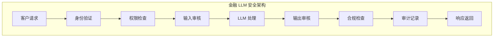
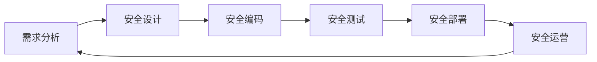

## 3.3 行业安全标准与最佳实践

不同行业对 LLM 安全有着各自的要求和最佳实践。本节将汇总主要行业的安全标准，并介绍跨行业通用的安全实践。

### 3.3.1 金融行业

金融行业对 AI/LLM 的使用有严格的监管要求，主要关注风险控制、数据隐私和消费者保护。

**主要监管要求**：

| 地区/机构 | 监管文件 | 核心要求 |
|-----------|----------|----------|
| 美国 SEC | AI 使用指南 | 披露义务、风险管理 |
| 美联储 | SR 11-7 | 模型风险管理 |
| 欧盟 EBA | AI 治理指南 | 可解释性、公平性 |
| 中国银保监 | 金融科技指引 | 数据安全、算法公平 |

**金融行业 LLM 安全要点**：

- **模型验证**：所有 LLM 应用需经过独立验证
- **审计追踪**：完整记录 AI 决策过程
- **偏见检测**：确保信贷决策等场景无歧视
- **人工监督**：高风险决策需人工审核
- **数据隔离**：严格保护客户金融数据



图 3-1：金融行业流程图

### 3.3.2 医疗健康行业

医疗行业 LLM 应用涉及患者安全和隐私保护，受到严格监管。

**主要合规要求**：

- **HIPAA（美国）**：保护患者健康信息
- **GDPR（欧盟）**：数据保护和隐私权
- **FDA 指南**：AI/ML 医疗设备监管
- **中国数据安全法**：医疗数据分类保护

**医疗 LLM 安全要点**：

- **临床验证**：LLM 建议需经过临床验证
- **免责声明**：明确 AI 不能替代专业医疗建议
- **数据脱敏**：严格保护患者隐私信息
- **回答边界**：限制 LLM 给出诊断或治疗建议
- **错误追溯**：可追踪错误信息的传播

**高风险场景管控**：

```
高风险场景：
├── 诊断建议 → 必须人工审核
├── 用药指导 → 仅提供参考，引导就医
├── 心理健康 → 检测危机信号，提供热线
└── 急症处理 → 立即引导拨打急救电话
```

### 3.3.3 政府与公共服务

政府部门使用 LLM 需考虑公众信任、透明度和公平性。

**核心要求**：

- **算法透明**：向公众解释 AI 决策依据
- **公平无歧视**：确保服务公平可及
- **数据主权**：敏感数据本地化处理
- **安全审计**：定期第三方安全评估

**政务 LLM 安全最佳实践**：

1. **分级管理**：根据敏感程度划分 LLM 应用等级
2. **国产化要求**：核心场景使用国产模型
3. **离线部署**：敏感系统与互联网隔离
4. **人工兜底**：关键服务保留人工通道

### 3.3.4 教育行业

教育场景下的 LLM 使用涉及学术诚信和未成年人保护。

**核心关注点**：

- **学术诚信**：防止滥用 LLM 进行作弊
- **内容适龄**：确保内容适合学生年龄
- **隐私保护**：保护学生个人信息
- **辅助而非替代**：LLM 作为学习辅助工具

**安全措施**：

| 场景 | 风险 | 防护措施 |
|------|------|----------|
| 作业辅导 | 直接给答案 | 引导式提问，不直接输出完整答案 |
| 内容生成 | 不适当内容 | 严格内容过滤 |
| 对话交互 | 隐私收集 | 最小化数据收集 |
| 评估反馈 | 偏见歧视 | 定期公平性审计 |

### 3.3.5 企业通用最佳实践

无论哪个行业，以下最佳实践具有普遍适用性：

**安全开发生命周期（SDL）**：



图 3-2：企业通用最佳实践流程图

- **需求阶段**：识别安全需求，定义安全目标
- **设计阶段**：威胁建模，安全架构设计
- **开发阶段**：安全编码规范，代码审查
- **测试阶段**：安全测试，红队评估
- **部署阶段**：安全配置，最小权限
- **运营阶段**：监控告警，事件响应

**数据安全基线**：

1. **数据分类分级**：明确不同敏感级别数据的处理要求
2. **访问控制**：基于角色的最小权限访问
3. **加密传输存储**：敏感数据全程加密
4. **审计追踪**：完整的操作日志记录
5. **数据生命周期**：明确数据保留和销毁策略

**第三方风险管理**：

- 对 LLM 供应商进行安全评估
- 审查数据处理协议
- 监控供应商安全状况
- 制定供应商退出计划

**员工安全意识**：

- 定期安全培训
- LLM 安全使用指南
- 事件报告机制
- 安全文化建设

### 3.3.6 合规检查清单

以下是企业 LLM 合规的快速检查清单：

```
□ 已识别适用的法规和标准
□ 已进行数据保护影响评估
□ 已实施数据最小化原则
□ 已部署输入输出安全控制
□ 已建立模型监控机制
□ 已制定事件响应计划
□ 已进行员工安全培训
□ 已记录安全决策和措施
□ 已安排定期安全评估
□ 已建立持续改进流程
```

行业标准和最佳实践是 LLM 安全的重要参考，但不应机械照搬。组织需要根据自身业务特点、风险偏好和资源条件，制定适合的安全策略。
