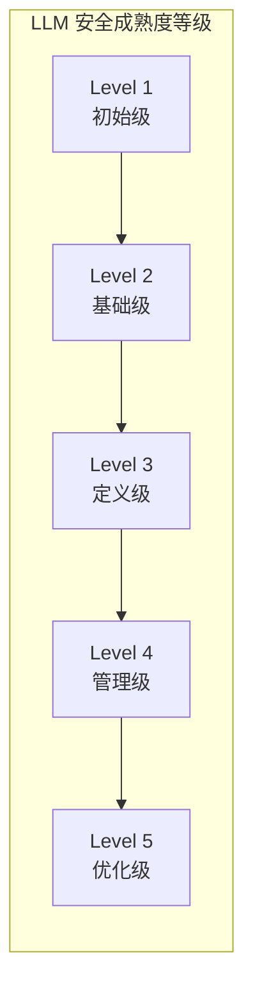
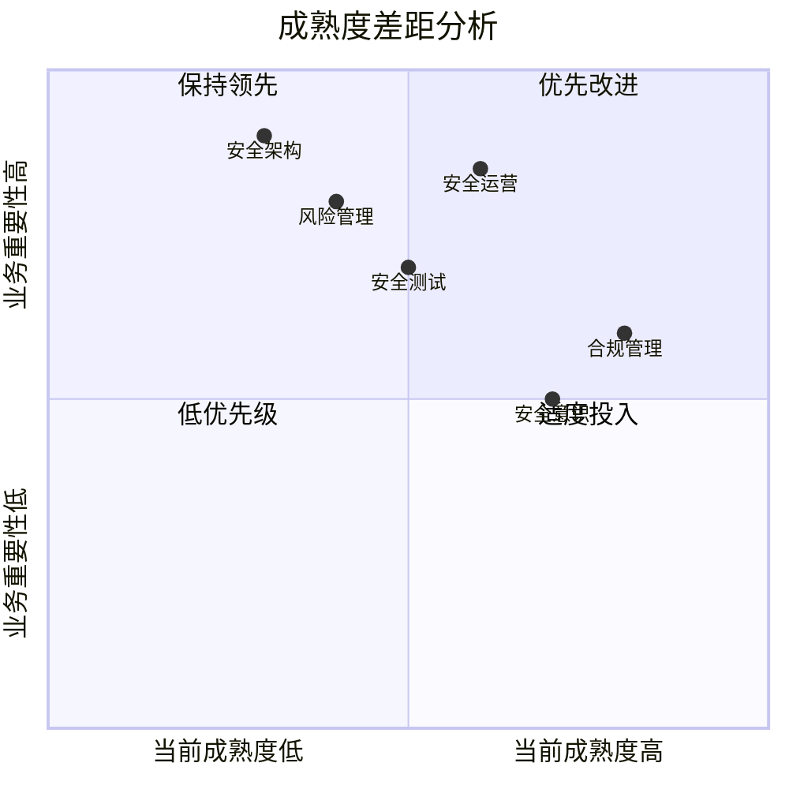
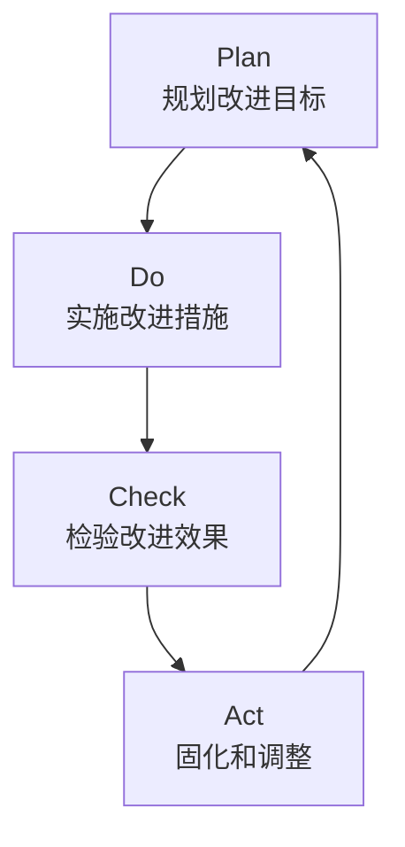

## 3.4 大语言模型安全成熟度模型

安全成熟度模型帮助组织评估当前的 LLM 安全能力水平，并规划持续改进的路径。本节将介绍 LLM 安全成熟度的评估方法和提升策略。

### 3.4.1 为什么需要成熟度模型

在 LLM 安全领域，不同组织的能力水平差异巨大：

- 有的组织刚开始意识到 LLM 安全问题
- 有的已建立基本的安全措施
- 少数领先组织已形成完善的安全体系

成熟度模型提供了：

- **现状评估**：了解组织当前的安全能力水平
- **差距识别**：发现需要改进的领域
- **路径规划**：制定分阶段的提升计划
- **基准对比**：与行业最佳实践对标

### 3.4.2 LLM 安全成熟度等级

参考通用的能力成熟度模型（CMM），LLM 安全成熟度可划分为五个等级：



图 3-1：LLM 安全成熟度等级流程图

**Level 1：初始级（Initial）**

特征：
- 安全措施临时性、不系统
- 依赖个人经验和意识
- 缺乏明确的安全策略
- 事件响应被动应对

典型表现：
- 直接使用第三方 LLM API，无额外安全措施
- 未考虑提示注入等安全风险
- 无安全监控和日志

**Level 2：基础级（Basic）**

特征：
- 基本的安全意识和措施
- 开始建立安全流程
- 关键风险得到关注
- 部分安全控制到位

典型表现：
- 实施基本的输入过滤
- 有简单的内容审核机制
- 建立了基本的访问控制
- 开始记录安全事件

**Level 3：定义级（Defined）**

特征：
- 明确的安全策略和标准
- 系统化的安全流程
- 覆盖主要风险领域
- 定期安全评估

典型表现：
- 完整的安全架构设计
- 多层输入输出防护
- 定期红队测试
- 安全培训计划
- 事件响应流程

**Level 4：管理级（Managed）**

特征：
- 量化的安全管理
- 持续的安全监控
- 基于数据的决策
- 主动的风险管理

典型表现：
- 安全指标体系和仪表盘
- 实时异常检测
- 威胁情报集成
- 自动化安全响应
- 持续的安全改进

**Level 5：优化级（Optimizing）**

特征：
- 持续创新和优化
- 行业领先实践
- 安全文化深入
- 引领安全发展

典型表现：
- 自研安全工具和方法
- 参与安全标准制定
- 安全研究和发布
- 全员安全意识

### 3.4.3 成熟度评估维度

LLM 安全成熟度可从以下维度进行评估：

| 维度 | 评估要点 |
|------|----------|
| 治理与策略 | 安全策略、组织架构、角色责任 |
| 风险管理 | 风险识别、评估、处置流程 |
| 安全架构 | 防护措施、分层设计、纵深防御 |
| 安全开发 | SDL 实践、安全编码、代码审查 |
| 安全测试 | 测试覆盖、红队评估、漏洞管理 |
| 安全运营 | 监控告警、事件响应、日志审计 |
| 数据保护 | 数据分类、隐私保护、访问控制 |
| 供应链安全 | 供应商评估、依赖管理、安全审计 |
| 安全意识 | 培训计划、文化建设、员工行为 |
| 合规管理 | 法规遵从、认证获取、审计应对 |

### 3.4.4 自评估方法

组织可以通过以下步骤进行 LLM 安全成熟度自评估：

**步骤一：收集信息**

- 梳理现有 LLM 应用清单
- 收集安全策略和流程文档
- 访谈关键利益相关者
- 审查安全事件记录

**步骤二：维度评分**

对每个评估维度，按 1-5 分进行评分：

```
评分标准：
1 分 - 无/极少相关实践
2 分 - 基本实践，不系统
3 分 - 定义明确，系统实施
4 分 - 量化管理，持续监控
5 分 - 持续优化，行业领先
```

**步骤三：识别差距**

比较当前分数与目标分数，识别差距最大的领域：



图 3-2：自评估方法流程图

> 说明：图中的坐标为示意，用于表达“优先级排序”，并非统计测量结果；实际可结合业务重要性与风险评估做量化。

**步骤四：制定计划**

基于差距分析，制定分阶段的改进计划：

- 短期（0-3 个月）：解决高风险、快速见效的问题
- 中期（3-12 个月）：系统化建设核心能力
- 长期（1-3 年）：建立持续优化机制

### 3.4.5 成熟度提升路径

从一个等级提升到下一个等级，需要关注不同的重点：

**Level 1 → Level 2**：

重点：建立基本安全意识和措施
- 识别主要 LLM 安全风险
- 实施基本输入输出过滤
- 建立简单的监控机制
- 制定基本安全策略

**Level 2 → Level 3**：

重点：系统化安全管理
- 制定完整的安全架构
- 建立安全开发流程
- 实施定期安全测试
- 建立事件响应流程

**Level 3 → Level 4**：

重点：量化和自动化
- 建立安全指标体系
- 部署自动化监控
- 实施威胁情报驱动
- 建立持续改进机制

**Level 4 → Level 5**：

重点：创新和引领
- 开展安全研究
- 开发创新安全工具
- 参与行业标准制定
- 建立安全卓越文化

### 3.4.6 持续改进机制

成熟度提升不是一次性工程，而是持续的过程：

**PDCA 循环**：



图 3-3：持续改进机制流程图

**定期评估**：
- 每季度进行成熟度自评
- 每年进行第三方评估
- 持续跟踪改进进度

**反馈整合**：
- 收集安全事件教训
- 整合行业最新实践
- 响应监管要求变化

安全成熟度模型为组织提供了持续改进 LLM 安全的路线图。通过定期评估和有针对性的改进，组织可以逐步建立起与业务需求相匹配的安全能力。
