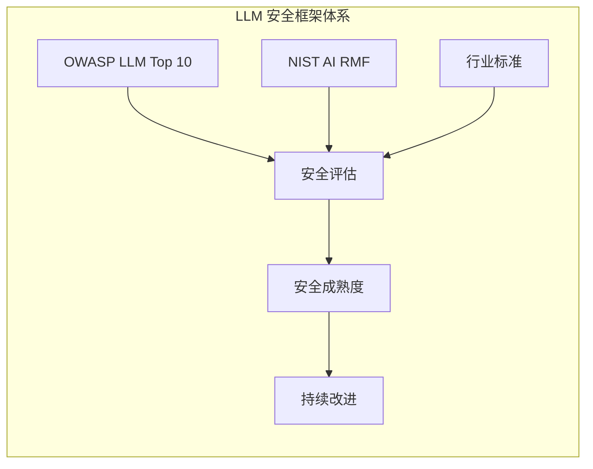

# 第三章：安全框架与标准

随着 LLM 安全问题日益受到重视，业界已经形成了一系列安全框架和标准，为评估和防护 LLM 安全提供了系统化的指导。本章将介绍最具影响力的安全框架，帮助读者建立结构化的安全思维。

本章聚焦于 LLM 安全的框架与标准，主要内容包括：

- **3.1 OWASP 大语言模型十大风险解析**：深入解读业界广泛采用的 LLM 安全风险清单
- **3.2 NIST AI 风险管理框架**：了解美国国家标准技术研究院的 AI 风险管理方法
- **3.3 行业安全标准与最佳实践**：汇总各行业的 LLM 安全要求
- **3.4 大语言模型安全成熟度模型**：评估组织 LLM 安全能力的方法论

通过本章的学习，读者将掌握评估 LLM 安全的系统方法，能够将这些框架应用于实际的安全实践中。

