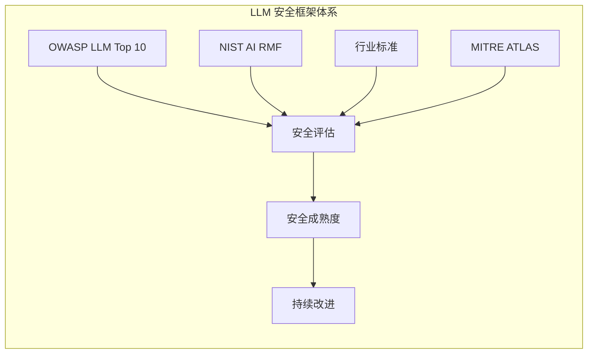

# 第三章 安全框架与标准

随着 LLM 安全问题日益受到重视，业界已形成一系列安全框架和标准，为评估和防护 LLM 安全提供系统化的指导。本章介绍其中最具影响力的几个框架：它们分别回答“有哪些风险”“如何治理”“各行业还有哪些特定要求”“攻击者具体如何攻击”。第二章从模型机制讲安全基础，本章从框架角度建立风险的全局地图；[第 4–7 章](../04_prompt_injection/README.md)将其中的主要风险展开为具体攻击技术。

## 学习目标

读完本章，读者应能：

1. 说出 OWASP LLM Top 10 2026 版的十个条目，并把 2025 版编号换算到 2026 版。
2. 判断一项风险应归入 LLM Top 10 还是 Agentic Top 10，并区分相邻条目的边界（例如提示注入管输入边界、输出处理不当管下游消费、过度自主权管动作是否应当执行）。
3. 说明 NIST AI RMF 的七组可信特征和四项核心功能（GOVERN、MAP、MEASURE、MANAGE），以及 AI 600-1 在其上补充的生成式 AI 风险。
4. 对比金融、医疗、政务、教育四个行业的 LLM 安全关注点，区分 ISO/IEC 23894 与 42001 的分工。
5. 用 MITRE ATLAS 技术编号把 OWASP 风险翻译成红队用例与检测规则，并说明 OWASP、NIST、ATLAS 如何组合使用。

## 本章结构

- [3.1](3.1_owasp_top10.md) OWASP 大语言模型十大风险解析：LLM 应用有哪些高频风险，每类风险的成因、边界与防护重点是什么？
- [3.2](3.2_nist_framework.md) NIST AI 风险管理框架：组织如何以结构化的方式治理 AI 风险？
- [3.3](3.3_industry_standards.md) 行业安全标准与最佳实践：在通用框架之外，各行业还有哪些特定要求，跨行业有哪些共同做法？
- [3.4](3.4_mitre_atlas.md) MITRE ATLAS 对抗矩阵：攻击者具体如何攻击 AI 系统，如何据此演练与检测？

各节按“风险—治理—合规—对抗”的顺序展开：先用 OWASP 盘点应用层风险，再用 NIST 把风险管理纳入组织流程，然后看各行业的合规要求，最后用 ATLAS 以攻击者视角把风险落到可演练、可检测的攻击技术。OWASP、NIST、ATLAS 三者构成“风险—治理—对抗”三视角，下图是它们共同支撑安全评估的关系。

```mermaid
graph LR
    subgraph "LLM 安全框架体系"
    A["OWASP LLM Top 10"] --> D["安全评估"]
    B["NIST AI RMF"] --> D
    C["行业标准"] --> D
    G["MITRE ATLAS"] --> D
    D --> E["安全成熟度"]
    E --> F["持续改进"]
    end
```
