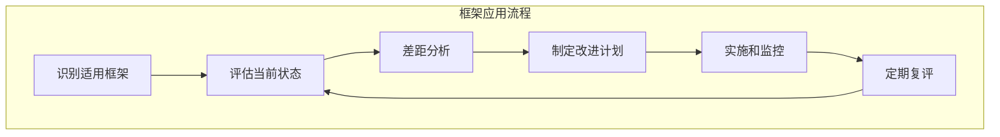

## 本章小结

本章系统介绍了 LLM 安全领域的主要框架和标准，为组织开展安全工作提供了结构化的指导。

### 核心要点回顾

**OWASP LLM Top 10**：业界广泛采用的 LLM 安全风险清单，覆盖提示注入、敏感信息泄露、供应链风险、数据与模型投毒、输出处理不当、过度自主权、系统提示泄露、向量与嵌入弱点、错误信息、无边界消耗等核心风险类别；具体条目与措辞请以 OWASP 官方最新发布为准。

**NIST AI RMF**：美国 NIST 发布的 AI 风险管理框架，定义了可信 AI 的八项特征和四个核心功能（治理、映射、测量、管理）；在生成式 AI 场景可结合 AI 600-1（GenAI Profile）细化落地控制。

**行业标准**：不同行业对 LLM 安全有各自的要求。金融行业关注模型验证和审计追踪，医疗行业强调临床验证和隐私保护，政务领域重视透明和公平，教育行业需要考虑学术诚信和内容适龄。

**安全成熟度模型**：将 LLM 安全能力分为初始、基础、定义、管理、优化五个等级，帮助组织评估现状、识别差距、规划提升路径。

### 框架应用指南

图 3-1：框架应用指南架构图

| 场景 | 推荐框架 | 应用重点 |
|------|----------|----------|
| 风险识别 | OWASP LLM Top 10（2025） | 系统性检查十大风险 |
| 风险管理 | NIST AI RMF | 建立治理-映射-测量-管理流程 |
| 行业合规 | 行业标准 | 满足特定监管要求 |
| 能力提升 | 成熟度模型 | 规划持续改进路径 |

### 关键建议

1. **不要孤立使用单一框架**：将多个框架结合使用，取长补短
2. **根据组织实际情况调整**：框架是指南，不是教条
3. **从风险优先级出发**：先解决高风险问题
4. **持续改进**：安全不是一次性工程
5. **建立安全文化**：技术措施需要文化支撑

### 延伸思考

1. 如何选择适合自己组织的安全框架组合？
2. 在资源有限的情况下，如何确定安全投入的优先级？
3. 如何衡量安全投入的投资回报率？

### 下章预告

第四章将进入"攻击篇"，深入剖析提示注入这一核心威胁。将详细介绍直接注入和间接注入的技术原理、攻击手法和真实案例。
