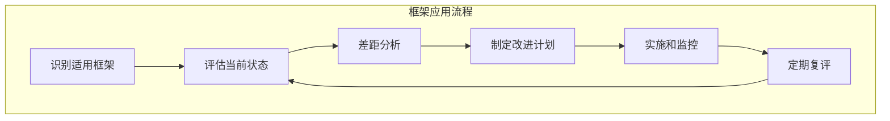

## 本章小结

本章介绍了 LLM 安全领域的四个主要框架和标准：OWASP LLM Top 10 回答“有哪些风险”，NIST AI RMF 回答“如何治理”，行业标准回答“各行业还有哪些特定要求”，MITRE ATLAS 回答“攻击者具体如何攻击”。

### 1. 核心要点

- OWASP 做风险盘点，NIST 做治理闭环，ATLAS 做攻击演练与检测，三个框架视角互补。
- 十条 OWASP 风险中能靠“模型更聪明”解决的很少，绝大多数要靠模型之外的边界、权限、参数化和审计来控制。
- 模型开始自行调用工具、跨会话携带记忆、在下游引发后果时，要同时对照 LLM Top 10 与 Agentic Top 10。
- 条目编号随版本变动，长期资产应同时记录条目名与版本号，例如 `LLM03:2026 Excessive Agency`。
- 行业要求并不构成一套统一的全球规则，套用前须核对适用范围。

### 2. 各节要点

- OWASP LLM Top 10（[3.1](3.1_owasp_top10.md)）：业界广泛采用的 LLM 安全风险清单，覆盖提示注入、敏感信息泄露、过度自主权、供应链风险、数据与模型投毒、无边界消耗、错误信息、隐藏上下文暴露、向量与嵌入弱点、输出处理不当等核心风险类别；具体条目与措辞请以 OWASP 官方最新发布为准。OWASP 另有一份与之并行的 *Top 10 For Agentic Applications 2026*（`ASI01`–`ASI10`），面向智能体应用，对照表见[附录 D](../16_appendix/D_owasp_agentic_crosswalk.md)。
- NIST AI RMF（[3.2](3.2_nist_framework.md)）：美国 NIST 发布的 AI 风险管理框架，定义了可信 AI 的七组特征和四个核心功能（治理、映射、测量、管理）；在生成式 AI 场景可结合 AI 600-1（GenAI Profile）细化落地控制。
- 行业标准（[3.3](3.3_industry_standards.md)）：不同行业对 LLM 安全有各自的要求。金融行业关注模型验证和审计追踪，医疗行业强调患者安全与隐私保护，政务领域重视透明、问责与持续监控，教育行业需要考虑学术诚信、未成年人保护与学生数据隐私。
- MITRE ATLAS（[3.4](3.4_mitre_atlas.md)）：以攻击者视角组织的 AI 对抗战术与技术（TTP）矩阵，仿照 ATT&CK，并新增 AI Model Access、AI Attack Staging 等 AI 专属战术；它把 OWASP/NIST 的“风险”翻译成可演练、可检测的具体攻击技术，是“风险—治理—对抗”三视角中的对抗一环。

### 3. 框架应用指南

组织应用框架时，可按下图的流程循环推进，并按场景选择主用框架。

```mermaid
flowchart TB
    subgraph "框架应用流程"
    A["识别适用框架"] --> B["评估当前状态"]
    B --> C["差距分析"]
    C --> D["制定改进计划"]
    D --> E["实施和监控"]
    E --> F["定期复评"]
    F --> B
    end
```

图 3-5：框架应用指南架构图

| 场景 | 推荐框架 | 应用重点 |
|------|----------|----------|
| 风险识别 | OWASP LLM Top 10（2026） | 系统性检查十大风险 |
| 风险管理 | NIST AI RMF | 建立治理-映射-测量-管理流程 |
| 行业合规 | 行业标准 | 满足特定监管要求 |
| 对抗演练 / 红队 | MITRE ATLAS | 把风险翻译成可演练、可检测的攻击 TTP |

### 4. 关键建议

1. 不要孤立使用单一框架：将多个框架结合使用，取长补短
2. 根据组织实际情况调整：框架是指南，不是教条
3. 从风险优先级出发：先解决高风险问题
4. 持续改进：安全不是一次性工程
5. 建立安全文化：技术措施需要文化支撑

### 5. 延伸思考

1. 如何选择适合自己组织的安全框架组合？
2. 在资源有限的情况下，如何确定安全投入的优先级？
3. 如何衡量安全投入的投资回报率？

## 与后续章节的关联

- 风险展开：第 4–7 章将 OWASP 十大风险中的主要风险展开为具体攻击技术
- 实施指导：NIST 框架指导第 8-10 章的防御实施，从架构设计到运营验证
- 合规实践：[第 15 章](../15_governance/README.md)将框架要求转化为治理合规实践，闭合治理环路

[第四章](../04_prompt_injection/README.md)进入“攻击篇”，介绍提示注入这一核心威胁，包括直接注入和间接注入的技术原理、攻击手法和真实案例。

---

> 📝 **发现错误或有改进建议？** 欢迎提交 [Issue](https://github.com/yeasy/ai_security_guide/issues) 或 [PR](https://github.com/yeasy/ai_security_guide/pulls)。
