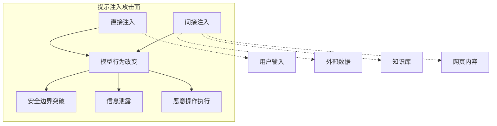

# 第四章：提示注入攻击

提示注入（Prompt Injection）是 LLM 面临的核心威胁之一，在 OWASP LLM Top 10（2025）中对应 LLM01。攻击者通过精心构造的输入，试图改变模型的行为、绕过安全限制或提取敏感信息。本章将深入剖析提示注入的原理、技术和防御策略。

本章聚焦于提示注入攻击，主要内容包括：

- **4.1 提示注入原理与分类**：理解提示注入的本质和分类体系
- **4.2 直接提示注入技术**：掌握用户直接与模型交互时的注入手法
- **4.3 间接提示注入技术**：了解通过外部数据源实施的注入攻击
- **4.4 公开案例与研究演示分析**：从公开案例与研究演示中学习攻防经验

通过本章的学习，读者将全面理解提示注入的攻击原理和技术细节，为后续的防御工作奠定基础。

