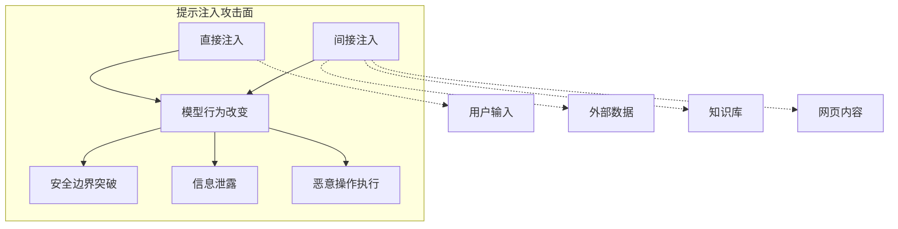

# 第四章 提示注入攻击与防御

提示注入（Prompt Injection）是 LLM 面临的核心威胁之一，在 OWASP LLM Top 10（2025）中对应 LLM01。攻击者通过精心构造的输入，试图改变模型的行为、绕过安全限制或提取敏感信息。本章将深入剖析提示注入的原理、技术和防御策略。

本章聚焦于提示注入攻击与防御，主要内容包括：

- **4.1 提示注入原理与分类**：理解提示注入的本质和分类体系
- **4.2 直接提示注入技术**：掌握用户直接与模型交互时的注入手法
- **4.3 间接提示注入技术**：了解通过外部数据源实施的注入攻击
- **4.4 公开案例与研究演示分析**：从公开案例与研究演示中学习攻防经验
- **4.5 提示注入防御实践**：实施多层次的提示注入防护体系
- **4.6 长上下文特有的安全风险与防御**：剖析长上下文窗口带来的新型攻击面与防御策略

通过本章的学习，读者将全面理解提示注入的攻击原理和技术细节，为后续的防御工作奠定基础。

```mermaid
flowchart TB
    subgraph "提示注入攻击面"
    A["直接注入"] --> C["模型行为改变"]
    B["间接注入"] --> C
    C --> D["安全边界突破"]
    C --> E["信息泄露"]
    C --> F["恶意操作执行"]
    end

    A -.-> A1["用户输入"]
    B -.-> B1["外部数据"]
    B -.-> B2["知识库"]
    B -.-> B3["网页内容"]
```

---

> **📚 延伸阅读**：OpenClaw 的三层纵深防御机制（工具策略、沙箱、审批联动），参见 [《OpenClaw 从入门到精通》第 11 章](https://github.com/yeasy/openclaw_guide)。
