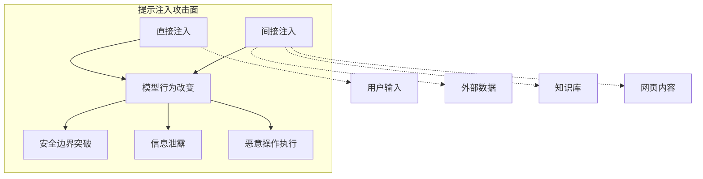

# 第四章 提示注入攻击与防御

提示注入（Prompt Injection）是 LLM 面临的核心威胁之一，在 OWASP LLM Top 10（2026）中对应 LLM01。攻击者通过精心构造的输入，试图改变模型的行为、绕过安全限制或提取敏感信息。

本章主要内容包括：

- **[4.1](4.1_principles.md) 提示注入原理与分类**：理解提示注入的本质和分类体系
- **[4.2](4.2_direct_injection.md) 直接提示注入技术**：掌握用户直接与模型交互时的注入手法
- **[4.3](4.3_indirect_injection.md) 间接提示注入技术**：了解通过外部数据源实施的注入攻击
- **[4.4](4.4_case_studies.md) 公开案例与研究演示分析**：从公开案例与研究演示中学习攻防经验
- **[4.5](4.5_injection_defense.md) 分层防御与安全门控**：实施多层次的提示注入防护体系
- **[4.6](4.6_long_context_risks.md) 长上下文的安全风险**：剖析长上下文窗口带来的新型攻击面与防御策略

> **⚠️ 道德边界与负责任披露**：本章、第五至[第七章](../07_rag_security/README.md)以及[第十二章](../12_agent_attack_surface/README.md)对攻击技术的描述仅用于安全研究、防御评估和已获明确授权的红队测试。在公开发布、复现或迁移攻击 PoC 前，应遵循组织的负责任披露（Responsible Disclosure）流程，通报受影响的模型提供方与部署方并预留合理的修复期；针对未授权目标的实际攻击违反所在司法管辖区的相关法律与服务条款。本书相关章节中的代码与样例 payload 均假设读者在合法授权场景下使用。

```mermaid
flowchart TB
    subgraph "提示注入攻击面"
    A["直接注入"] --> C["模型行为改变"]
    B["间接注入"] --> C
    C --> D["安全边界突破"]
    C --> E["信息泄露"]
    C --> F["恶意操作执行"]
    end

    A -.-> A1["用户输入"]
    B -.-> B1["外部数据"]
    B -.-> B2["知识库"]
    B -.-> B3["网页内容"]
```

---

> **📚 延伸阅读**：OpenClaw 的三层纵深防御机制（工具策略、沙箱、审批联动），参见 [《OpenClaw 从入门到精通》第 11 章](https://yeasy.gitbook.io/openclaw_guide)。
