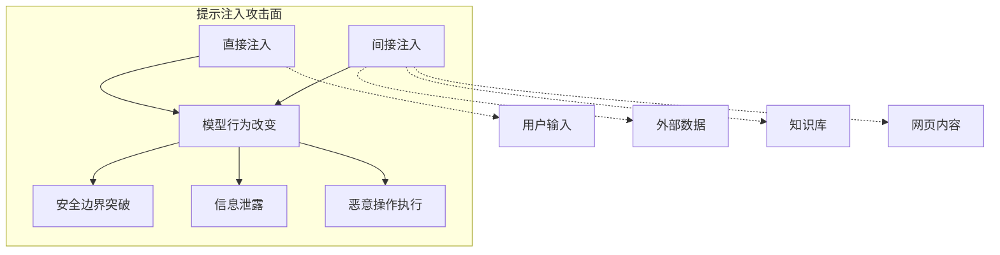

# 第四章 提示注入攻击与防御

提示注入（Prompt Injection）是 LLM 面临的核心威胁之一，在 OWASP LLM Top 10（2026）中对应 LLM01（见[第三章](../03_frameworks/README.md)）。攻击者通过精心构造的输入，试图改变模型的行为、绕过安全限制或提取敏感信息。本章讨论提示注入为什么会发生、攻击者如何实施，以及各类防御能提供什么保证。[第五章](../05_jailbreak/README.md)讨论与之相近的越狱攻击，两章的区别在于本章侧重注入面与上下文边界，第五章侧重绕过安全对齐的策略演化。

> **⚠️ 道德边界与负责任披露**：本章、第五至[第七章](../07_rag_security/README.md)以及[第十二章](../12_agent_attack_surface/README.md)对攻击技术的描述仅用于安全研究、防御评估和已获明确授权的红队测试。在公开发布、复现或迁移攻击 PoC 前，应遵循组织的负责任披露（Responsible Disclosure）流程，通报受影响的模型提供方与部署方并预留合理的修复期；针对未授权目标的实际攻击违反所在司法管辖区的相关法律与服务条款。本书相关章节中的代码与样例 payload 均假设读者在合法授权场景下使用。

## 学习目标

读完本章，读者应能：

1. 解释提示注入为什么源于模型不区分指令与数据，以及它为什么不能像 SQL 注入那样通过参数化查询彻底解决。
2. 区分直接注入与间接注入，说明二者在攻击者角色、Payload 位置、受害者和攻击规模上的差异。
3. 识别常见注入手法及其入口，如角色扮演、编码混淆、多轮分步诱导、RAG 知识库投毒、网页隐藏文本和日历邀请。
4. 判断一项防御属于概率性防御还是确定性防御：假设攻击者能让模型输出任意内容，这项防御是否仍然成立。
5. 检查一项防御评估是否充分：攻击者是否知晓防御、是否允许多次尝试、是否包含人工红队、是否同时报告效用、是否区分静态与自适应两个口径。

## 本章结构

- [4.1](4.1_principles.md) 提示注入原理与分类：提示注入是什么，为什么难以根除，可以从哪些维度分类。
- [4.2](4.2_direct_injection.md) 直接提示注入技术：攻击者在对话中直接输入恶意指令时，有哪些常见手法。
- [4.3](4.3_indirect_injection.md) 间接提示注入技术：恶意指令如何经由 RAG、网页、邮件日历、供应链等外部数据进入模型，又如何跨应用扩散。
- [4.4](4.4_case_studies.md) 公开案例与研究演示分析：这些攻击在公开案例与研究演示中造成了什么后果，对应哪些防御。
- [4.5](4.5_injection_defense.md) 分层防御与安全门控：有哪些防御手段，哪些只能降低频率、哪些能设定上界，以及如何评估防御的可靠性。
- [4.6](4.6_long_context_risks.md) 长上下文的安全风险：长上下文窗口带来了哪些新的攻击面，如何在成本可控的前提下防御。

各节按“原理 → 攻击 → 案例 → 防御”的顺序展开：4.1 建立概念与分类，4.2 和 4.3 按注入路径分述攻击手法，4.4 用案例检验这些手法，4.5 讲防御及其可靠性，4.6 讨论长上下文这一特定场景下的攻防。下图概括了本章讨论的攻击面：

```mermaid
flowchart TB
    subgraph "提示注入攻击面"
    A["直接注入"] --> C["模型行为改变"]
    B["间接注入"] --> C
    C --> D["安全边界突破"]
    C --> E["信息泄露"]
    C --> F["恶意操作执行"]
    end

    A -.-> A1["用户输入"]
    B -.-> B1["外部数据"]
    B -.-> B2["知识库"]
    B -.-> B3["网页内容"]
```

---

> **📚 延伸阅读**：OpenClaw 的三层纵深防御机制（工具策略、沙箱、审批联动），参见 [《OpenClaw 从入门到精通》第 11 章](https://yeasy.gitbook.io/openclaw_guide)。
