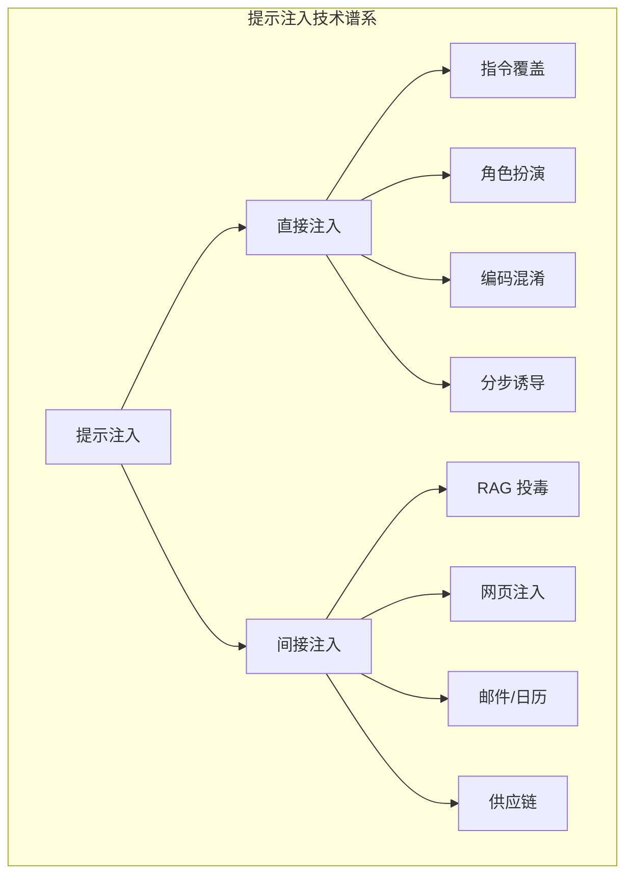

## 本章小结

本章深入剖析了提示注入攻击这一核心威胁。从原理到实践，从直接注入到间接注入，全面展示了这一攻击类型的技术细节。

### 核心要点回顾

**提示注入本质**：利用 LLM 无法严格区分指令与数据的特性，通过精心构造的输入改变模型行为。与传统注入攻击类似但更难防御，因为使用自然语言且边界模糊。

**直接注入技术**：攻击者在对话中直接输入恶意指令。常见技术包括指令覆盖、角色扮演（如 DAN）、上下文操纵、编码混淆、分步诱导和系统提示提取。现代 LLM 已对简单攻击有一定抵抗力，但变体攻击仍具威胁。

**间接注入技术**：恶意指令隐藏在外部数据源中，当 LLM 处理这些数据时被触发。攻击面包括 RAG 知识库、网页浏览、邮件日历、供应链等。间接注入更加隐蔽，可能影响多个用户，Agent 系统会放大危害。

**真实案例**：网页内容注入、办公套件集成渠道注入、文件上传/代码执行环境注入、企业 RAG 信息泄露、URL/会话注入等案例展示了提示注入的实际危害和多样化的攻击向量。

### 攻击技术速查

图 4-1：攻击技术速查流程图

### 防御思路预览

| 防御层面 | 关键措施 |
|----------|----------|
| 输入防护 | 验证过滤、来源标记、编码检测 |
| 模型层面 | 安全对齐、能力限制 |
| 输出防护 | 内容审核、敏感过滤 |
| 架构层面 | 权限最小化、沙箱隔离 |
| 运营层面 | 持续监控、事件响应 |

### 延伸思考

1. 随着 Agent 能力的增强，提示注入的危害会如何演变？
2. 是否可能从根本上解决指令与数据混淆的问题？
3. 如何在开放系统中平衡功能丰富性与安全性？

### 下章预告

第五章将介绍越狱与对抗攻击。越狱攻击试图绕过 LLM 的安全对齐机制，诱导模型生成被禁止的内容。将深入分析经典越狱技术、多模态越狱和对抗样本，进一步丰富对 LLM 攻击手段的理解。
