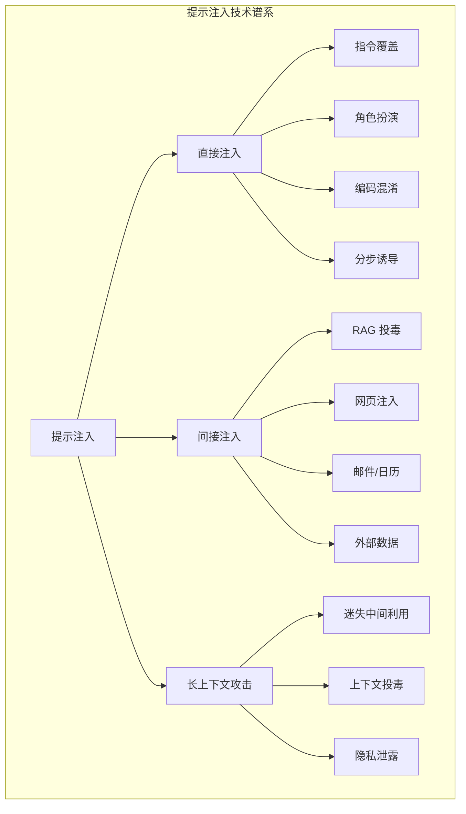

## 本章小结

本章深入剖析了提示注入攻击这一核心威胁。从原理到实践，从直接注入到防御体系构建，全面展示了这一攻击类型的技术细节。

### 核心要点回顾

**提示注入本质**：利用 LLM 无法严格区分指令与数据的特性，通过精心构造的输入改变模型行为。与传统注入攻击类似但更难防御，因为使用自然语言且边界模糊。

**直接注入技术**：攻击者在对话中直接输入恶意指令。常见技术包括指令覆盖、角色扮演（如 DAN）、上下文操纵、编码混淆、分步诱导和系统提示提取。现代 LLM 已对简单攻击有一定抵抗力，但变体攻击仍具威胁。

**间接注入技术**：恶意指令隐藏在外部数据源中，当 LLM 处理这些数据时被触发。攻击面包括 RAG 知识库、网页浏览、邮件日历、供应链等。间接注入更加隐蔽，可能影响多个用户，智能体系统会放大危害。

**真实案例**：网页内容注入、办公套件集成渠道注入、文件上传/代码执行环境注入、企业 RAG 信息泄露、URL/会话注入等案例展示了提示注入的实际危害和多样化的攻击向量。

**提示注入防御**：系统提示加固、输入输出分离、基于 LLM 的注入检测（需注意递归注入风险）、来源标记及工具调用保护等多层防御机制协同防护。

**长上下文安全**：随着上下文窗口增长至百万级 Token，长上下文引入了新的攻击面。"迷失中间"（Lost in the Middle）现象可被攻击者利用隐藏恶意指令，上下文投毒在海量信息中更加隐蔽，防御成本也呈指数增长。智能采样、结构化上下文管理和隐私脱敏是关键防御策略。

### 攻击技术速查

```mermaid
graph TB
    subgraph "提示注入技术谱系"
    A["提示注入"] --> B["直接注入"]
    A --> C["间接注入"]

    B --> B1["指令覆盖"]
    B --> B2["角色扮演"]
    B --> B3["编码混淆"]
    B --> B4["分步诱导"]

    C --> C1["RAG 投毒"]
    C --> C2["网页注入"]
    C --> C3["邮件/日历"]
    C --> C4["外部数据"]

    A --> L["长上下文攻击"]
    L --> L1["迷失中间利用"]
    L --> L2["上下文投毒"]
    L --> L3["隐私泄露"]
    end
```

图 4-18：攻击技术速查流程图

### 防御思路预览

| 防御层面 | 关键措施 |
|----------|----------|
| 输入防护 | 验证过滤、来源标记、编码检测 |
| 模型层面 | 安全对齐、能力限制 |
| 输出防护 | 内容审核、敏感过滤 |
| 架构层面 | 权限最小化、沙箱隔离 |
| 运营层面 | 持续监控、事件响应 |

### 延伸思考

1. 随着智能体能力的增强，提示注入的危害会如何演变？
2. 是否可能从根本上解决指令与数据混淆的问题？
3. 如何在开放系统中平衡功能丰富性与安全性？

## 与其他章节的关联

- **攻击对比**：第 5 章越狱与本章注入的区分，澄清两类攻击的本质差异
- **间接注入扩展**：第 7 章展开间接注入在 RAG/Agent 中的应用，深化本章概念
- **防护实现**：第 9 章提供输入输出防护的工程实现，将防御思路转化为具体方案

### 下章预告

[第五章](../05_jailbreak/README.md)将介绍越狱攻击。越狱攻击试图绕过 LLM 的安全对齐机制，诱导模型生成被禁止的内容。将深入分析经典越狱技术和多模态越狱，进一步丰富对 LLM 攻击手段的理解。
---

> 📝 **发现错误或有改进建议？** 欢迎提交 [Issue](https://github.com/yeasy/ai_security_guide/issues) 或 [PR](https://github.com/yeasy/ai_security_guide/pulls)。
