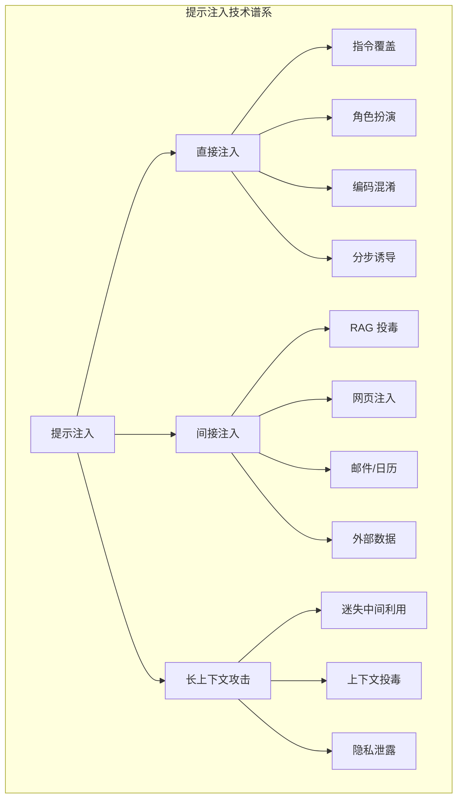

## 本章小结

本章说明了提示注入源于模型不区分指令与数据，攻击者可经直接与间接两条路径实施注入，而防御中只有权限、隔离等确定性措施能限定最坏后果。

### 1. 核心要点

- 提示注入利用 LLM 无法严格区分指令与数据的特性，不能像 SQL 注入那样通过参数化查询彻底解决。
- 直接注入由攻击者在对话中输入恶意指令；间接注入把指令藏在模型处理的外部数据中，更隐蔽，且可能影响多个用户。
- 智能体具备工具调用等自主操作能力后，间接注入的危害被显著放大。
- 系统提示加固、来源标记、注入检测器和指令层级训练都是概率性防御，在自适应攻击下均可被绕过。
- 概率性防御用于降低频率，确定性防御用于设定上界；评估最坏情况时只考察确定性防御。
- 长上下文使恶意内容更容易隐藏、防御成本显著上升，需要按来源和风险有选择地检查。

### 2. 各节要点

- **4.1 原理与分类**：提示注入通过精心构造的输入改变模型行为，可按注入路径、攻击目标和技术手段分类。它与传统注入攻击类似，但由于使用自然语言、边界模糊而更难防御。
- **4.2 直接注入**：常见技术包括指令覆盖、角色扮演（如 DAN）、上下文操纵、编码混淆、分步诱导和系统提示提取。现代 LLM 已对简单攻击有一定抵抗力，但变体攻击仍具威胁。
- **4.3 间接注入**：攻击面包括 RAG 知识库、网页浏览、邮件日历、供应链等。间接注入还可能多阶段推进、跨应用传播，甚至以蠕虫形式自我复制。
- **4.4 公开案例与研究演示**：Remoteli.io 推特机器人、Clinejection 供应链两起真实事件，以及网页内容注入、办公套件集成渠道注入、URL/会话注入、企业 RAG 信息泄露、文件上传/代码执行环境注入等研究演示，展示了提示注入的危害和多样化的攻击向量；各案例证据等级不同。
- **4.5 分层防御**：系统提示加固、输入输出分离、来源标记、基于 LLM 的注入检测（需注意递归注入风险）及工具调用保护等多层防御机制协同防护。这些多为概率性防御，在自适应攻击下均可被绕过（[4.5.11](4.5_injection_defense.md)）；能限定最坏后果的只有权限、隔离等确定性防御。
- **4.6 长上下文**：“迷失中间”（Lost in the Middle）现象会削弱模型对中部信息的稳定利用，上下文投毒在海量信息中更加隐蔽，防御成本也会显著上升。智能采样、结构化上下文管理和隐私脱敏是关键防御策略。

### 3. 攻击技术速查

```mermaid
graph TB
    subgraph "提示注入技术谱系"
    A["提示注入"] --> B["直接注入"]
    A --> C["间接注入"]

    B --> B1["指令覆盖"]
    B --> B2["角色扮演"]
    B --> B3["编码混淆"]
    B --> B4["分步诱导"]

    C --> C1["RAG 投毒"]
    C --> C2["网页注入"]
    C --> C3["邮件/日历"]
    C --> C4["外部数据"]

    A --> L["长上下文攻击"]
    L --> L1["迷失中间利用"]
    L --> L2["上下文投毒"]
    L --> L3["隐私泄露"]
    end
```

图 4-20：攻击技术速查流程图

### 4. 防御层面速查

| 防御层面 | 关键措施 |
|----------|----------|
| 输入防护 | 验证过滤、来源标记、编码检测 |
| 模型层面 | 安全对齐、能力限制 |
| 输出防护 | 内容审核、敏感过滤 |
| 架构层面 | 权限最小化、沙箱隔离 |
| 运营层面 | 持续监控、事件响应 |

### 5. 延伸思考

1. 随着智能体能力的增强，提示注入的危害会如何演变？
2. 是否可能从根本上解决指令与数据混淆的问题？
3. 如何在开放系统中平衡功能丰富性与安全性？

## 与后续章节的关联

- **攻击对比**：[第 5 章](../05_jailbreak/README.md)越狱与本章注入的区分，澄清两类攻击的本质差异
- **间接注入扩展**：[第 7 章](../07_rag_security/README.md)与[第 12 章](../12_agent_attack_surface/README.md)分别展开间接注入在 RAG 和智能体中的应用
- **防护实现**：[第 9 章](../09_io_protection/README.md)提供输入输出防护的工程实现

[第五章](../05_jailbreak/README.md)介绍越狱攻击，包括经典越狱技术和多模态越狱。越狱攻击试图绕过 LLM 的安全对齐机制，诱导模型生成被禁止的内容。

---

> 📝 **发现错误或有改进建议？** 欢迎提交 [Issue](https://github.com/yeasy/ai_security_guide/issues) 或 [PR](https://github.com/yeasy/ai_security_guide/pulls)。
