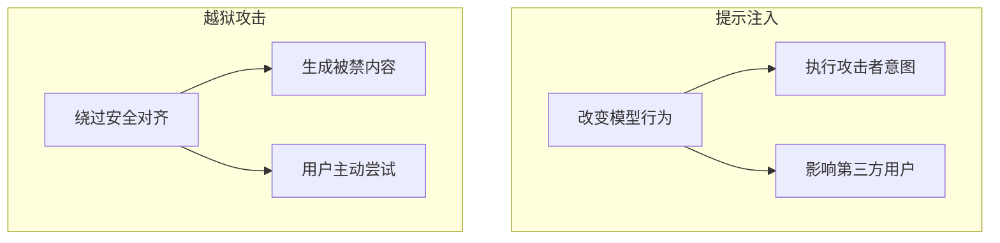
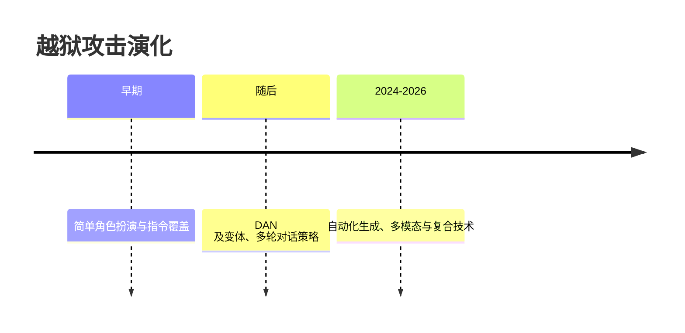
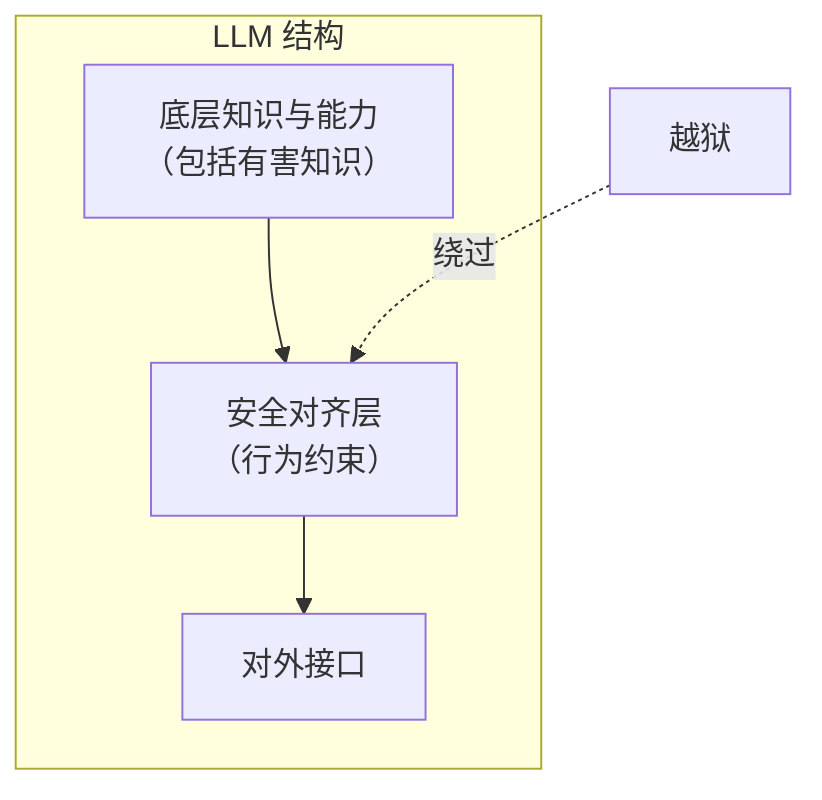

## 5.1 越狱攻击概述

越狱攻击是 LLM 安全研究中的热点话题。理解其本质有助于设计更稳健的安全对齐机制。

### 5.1.1 什么是越狱攻击

越狱（Jailbreak）一词源于移动设备领域，指绕过设备的安全限制获取更高权限。在 LLM 语境下，越狱指通过特定的输入使模型绕过其安全对齐机制，生成正常情况下会被拒绝的内容。

**越狱的目标**：

| 目标类型 | 描述 | 示例 |
|----------|------|------|
| 生成有害内容 | 突破内容安全限制 | 暴力、仇恨、非法指南 |
| 突破行为限制 | 违反预设的行为规则 | 忽略角色设定 |
| 获取敏感信息 | 提取被保护的信息 | 系统提示、训练数据 |
| 展示隐藏能力 | 激活被限制的功能 | 执行被禁止的任务 |

### 5.1.2 越狱与提示注入的区别

虽然越狱和[提示注入](../04_prompt_injection/README.md)有时被混用，但它们侧重点不同：

图 5-1：越狱与提示注入的区别流程图

| 方面 | 提示注入 | 越狱攻击 |
|------|----------|----------|
| 主要目标 | 操纵模型执行意外操作 | 绕过内容安全限制 |
| 攻击对象 | 系统提示和业务逻辑 | 安全对齐机制 |
| 典型场景 | 利用模型做恶意事情 | 使模型说不该说的话 |
| 受害者 | 可能是第三方用户 | 通常是攻击者自身使用 |

两者可以结合使用：先越狱获取更高"权限"，再进行提示注入。

### 5.1.3 越狱的动机分析

理解攻击者的动机有助于预判攻击趋势：

**好奇心驱动**：探索 LLM 能力边界，测试安全限制

**恶意使用**：获取非法内容、自动化生成有害材料

**研究目的**：安全研究人员发现漏洞以推动改进

**商业动机**：绕过 API 使用限制，获取竞争情报

**对抗心理**：将绕过 AI 安全视为智力挑战

### 5.1.4 越狱攻击的演化

越狱技术随着 LLM 安全对齐的进步而不断演化：

图 5-2：越狱攻击的演化时间线

> 说明：该时间线为概念性示意，用于表达“从简单到自动化/复合化”的演进方向，具体时间点与技术细节会随模型与产品迭代而变化。

**演化趋势**：

1. **复杂度提升**：从简单指令到复杂多步骤攻击
2. **自动化程度提高**：使用 AI 辅助生成越狱 Payload
3. **多模态化**：利用图像、音频等渠道绕过文本过滤
4. **针对性增强**：针对特定模型和版本的定制攻击

### 5.1.5 安全对齐的困境

越狱攻击的持续成功揭示了安全对齐面临的深层困境：

**表面对齐问题**：

安全对齐主要通过 RLHF 等技术在模型"表面"添加行为约束，但模型的底层知识和能力并未改变。越狱本质上是找到绕过这层约束的路径。

图 5-3：安全对齐的困境流程图

**对齐税**：

过于严格的对齐会导致"过度拒绝"，降低模型可用性。厂商需要在安全与实用之间权衡，这创造了可被利用的空间。

**攻防不对称**：

防御者需要防住所有攻击，攻击者只需找到一个漏洞。随着模型能力增强和应用场景扩展，完全的安全对齐越来越难以实现。

### 5.1.6 越狱的影响评估

评估越狱风险需要考虑多个维度：

| 维度 | 低风险 | 高风险 |
|------|--------|--------|
| 内容类型 | 一般不当内容 | 严重有害内容 |
| 可获取性 | 信息公开可查 | 专业/机密信息 |
| 规模化潜力 | 单次手动操作 | 可自动化大规模利用 |
| 实际危害 | 仅影响攻击者 | 可能伤害他人 |

理解越狱攻击的全貌后，下一节将深入分析具体的越狱技术实现。
