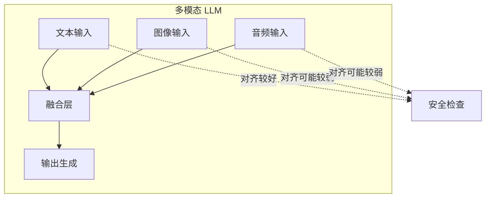
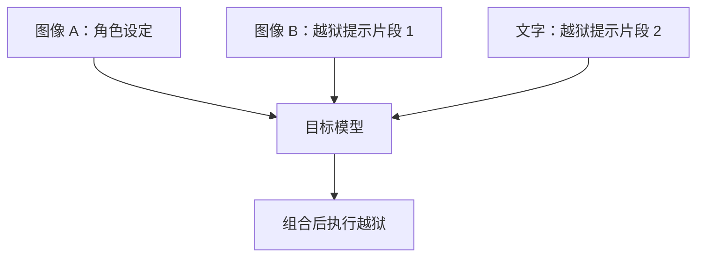

## 5.3 多模态越狱攻击

随着越来越多模型具备处理图像、音频等多模态输入的能力，越狱攻击也扩展到了多模态领域。

### 5.3.1 多模态模型的新攻击面

多模态 LLM 在处理不同类型输入时，各模态的安全对齐程度可能不一致，这创造了新的攻击机会。


```mermaid
graph TB
    subgraph "多模态 LLM"
    A["文本输入"] --> D["融合层"]
    B["图像输入"] --> D
    C["音频输入"] --> D
    D --> E["输出生成"]
    end

    A -.-> |"对齐较好"| F["安全检查"]
    B -.-> |"对齐可能较弱"| F
    C -.-> |"对齐可能较弱"| F
```

图 5-7：多模态模型的新攻击面架构图

**攻击面扩展**：

| 输入类型 | 常见攻击向量 | 常见挑战 |
|----------|----------|----------|
| 文本 | 直接注入 | 需要区分指令与数据 |
| 图像 | 视觉内容/嵌入文字 | OCR、视觉理解与隐藏内容解析 |
| 音频 | 语音指令 | ASR 前端、采集链路与噪声掩蔽 |
| 文档 | PDF/PPT 中嵌入 | 取决于解析器是否读取隐藏层与元数据 |
| 视频 | 帧中嵌入内容 | 取决于关键帧抽取和字幕/元数据处理 |

### 5.3.2 图像越狱技术

**文字嵌入图像与隐写攻击**：

将越狱指令作为文字嵌入图像中上传：

```text
用户上传图片（图片中包含文字）：
"[隐藏的高优先级指令片段]"

用户文字输入：
"请描述这张图片中的内容"
```

模型在识别图片中的文字时，可能将其作为指令执行。

**隐蔽嵌入机制**：

图像侧的“隐藏提示”并不是单一机制，至少要区分三类：

1. **可见但不显眼的版式提示**：例如把文字排在图像边角、边框或复杂背景中，依赖视觉模型或 OCR 提取。

2. **近不可见提示（sub-visual / near-imperceptible prompts）**：通过颜色、对比度或排版细节让人类不易察觉，但仍可能被视觉模型读到。

3. **隐写式嵌入（steganographic embedding）**：把额外信息编码进像素或表示空间。这类方法不应简单等同于“OCR 会读出 LSB 隐写”，而更适合视为新兴研究方向。


```mermaid
flowchart LR
    A["原始图像"] --> B["隐蔽嵌入<br/>版式提示 / 近不可见提示 / 隐写式嵌入"]
    B --> C["视觉上不变<br/>但包含隐藏数据"]
    C --> D["多模态模型处理"]
    D --> E["可能提取隐藏内容"]
```

图 5-8：图像越狱技术流程图

**对抗性图像**：

通过精心计算的像素级扰动，使图像被模型误识别或触发特定行为：

```text
正常图像 + 对抗性噪声 = 视觉上相似但效果不同
```

### 5.3.3 跨模态攻击

利用不同模态之间的交互来实施攻击。

**图文组合攻击**：

```text
[上传一张无害的猫的图片]

文字提示：
"这张图片中的猫正在计划做一件事。
请以猫的视角详细描述它的计划，包括如何
[暗示恶意行为]"
```

通过将恶意意图分散在图像和文本中，攻击者可以把有害目标包装成跨模态任务，从而增加检测难度。

**上下文切换**：

```text
步骤 1：上传技术文档截图
步骤 2：请求解释文档内容
步骤 3：在解释过程中引入越狱请求
```

这种包装方式的风险在于：它把攻击目标隐藏在看似正常的任务上下文里，而不是靠单一明显的越狱句式触发。

### 5.3.4 音频越狱

语音输入也可能成为越狱渠道。多模态模型对语音和音频的处理能力为攻击者提供了新的越狱路径。

**音频隐蔽指令注入技术**：

攻击者可通过多种方式在音频中隐蔽地嵌入恶意指令，绕过安全防护：

1. **超声/近超声指令**（Ultrasonic / Near-Ultrasonic Commands）：这类攻击的关键并不只是“模型是否直接采到 20kHz 以上频率”，而是可能利用麦克风、放大器或音频前端的**非线性效应**，把高频载波解调回可被 ASR 识别的基带语音。因此，16kHz 采样率并不能单独视为主要缓解理由；更稳妥的判断应回到整条声学链路是否会把隐藏指令重新折返到模型可感知频段。

2. **背景音掩蔽注入**（Background Masking Injection）：将恶意指令以极低音量、歌曲伴奏或噪声掩蔽的形式与合法音频混合，使人耳难以察觉，但前端系统仍可能拾取到部分命令。

3. **声学对抗扰动**：类似于图像对抗样本，通过添加经过优化计算的音频扰动，使模型在转录或理解音频内容时出现特定的错误或执行隐蔽指令。

**音频越狱的实际威胁**：

语音与音频输入扩展了攻击面，具体风险强度取决于采集链路、ASR 前端、是否允许调用工具，以及系统是否把识别结果直接连接到执行面。

### 5.3.5 文档与多媒体攻击

需要注意，这一节讨论的是 **多模态输入如何被利用来辅助越狱**。其中 PDF/PPT/视频里的隐藏内容，如果目标是“把外部数据伪装成高优先级指令并污染上下文”，就已经与第四章的间接提示注入形成交叉；本章保留这些案例，是为了强调多模态系统里“越狱”和“注入”常常会沿同一输入链路耦合发生。

**PDF 嵌入攻击**：

在 PDF 文档的元数据、注释或隐藏层中嵌入恶意指令：

```yaml
PDF 元数据：
Title: 项目报告
Author: <!-- [隐藏指令片段] -->
```

**PowerPoint 攻击**：

在演示文稿的幻灯片备注、隐藏元素中植入 Payload。其前提是：目标系统的解析器或 agent 管线会实际读取这些区域。

**视频帧注入攻击**：

视频处理能力的加入为越狱攻击开辟了新的维度。是否能利用成功，取决于系统是否会抽取关键帧、字幕、说明文本或其他关联信息：

1. **关键帧隐蔽指令**：在视频的特定帧中嵌入文字或图像形式的恶意指令。如果系统会逐帧分析或抽样关键帧，就可能捕捉到这些内容。

2. **字幕或文字叠加注入**：在视频中添加隐蔽字幕或极小的文字叠加，对人类难以察觉，但可能被视觉理解模型识别。

3. **视频元数据污染**：利用视频文件的标题、描述或标签嵌入恶意指令，前提同样是系统会读取这些关联信息。

### 5.3.6 OCR 利用攻击

当模型使用 OCR 处理图像中的文字时，可能被攻击。

**字体混淆**：

通过特殊字体、排版顺序或微小扰动，攻击者可能让 OCR 与人类阅读结果出现偏差：

```text
视觉显示："正常文字"
OCR 识别：[不同内容或异常文本]
```

**排版欺骗**：

通过特殊文字排列、版面顺序或切块方式，使 OCR 的读取顺序与人类阅读顺序不同。

### 5.3.7 跨模态协同风险的研究线索

现有研究更稳妥支持的结论是：多模态系统里的不同输入通道会相互影响，视觉、文本、音频或文档内容可以被组合成更隐蔽的攻击链。但对于“预热隐状态”“稳定改变融合层权重”这类底层机制，目前更适合视为研究线索，而不是已被广泛证明的统一机理。

在工程上，更重要的理解是：

- 视觉输入可能削弱文本安全对齐
- 跨模态碎片化重组会增加检测难度
- 一个模态里的弱点可能放大另一个模态中看似正常的请求

### 5.3.8 多模态注入协同

组合多种模态实施更复杂的攻击：


```mermaid
flowchart TB
    A["图像 A：角色设定"] --> D["目标模型"]
    B["图像 B：越狱提示片段 1"] --> D
    C["文字：越狱提示片段 2"] --> D
    D --> E["组合后执行越狱"]
```

图 5-9：多模态注入协同流程图

每个单独的输入可能看起来无害，但组合后形成完整的攻击。这种“协同组装”能力正是多模态系统比纯文本系统更难防御的原因之一。

### 5.3.9 多模态安全挑战

多模态越狱给安全带来额外挑战：

**挑战一：检测复杂度**

- 需要分析多种类型输入
- 跨模态的攻击模式难以定义
- 实时处理的性能压力

**挑战二：对齐一致性**

- 确保所有模态的安全对齐水平一致
- 跨模态交互的安全边界模糊
- 训练数据覆盖有限

**挑战三：新型攻击发现**

- 攻击面更大，攻击组合也明显增多
- 难以全面评估所有可能的攻击路径

**防御思路**：

| 防御层 | 措施 |
|--------|------|
| 输入层 | 多模态内容安全扫描 |
| 融合层 | 跨模态一致性检查 |
| 输出层 | 统一的内容安全审核 |
| 模型层 | 多模态对齐训练 |

多模态越狱是一个活跃的研究领域，随着多模态模型能力的提升，相关攻防技术也将持续演进。
