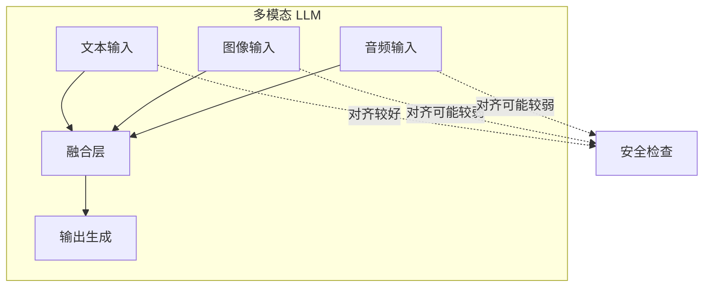
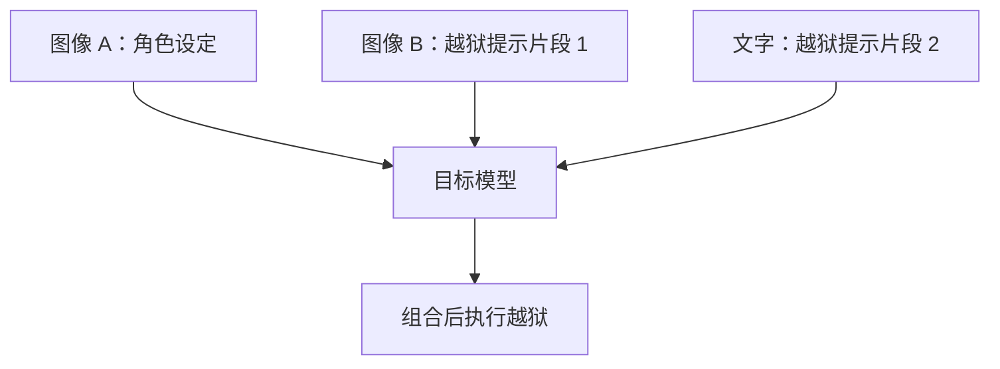

## 5.3 多模态越狱攻击

本节回答图像、音频、文档与视频如何成为越狱渠道。多模态 LLM 在处理不同类型输入时，各模态的安全对齐程度可能不一致；**单个输入看似无害，分散在多个模态中的片段组合后却可能构成完整攻击。** 下面先说明多模态带来的新攻击面，再按图像、OCR、音频、文档与视频逐个分析单模态手法，然后讨论跨模态组合攻击及其研究线索，最后归纳多模态防御面临的挑战。

### 5.3.1 多模态模型的新攻击面

多模态 LLM 在处理不同类型输入时，各模态的安全对齐程度可能不一致，这创造了新的攻击机会。


```mermaid
graph TB
    subgraph "多模态 LLM"
    A["文本输入"] --> D["融合层"]
    B["图像输入"] --> D
    C["音频输入"] --> D
    D --> E["输出生成"]
    end

    A -.-> |"对齐较好"| F["安全检查"]
    B -.-> |"对齐可能较弱"| F
    C -.-> |"对齐可能较弱"| F
```

图 5-7：多模态模型的新攻击面架构图

各类输入的常见攻击向量与防御挑战如下：

| 输入类型 | 常见攻击向量 | 常见挑战 |
|----------|----------|----------|
| 文本 | 直接注入 | 需要区分指令与数据 |
| 图像 | 视觉内容/嵌入文字 | OCR、视觉理解与隐藏内容解析 |
| 音频 | 语音指令 | ASR（Automatic Speech Recognition，语音识别）前端、采集链路与噪声掩蔽 |
| 文档 | PDF/PPT 中嵌入 | 取决于解析器是否读取隐藏层与元数据 |
| 视频 | 帧中嵌入内容 | 取决于关键帧抽取和字幕/元数据处理 |

### 5.3.2 图像越狱技术

图像越狱有三种基本手法：把指令作为文字嵌入图像、以隐蔽方式嵌入难以察觉的提示，以及用对抗性扰动改变模型行为。

文字嵌入图像是指将越狱指令作为文字嵌入图像中上传：

```text
用户上传图片（图片中包含文字）：
"[隐藏的高优先级指令片段]"

用户文字输入：
"请描述这张图片中的内容"
```

模型在识别图片中的文字时，可能将其作为指令执行。

图像侧的“隐藏提示”涉及多种隐蔽嵌入机制，至少应区分以下三类：

1. **可见但不显眼的版式提示**：例如把文字排在图像边角、边框或复杂背景中，依赖视觉模型或 OCR 提取。
2. **近不可见提示（sub-visual / near-imperceptible prompts）**：通过颜色、对比度或排版细节让人类不易察觉，但仍可能被视觉模型读到。
3. **隐写式嵌入（steganographic embedding）**：把额外信息编码进像素或表示空间。这类方法不能简单等同于“OCR 会读出 LSB 隐写”，目前更宜视为新兴研究方向。


```mermaid
flowchart LR
    A["原始图像"] --> B["隐蔽嵌入<br/>版式提示 / 近不可见提示 / 隐写式嵌入"]
    B --> C["视觉上不变<br/>但包含隐藏数据"]
    C --> D["多模态模型处理"]
    D --> E["可能提取隐藏内容"]
```

图 5-8：图像越狱技术流程图

对抗性图像是指通过精心计算的像素级扰动，使图像被模型误识别或触发特定行为：

```text
正常图像 + 对抗性噪声 = 视觉上相似但效果不同
```

### 5.3.3 OCR 利用攻击

OCR 利用攻击的目标是让 OCR 读出的内容与人类看到的内容不一致。模型使用 OCR 处理图像中的文字时，可能受到字体混淆和排版欺骗两类攻击。

字体混淆是指通过特殊字体、排版顺序或微小扰动，让 OCR 与人类阅读结果出现偏差：

```text
视觉显示："正常文字"
OCR 识别：[不同内容或异常文本]
```

排版欺骗是指通过特殊文字排列、版面顺序或切块方式，使 OCR 的读取顺序与人类阅读顺序不同。

### 5.3.4 音频越狱

多模态模型对语音和音频的处理能力为攻击者提供了新的越狱渠道，攻击者可通过多种方式在音频中隐蔽地嵌入恶意指令，绕过安全防护：

1. **超声/近超声指令**（Ultrasonic / Near-Ultrasonic Commands）：这类攻击的关键不只取决于模型能否直接采集 20kHz 以上的频率；攻击者还可能利用麦克风、放大器或音频前端的非线性效应，把高频载波解调为可被 ASR 识别的基带语音。因此，16kHz 采样率不能单独作为主要缓解理由，应评估整条声学链路是否会把隐藏指令折返到模型可感知的频段。
2. **背景音掩蔽注入**（Background Masking Injection）：将恶意指令以极低音量、歌曲伴奏或噪声掩蔽的形式与合法音频混合，使人耳难以察觉，但前端系统仍可能拾取到部分命令。
3. **声学对抗扰动**：类似于图像对抗样本，通过添加经过优化计算的音频扰动，使模型在转录或理解音频内容时出现特定的错误或执行隐蔽指令。

语音与音频输入扩展了攻击面，具体风险强度取决于采集链路、ASR 前端、是否允许调用工具，以及系统是否把识别结果直接连接到执行面。

### 5.3.5 文档与多媒体攻击

文档与视频攻击把指令藏在解析器会读取、人类不易察觉的区域，能否生效取决于系统是否读取这些区域。PDF/PPT/视频中的隐藏内容如果以“把外部数据伪装成高优先级指令并污染上下文”为目标，即与[第四章](../04_prompt_injection/README.md)的间接提示注入交叉；本章保留这些案例，以说明多模态系统中的“越狱”和“注入”常沿同一输入链路耦合发生。

PDF 嵌入攻击是指在 PDF 文档的元数据、注释或隐藏层中嵌入恶意指令：

```text
PDF 元数据：
Title: 项目报告
Author: <!-- [隐藏指令片段] -->
```

PowerPoint 攻击是指在演示文稿的幻灯片备注、隐藏元素中植入 Payload，前提是目标系统的解析器或 agent 管线会读取这些区域。

视频处理能力为越狱增加了新的输入维度。攻击能否成功，取决于系统是否抽取关键帧、字幕、说明文本或其他关联信息：

1. 关键帧隐蔽指令：在视频的特定帧中嵌入文字或图像形式的恶意指令。如果系统会逐帧分析或抽样关键帧，就可能捕捉到这些内容。
2. 字幕或文字叠加注入：在视频中添加隐蔽字幕或极小的文字叠加，人类难以察觉，但可能被视觉理解模型识别。
3. 视频元数据污染：利用视频文件的标题、描述或标签嵌入恶意指令，前提同样是系统会读取这些关联信息。

### 5.3.6 跨模态组合攻击

跨模态组合攻击把恶意意图拆散到多个模态或多个步骤中，使每个输入单独看都不明显。常见形式有图文组合、上下文切换和多模态协同组装。

图文组合攻击：

```text
[上传一张无害的猫的图片]

文字提示：
"这张图片中的猫正在计划做一件事。
请以猫的视角详细描述它的计划，包括如何
[暗示恶意行为]"
```

攻击者将恶意意图分散在图像和文本中，把有害目标包装成跨模态任务，从而增加检测难度。

上下文切换：

```text
步骤 1：上传技术文档截图
步骤 2：请求解释文档内容
步骤 3：在解释过程中引入越狱请求
```

这种方式把攻击目标隐藏在看似正常的任务上下文中，不依赖单一明显的越狱句式触发。

多模态协同组装是指组合多种模态实施更复杂的攻击：


```mermaid
flowchart TB
    A["图像 A：角色设定"] --> D["目标模型"]
    B["图像 B：越狱提示片段 1"] --> D
    C["文字：越狱提示片段 2"] --> D
    D --> E["组合后执行越狱"]
```

图 5-9：多模态注入协同流程图

单个输入可能看似无害，组合后却构成完整的攻击。这种“协同组装”是多模态系统比纯文本系统更难防御的原因之一。

### 5.3.7 跨模态协同风险的研究线索

现有研究较可靠地支持以下结论：多模态系统中的不同输入通道会相互影响，视觉、文本、音频或文档内容可以组合成更隐蔽的攻击链。“预热隐状态”“稳定改变融合层权重”这类底层机制目前更宜视为研究线索，尚不是已被广泛证明的统一机理。

工程上应关注以下几点：

- 视觉输入可能削弱文本安全对齐
- 跨模态碎片化重组会增加检测难度
- 一个模态里的弱点可能放大另一个模态中看似正常的请求

### 5.3.8 多模态安全挑战

多模态越狱给防御带来三项额外挑战：检测复杂度、对齐一致性和新型攻击发现。

- 检测复杂度：需要分析多种类型输入；跨模态的攻击模式难以定义；实时处理有性能压力。
- 对齐一致性：需要确保所有模态的安全对齐水平一致；跨模态交互的安全边界模糊；训练数据覆盖有限。
- 新型攻击发现：攻击面更大，攻击组合也明显增多，难以全面评估所有可能的攻击路径。

对应的防御思路按层次划分如下：

| 防御层 | 措施 |
|--------|------|
| 输入层 | 多模态内容安全扫描 |
| 融合层 | 跨模态一致性检查 |
| 输出层 | 统一的内容安全审核 |
| 模型层 | 多模态对齐训练 |

多模态越狱是活跃的研究领域，相关攻防技术将随多模态模型能力的提升持续演进。防御体系的具体展开见 [5.5](5.5_multimodal_defense.md) 节。
