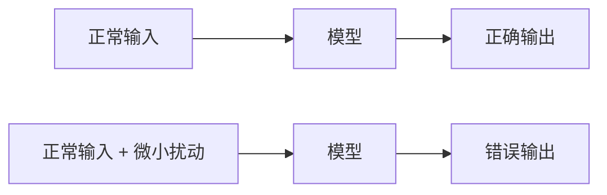
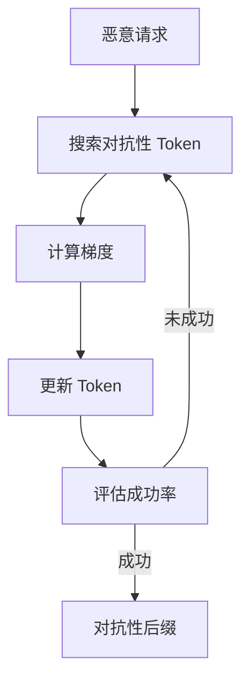
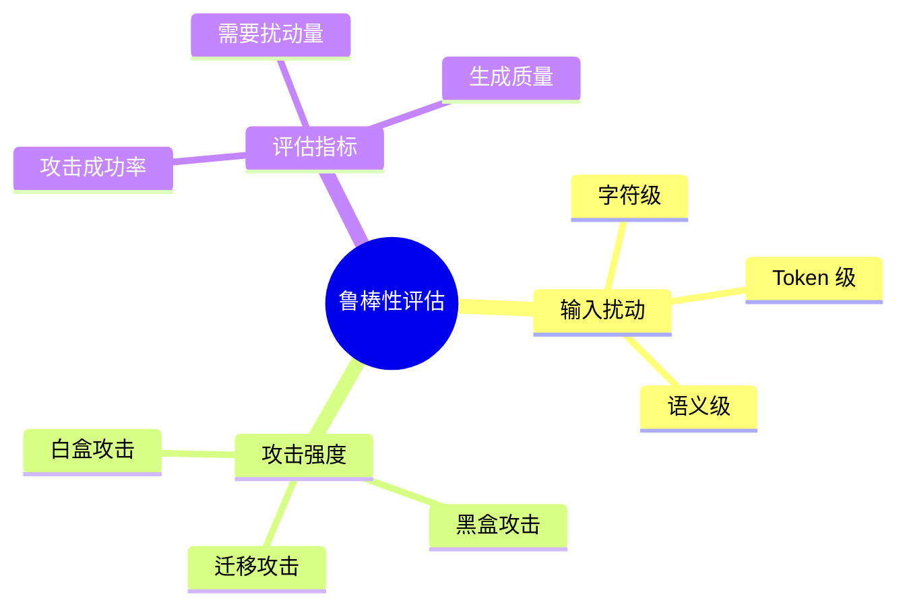
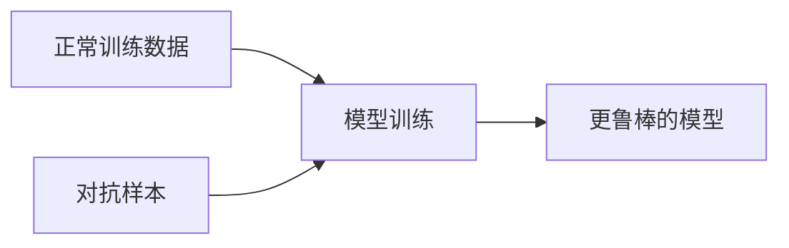
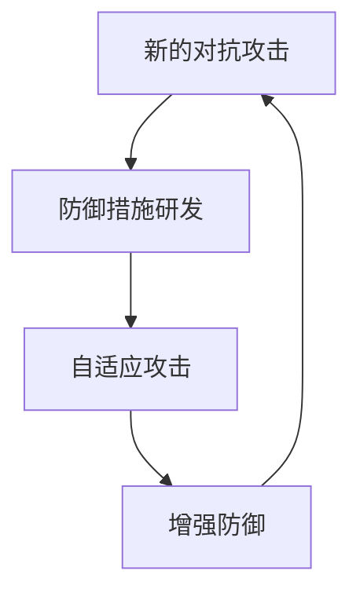

## 5.4 对抗样本与鲁棒性

对抗样本（Adversarial Examples）是机器学习安全的经典话题，其在 LLM 领域呈现出独特的形式和挑战。

### 5.4.1 对抗样本基础

对抗样本是指经过精心设计的输入，对人类来说与正常输入无异，但会导致模型产生错误或意外的输出。

**传统对抗样本**：



图 5-1：对抗样本基础流程图

在图像识别中，对抗样本表现为：添加人眼不可见的噪声，使熊猫图片被识别为长臂猿。

**LLM 对抗样本特点**：

LLM 的对抗样本主要体现在文本层面，形式包括：

| 类型 | 描述 | 示例 |
|------|------|------|
| 字符级扰动 | 插入/替换/删除字符 | "how to mаke" (使用西里尔字母 а) |
| Token 级扰动 | 构造特定 Token 序列 | 无意义但有效的后缀 |
| 语义级扰动 | 改变表达但保持意图 | 各种同义改写 |

### 5.4.2 GCG 攻击：梯度引导的对抗后缀

Greedy Coordinate Gradient（GCG）攻击是一种经典的 LLM 对抗攻击方法。

**基本原理**：

通过计算梯度，找到能够最大化越狱成功概率的 Token 序列，将其作为后缀添加到恶意请求后。



图 5-2：GCG 攻击：梯度引导的对抗后缀流程图

**攻击效果**：

研究表明，通过 GCG 方法生成的对抗性后缀可以显著提高越狱成功率，且具有一定的迁移性——在一个模型上生成的后缀可能对其他模型也有效。

### 5.4.3 AutoDAN：语义化的遗传算法攻击

为了解决 GCG 生成的乱码容易被基于困惑度（Perplexity）的过滤器拦截的问题，AutoDAN 应运而生。

**核心机制**：
- **进化策略**：结合梯度信息与 **遗传算法 (Genetic Algorithm)**。
- **种群进化**：从通过手动越狱的 Prompt 出发作为初始种群，进行变异（同义词替换、句式重组）和交叉。
- **适应度评估**：利用目标模型的反馈作为适应度函数，自动演化出人类难以构想的、语义连贯的攻击 Prompt。

**特点**：
- 生成的 Prompt 是自然语言，隐蔽性强。
- 难以通过简单的统计特征防御。

### 5.4.4 鲁棒性评估

评估 LLM 对对抗攻击的鲁棒性是安全评估的重要组成部分。

**评估维度**：



图 5-3：鲁棒性评估思维导图

**主要评估指标**：

| 指标 | 描述 |
|------|------|
| 攻击成功率 | 对抗样本导致目标行为的比例 |
| 最小扰动量 | 成功攻击所需的最小修改 |
| 迁移成功率 | 跨模型攻击的成功率 |
| 防御绕过率 | 绕过特定防御措施的成功率 |

### 5.4.5 提升鲁棒性的方法

**对抗训练**：

在训练过程中加入对抗样本，使模型学会抵抗此类攻击：



图 5-4：提升鲁棒性的方法流程图

**输入净化**：

在输入到达模型前进行预处理，去除可能的对抗性扰动：

- 字符规范化
- Token 过滤
- 语义保持的改写

**集成防御**：

使用多个模型集成，降低单一对抗样本的成功率。

**认证鲁棒性**：

开发具有可证明鲁棒性的防御方法，在一定扰动范围内保证安全。

### 5.4.6 对抗性与安全对齐

对抗样本与安全对齐的关系：

**对齐的脆弱性**：

安全对齐通过训练使模型学会拒绝有害请求，但这种学习可能被对抗性输入绕过。对齐更多是让模型学会了特定的拒绝模式，而非真正理解什么是有害的。

**对抗性评估**：

对抗样本可作为评估对齐效果的工具：

- 如果简单的对抗样本就能绕过对齐，说明对齐不够鲁棒
- 对抗性评估帮助发现对齐的薄弱点

**鲁棒对齐**：

追求对对抗性攻击也有效的安全对齐：

```
目标：即使面对精心设计的对抗性输入，
模型也能保持安全行为
```

### 5.4.7 对抗与防御的军备竞赛

对抗样本领域呈现出典型的攻防军备竞赛特征：



图 5-5：对抗与防御的军备竞赛流程图

**发展趋势**：

- 攻击方法越来越自动化和高效
- 防御需要在多个层面部署
- 完全的鲁棒性可能无法实现
- 实用防御需要在鲁棒性和成本之间权衡

### 5.4.8 实践建议

**对于安全评估**：

1. 将对抗性测试纳入安全评估流程
2. 使用自动化工具生成对抗样本
3. 关注跨模型的迁移攻击
4. 持续跟踪新的攻击技术

**对于防御部署**：

1. 实施输入预处理和规范化
2. 部署多层防御机制
3. 监控异常输入模式
4. 保持模型和防御措施的更新

对抗样本和模型鲁棒性是 LLM 安全的重要组成部分。虽然完美的鲁棒性难以实现，但通过系统性的评估和防御措施，可以显著提高安全水平。
