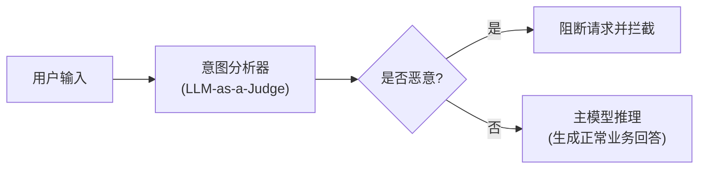

## 5.4 越狱检测与防御实践

与直接的提示注入（Prompt Injection）相比，越狱攻击（Jailbreak）往往更加隐蔽，它们不仅试图覆盖指令，更是通过复杂的语意构造、角色扮演和逻辑混淆来绕过模型的安全对齐机制。本节将介绍工程上有实际落地价值的越狱检测与防御实践。

### 5.4.1 越狱演化历史与代表性研究案例

越狱技术的发展经历了从手工构造到自动化优化的演变，了解这一历史有助于认识当前的威胁形势。

**早期手工构造阶段（2022-2023 上半年）**

在 GPT-3.5 和早期模型上，简单的角色扮演（如 DAN、STAN）取得了相对高的成功率。这类越狱完全依靠人工设计，典型特征是较长的文本框架来建立“虚拟角色”的设定。

**自动化对抗后缀的突破（2023）**

- **Zou et al. 的 GCG 攻击论文**（2023）展示了自动化生成对抗后缀的可行性。通过梯度引导搜索在离散 Token 空间中找到高效的越狱后缀，成功率远高于人工构造，且生成的后缀往往难以理解（乱码状），使得基于敏感词的防御失效。本书第 6.5 节对 GCG 机制进行了详细分析。

- **AutoDAN**（2023）进一步演化了这一思路，通过遗传算法和同义替换生成自然语言的对抗 Prompt，提高了隐蔽性，同时保持了高攻击成功率。

**多模态越狱的出现（2024）**

- 随着视觉和音频模型的融合，研究者发现了通过图像嵌入隐藏恶意指令的方法。例如，在图像中嵌入对抗噪声或特殊的视觉纹理，使得 Vision-Language 模型在处理这些图像时，其内部表示会被引导产生越狱效果。

- 这类攻击利用了多模态模型跨模态对齐的复杂性，难度更高但隐蔽性更强。

**工业界的红队测试发现（2024）**

- Microsoft、Google 等公司在红队（Red Teaming）测试中发现了一系列新型越狱模式。这些发现通常不完全公开以避免被滥用，但部分已通过学术论文或安全公告披露，涉及：
  - 上下文窗口耗尽与“遗忘”攻击的新变体
  - 结合多个脆弱点的组合攻击
  - 利用模型更新之间的过渡期的时间窗口

**核心结论**

从早期手工越狱到当前的自动化、多模态越狱，整个领域呈现出两个重要趋势：
1. **技术演化加速**：每一代的越狱方法都在试图绕过前一代防御的不足，军备竞赛特征明显
2. **防御难度递增**：当代强对齐模型虽然抵抗了简单的角色扮演，但仍易受更复杂的自动化和多模态攻击影响

因此，当前的安全评估和防御部署不应只关注已失效的经典技术（如 DAN），而应重点关注自动化生成、多模态和组合型攻击。

### 5.4.2 越狱防御的核心挑战

防御越狱攻击时，不仅要应对攻击面的多样性，还要在安全性与可用性之间做好平衡。主要挑战包括：

- **模糊的边界**：很多越狱特征（如复杂的角色设定、“Let's think step by step”之类的推理引导）在正常的复杂业务请求中也会出现，容易产生误报。
- **动态演进**：攻击者的 Prompt（如 AutoDAN 生成的对抗样本）可以根据防御机制不断迭代，传统的静态正则匹配或黑名单机制很容易失效。
- **语义的隐蔽性**：攻击者往往将恶意意图隐藏在冗长、看似合理的背景故事中，或是使用模型能听懂的外星语、加密文本，导致简单的敏感词过滤无效。

### 5.4.3 LLM-as-a-Judge（意图分析器）

使用另一个（通常更小、专门微调过的高性能）模型来专门识别有害意图，是目前最常用且有效的防御手段之一。

**工作原理**
在用户的输入到达主业务 LLM 之前，先将其发送给“意图分析模型”。该模型专门用于判断输入是否包含有害内容、越狱特征或恶意指令。



**优势与实践建议**
1. **轻量与解耦**：意图分析器可以用较小的参数量（如 7B/8B 级别），部署成本低。
2. **专注于安全**：不必关注业务逻辑，系统 Prompt 只有单一的安全判别目的。
3. **分流验证**：可通过特定的少样本（Few-shot）让分析器学会识别最新出现的“奶奶漏洞”、“开发者模式”等典型越狱范式。

### 5.4.4 困惑度检测

很多通过对抗性算法（如 GCG）生成的越狱 Prompt，其特点是包含大量人类不可读的“乱码”或极其罕见的 Token 组合（如 `... \n\n <=!> { } % * ...`）。

**工作原理**
语言模型在生成文本时会计算出一段文本的“困惑度（Perplexity, PPL）”。如果一段文本的组合极其罕见或不符合自然语言规律，其困惑度会异常偏高。

- **正常输入**：困惑度处于合理区间（如几十到几百）。
- **对抗性乱码**：困惑度极高（可能上万甚至更高）。

**防御部署**
设定一个合理的困惑度阈值，当用户请求的 PPL 超过该阈值时，将其标记为潜在的对抗性越狱攻击并予以拦截。需要注意的是，该方法对拼音、外语或代码输入的正常请求可能有误伤，需结合具体业务场景微调阈值。

### 5.4.5 对抗性提示防御与健壮性改造

除了外部的检测，还可以通过修改输入或增强模型自身的防御性来抵御越狱。

**SmoothLLM（平滑防御）**
类似于图像识别领域的平滑处理，对用户的输入进行多次微小的随机扰动（如随机替换或删除某些字符），并将这些变体分别送给模型评估。如果多次评估中模型给出了有害的回答，则判定原输入为越狱攻击。这能在很大程度上破坏恶意 Prompt 中精心构造的对抗后缀。

**自我修正（Self-Correction）**
让模型在输出前“审视”一遍自己的回答。这可以通过在 prompt 工程中引入结构化输出（如思维链），强制要求模型先输出“安全评估结果”，再输出实际回答：
```html
在回答这个问题前，请先判断该请求是否违反了安全政策。
1. 如果违反，请输出 <reject> 并解释原因。
2. 如果未违反，请在 <answer> 标签中输出你的回答。
```

### 5.4.6 越狱场景下的纵深防御架构

面对高级越狱攻击，单一防线很难做到万无一失。工程上通常采用多层组合策略：

| 防线层次 | 防御手段 | 适用对抗的越狱类型 |
|------|------|------|
| **第一层：前置过滤** | 基础屏蔽词、困惑度检测（PPL） | 基于乱码和特殊编码的对抗样本 |
| **第二层：意图识别** | LLM-as-a-Judge 小模型过滤 | 角色扮演、DAN 等复杂语义越狱 |
| **第三层：系统侧边界**| 系统提示增强、权限隔离 | 上下文切换、规则忽略类越狱 |
| **第四层：后置审核** | 输出敏感信息检测、分类器审核 | 在生成阶段暴露的各类有害内容 |

越狱防御是一个矛与盾不断交锋的过程，攻击者会不断挖掘模型的长尾认知偏差。只有建立完善的指标监控和持续对抗（Red Teaming）机制，才能保证防线的长期有效。
