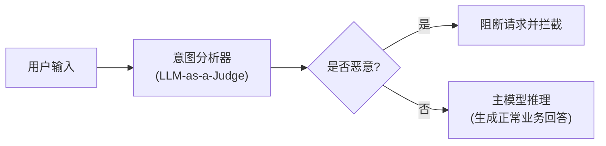

## 5.4 越狱检测与防御实践

本节回答工程上如何检测并防御文本越狱。与直接的提示注入（Prompt Injection）相比，越狱攻击（Jailbreak）往往更加隐蔽：除试图覆盖指令外，还通过复杂的语义构造、角色扮演和逻辑混淆绕过模型的安全对齐机制。**单一防线难以完全抵御高级越狱攻击，工程上需要把前置过滤、意图识别、系统侧边界和后置审核组合成纵深防御。** 下面先回顾越狱技术的演化以明确当前威胁，再分析防御的核心挑战，然后依次介绍 LLM-as-a-Judge、困惑度检测、对抗性提示防御三类手段，最后给出纵深防御架构。

### 5.4.1 越狱演化历史与代表性研究案例

越狱技术经历了从手工构造到自动化优化、再到多模态与组合攻击的演变，防御重点也应随之转移。

#### 早期手工构造阶段（2022-2023 上半年）

在 GPT-3.5 和早期模型上，简单的角色扮演（如 DAN、STAN）取得了较高的成功率。这类越狱完全依靠人工设计，典型特征是用较长的文本框架建立“虚拟角色”设定。

#### 自动化对抗后缀的突破（2023）

- Zou et al. 的 GCG 攻击论文（2023）展示了自动化生成对抗后缀的可行性。该方法通过梯度引导搜索在离散 Token 空间中找到高效的越狱后缀，成功率远高于人工构造；生成的后缀往往呈乱码状、难以理解，使基于敏感词的防御失效。第 [6.5](../06_data_model_attacks/6.5_adversarial_robustness.md) 节详细分析了 GCG 机制。
- AutoDAN（2023）进一步发展了这一思路，通过遗传算法和同义替换生成自然语言的对抗 Prompt，提高了隐蔽性，同时保持了高攻击成功率。

#### 多模态越狱的出现（2024）

- 随着视觉和音频模型的融合，研究者发现了通过图像嵌入隐藏恶意指令的方法。例如，在图像中嵌入对抗噪声或特殊的视觉纹理，使 Vision-Language 模型处理这些图像时的内部表示被引导，从而产生越狱效果。
- 这类攻击利用了多模态模型跨模态对齐的复杂性，难度更高但隐蔽性更强。

#### 工业界的红队测试发现（2024）

Microsoft、Google 等公司在红队（Red Teaming）测试中发现了一系列新型越狱模式。这些发现通常不完全公开以避免被滥用，但部分已通过学术论文或安全公告披露，涉及：

- 上下文窗口耗尽与“遗忘”攻击的新变体
- 结合多个脆弱点的组合攻击
- 利用模型更新之间的过渡期的时间窗口

#### 演化趋势与防御重点

从早期手工越狱到当前的自动化、多模态越狱，整个领域呈现出两个重要趋势：

1. 技术演化加速：每一代越狱方法都针对前一代防御的不足，攻防对抗特征明显。
2. 防御难度递增：当代强对齐模型虽然抵抗了简单的角色扮演，但仍易受更复杂的自动化和多模态攻击影响。

因此，当前的安全评估和防御部署不应只关注已失效的经典技术（如 DAN），而应重点关注自动化生成、多模态和组合型攻击。

### 5.4.2 越狱防御的核心挑战

越狱防御既要应对多样的攻击面，也要平衡安全性与可用性。主要挑战有三项：

- 模糊的边界：很多越狱特征（如复杂的角色设定、“Let's think step by step”之类的推理引导）在正常的复杂业务请求中也会出现，容易产生误报。
- 动态演进：攻击者的 Prompt（如 AutoDAN 生成的对抗样本）可以根据防御机制不断迭代，传统的静态正则匹配或黑名单机制容易失效。
- 语义的隐蔽性：攻击者往往将恶意意图隐藏在冗长、看似合理的背景故事中，或使用模型能够理解的外星语、加密文本，使简单的敏感词过滤失效。

### 5.4.3 LLM-as-a-Judge（意图分析器）

**LLM-as-a-Judge** 是指使用另一个模型（通常是更小、经专门微调的高性能模型）专门识别有害意图，是目前最常用且有效的防御手段之一。

其工作原理是：用户输入到达主业务 LLM 之前，先发送给“意图分析模型”，由该模型判断输入是否包含有害内容、越狱特征或恶意指令。


```mermaid
flowchart LR
    A["用户输入"] --> B["意图分析器<br/>(LLM-as-a-Judge)"]
    B --> C{"是否恶意?"}
    C --> |是| D["阻断请求并拦截"]
    C --> |否| E["主模型推理<br/>(生成正常业务回答)"]
```

这种做法的优势与实践建议如下：

1. 轻量与解耦：意图分析器可以用较小的参数量（如 7B/8B 级别），部署成本低。
2. 专注于安全：不必关注业务逻辑，系统 Prompt 只有单一的安全判别目的。
3. 分流验证：可通过特定的少样本（Few-shot）让分析器学会识别最新出现的“奶奶漏洞”、“开发者模式”等典型越狱范式。

### 5.4.4 困惑度检测

困惑度检测针对算法生成的乱码式越狱 Prompt。许多由对抗性算法（如 GCG）生成的越狱 Prompt 包含大量人类不可读的“乱码”或极其罕见的 Token 组合（如 `... \n\n <=!> { } % * ...`）。

其工作原理是：语言模型在生成文本时会计算出一段文本的“困惑度（Perplexity, PPL）”。如果一段文本的组合极其罕见或不符合自然语言规律，其困惑度会异常偏高。

- 正常输入：困惑度处于合理区间（如几十到几百）。
- 对抗性乱码：困惑度极高（可能上万甚至更高）。

部署时设定一个合理的困惑度阈值，当用户请求的 PPL 超过该阈值时，将其标记为潜在的对抗性越狱攻击并予以拦截。该方法可能误伤拼音、外语或代码等正常输入，需结合具体业务场景调整阈值。

困惑度由一个语言模型对文本逐 token 计算：先求各 token 的平均负对数似然，再取指数。文本越不通顺、越不合语法，值越高。计算它可用被保护模型本身，也可另选小模型，例如 [Alon 与 Kamfonas](https://arxiv.org/abs/2308.14132) 用的是 GPT-2。[Jain 等人](https://arxiv.org/abs/2309.00614)给出了两种过滤器和阈值取法：

1. **整段过滤**：阈值取一组不带后缀的有害请求（AdvBench）中困惑度的最大值，超过即报警。
2. **窗口过滤**：把文本切成连续的若干段（论文的窗口为 10 个 token），任一段的困惑度超过阈值即视为可疑。

他们的实验中，两种过滤器都拦下了全部 GCG 后缀；但在 AlpacaEval 的正常指令上，平均约十分之一被误判。作者因此认为单独使用过于粗暴，更合适的做法是不直接丢弃高困惑度输入，而是转交其他防御处理，或用于识别恶意用户。Alon 与 Kamfonas 则以困惑度和 token 长度为特征训练 LightGBM 分类器，以降低误报。

困惑度检测不管通顺的越狱提示。AutoDAN 用遗传算法生成通顺的自然语言提示，其[论文](https://arxiv.org/abs/2310.04451)报告它能有效绕过基于困惑度的防御（另见 [6.5](../06_data_model_attacks/6.5_adversarial_robustness.md)）；SmoothLLM 论文的对比中，困惑度过滤只使 PAIR 的攻击成功率相对下降 32%（SmoothLLM 为 60%）。

### 5.4.5 对抗性提示防御与鲁棒性改造

除外部检测外，还可以通过修改输入或增强模型自身的防御能力抵御越狱，代表做法是 SmoothLLM 和自我修正。

**SmoothLLM（平滑防御）** 类似于图像识别领域的平滑处理，对用户输入生成多个随机字符扰动副本，分别送给模型，再对各副本的回答做聚合（多数表决）。其前提是论文的核心发现：对抗后缀对字符级改动极其脆弱，只改动后缀中很小比例的字符，攻击成功率常常下降一个数量级以上。它处理一条输入的步骤如下（[论文](https://arxiv.org/abs/2310.03684)）：

1. 把输入复制 N 份，每份随机扰动比例为 q 的字符。扰动有三种：在随机选中的字符后插入随机字符（insert），把随机选中的字符换成随机字符（swap），把一段连续字符整体换成随机字符（patch）。
2. 把 N 份扰动后的输入分别送给模型，得到 N 个回答。
3. 用越狱判定函数逐个判断回答是否越狱。官方实现的判定很简单：回答中不含“I'm sorry”“I cannot”等拒答短语即记为越狱。
4. 多数表决：越狱的比例超过一半则整体判为越狱，否则判为未越狱；从与多数结论一致的回答中随机返回一个。

可见 SmoothLLM 不拦截请求，越狱判定只用于表决。它靠扰动打断攻击，使多数副本回到拒答；若多数副本仍然越狱，返回的也是越狱回答。论文的实测范围是 GCG、PAIR、RandomSearch、AmpleGCG：GCG 的攻击成功率被压到 1% 以下；对语义型的 PAIR，Vicuna 与 GPT-4 上只降到约一半，GPT-3.5 上降到约 1/29。代价有两项：每条请求要调用模型 N 次；q 越大，正常任务的表现下降越多，论文称这一代价虽小但不可忽略。[官方代码](https://github.com/arobey1/smooth-llm)用 `--smoothllm_num_copies`、`--smoothllm_pert_pct` 和 `--smoothllm_pert_type` 三个参数设置 N、q 与扰动类型，README 的示例是 10 份副本、扰动 10% 的字符、swap 扰动。

**自我修正（Self-Correction）** 是指让模型在输出前“审视”自己的回答。具体做法是在 prompt 中引入结构化输出（如思维链），要求模型先输出“安全评估结果”，再输出实际回答：

<!-- SAFE-LAB: defensive-only -->
```html
在回答这个问题前，请先判断该请求是否违反了安全政策。
1. 如果违反，请输出 <reject> 并解释原因。
2. 如果未违反，请在 <answer> 标签中输出你的回答。
```

### 5.4.6 越狱场景下的纵深防御架构

单一防线难以完全抵御高级越狱攻击，工程上通常采用四层组合策略：

| 防线层次 | 防御手段 | 适用对抗的越狱类型 |
|------|------|------|
| 第一层：前置过滤 | 基础屏蔽词、困惑度检测（PPL） | 基于乱码和特殊编码的对抗样本 |
| 第二层：意图识别 | LLM-as-a-Judge 小模型过滤 | 角色扮演、DAN 等复杂语义越狱 |
| 第三层：系统侧边界 | 系统提示增强、权限隔离 | 上下文切换、规则忽略类越狱 |
| 第四层：后置审核 | 输出敏感信息检测、分类器审核 | 在生成阶段暴露的各类有害内容 |

越狱攻防是持续对抗的过程，攻击者会不断挖掘模型的长尾认知偏差。只有建立完善的指标监控和持续对抗（Red Teaming）机制，才能保证防线长期有效。
