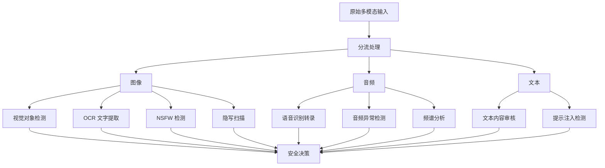
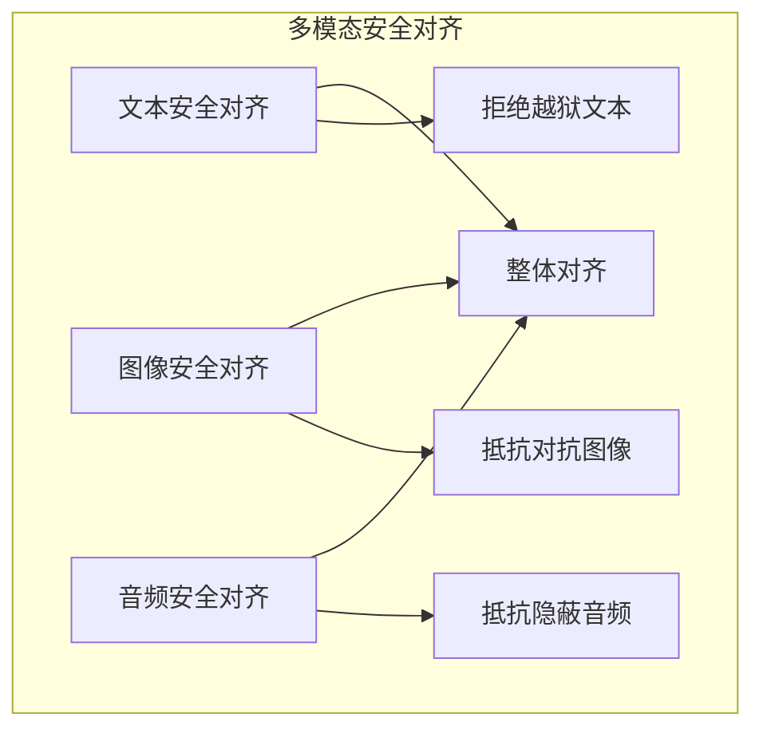

## 5.5 多模态安全防御体系

随着多模态 LLM 的快速演进，多模态攻击的复杂性和隐蔽性也在不断提升。单一模态的防御策略已难以应对跨模态的协同攻击。本节系统阐述多模态安全防御的核心原则、技术方案和落地实践。

### 5.5.1 多模态防御的核心挑战

**防御复杂度增长**

多模态系统通常需要更多检测与治理环节，但具体控制点取决于输入来源、工具权限和业务风险：

```text
单一文本系统：
→ 主要关注文本输入、上下文构建与输出治理

多模态系统：
→ 还可能额外涉及图像、音频、文档解析、工具权限和跨模态协同检查
```

**跨模态攻击的隐蔽性**

相比单一模态攻击，跨模态攻击具有以下特点：

| 攻击特征 | 单一模态 | 多模态 |
|----------|----------|--------|
| 隐蔽化方式 | 文本变形 | 跨模态分散 |
| 欺骗方式 | 单一触发器 | 多个触发器协同 |
| 检查工具 | 较集中 | 往往需要组合多套工具链 |
| 主要难点 | 文本边界识别 | 输入链路更长、系统边界更多 |

**防御与可用性的权衡**

过度严格的防御可能导致：
- 合法图像被误判（如包含文字的 OCR 识别失败）
- 音频识别错误率上升
- 用户体验严重下降

### 5.5.2 输入层多模态内容安全扫描

**分模态的内容识别**



图 5-10：分模态内容安全扫描流程图

**图像安全检查示例**

#### 视觉内容检测

- 可使用目标检测模型（YOLO、Faster R-CNN 等）识别高风险物体
- 检测是否存在武器、毒品、暴力等禁止内容
- 评估图像中人脸的合法性（检测深度伪造）

#### OCR 与文本提取

- 提取图像中的所有文字并进行内容安全检查
- 可尝试检测隐蔽文字编码（微观文字、近不可见提示等）
- 验证文字与图像主体的关联合理性

#### 隐写与隐蔽攻击检测

   - **LSB 分析**：尝试检测最低有效位隐写
   - **频域分析**：检查图像频域是否存在异常模式
   - **噪声模式识别**：识别是否存在对抗样本特征

这些方法更适合视为可选启发式检测，能够降低部分风险，但不能替代权限隔离、人工确认和系统级防护。

```python

# 伪代码：隐写检测
def detect_steganography(image):
    """检测图像中的隐写内容"""
    # 提取 LSB 信息
    lsb_data = extract_lsb(image)

    # 频域分析
    freq_spectrum = fft(image)
    anomaly_score = detect_frequency_anomaly(freq_spectrum)

    # 对抗样本特征检查
    adversarial_score = check_adversarial_patterns(image)

    if anomaly_score > threshold or adversarial_score > threshold:
        return "SUSPICIOUS"
    return "CLEAN"
```

**音频安全检查**

#### 转录与内容检查

- 将音频转录为文本，对转录内容进行安全检查
- 可组合 ASR 与二次校验模型提高准确度；若使用 OpenAI 方案，当前更常见的是 `gpt-4o-transcribe` / `gpt-4o-mini-transcribe`

#### 频谱异常检测

- 分析是否存在超声波、噪声掩蔽或异常频谱模式
- 检测背景音掩蔽注入的特征

```python
def detect_hidden_audio_commands(audio_file):
    """检测隐蔽音频指令"""
    # 加载音频
    waveform, sr = librosa.load(audio_file)

    # 频域分析
    spectrogram = librosa.feature.melspectrogram(y=waveform, sr=sr)

    # 检查超声波频段（>20kHz）
    ultrasonic_energy = np.sum(spectrogram[-2:, :])

    # 检查异常频谱分布
    freq_anomaly = detect_unusual_frequency_patterns(spectrogram)

    risk_score = (ultrasonic_energy + freq_anomaly) / 2
    return risk_score
```

### 5.5.3 融合层的跨模态一致性检查

多模态模型的关键风险点在于不同模态在融合层的交互。

**多模态对齐验证**

```text
正常情况：
图像：“一个红色的苹果”  +  文本："描述这个水果"
→ 融合：苹果是水果 ✓
→ 输出：一致

攻击情况：
图像：“包含隐蔽指令的噪声”  +  文本："描述这个图像"
→ 融合：模态不对齐，但模型仍可能处理 ✗
→ 输出：可能执行隐蔽指令
```

**跨模态一致性检查算法（研究性启发式）**

```python
def verify_multimodal_consistency(image, audio, text):
    """
    验证多模态输入的一致性，检测跨模态攻击
    """
    # 提取各模态的语义表示
    image_features = vision_encoder(image)
    audio_features = audio_encoder(audio)
    text_features = text_encoder(text)

    # 计算模态间的相似度
    img_audio_sim = cosine_similarity(image_features, audio_features)
    img_text_sim = cosine_similarity(image_features, text_features)
    audio_text_sim = cosine_similarity(audio_features, text_features)

    # 检查一致性
    consistency_score = (img_audio_sim + img_text_sim + audio_text_sim) / 3

    # 如果一致性过低，可能存在攻击或模态不匹配
    if consistency_score < CONSISTENCY_THRESHOLD:
        # 标记为可疑，进行额外检查
        return {
            "risk": "HIGH",
            "consistency_score": consistency_score,
            "misaligned_modalities": identify_suspicious_modalities(...)
        }

    return {"risk": "LOW", "consistency_score": consistency_score}
```

当前尚无公认统一的跨模态一致性阈值，因此这类方法更适合作为研究性启发式，而不是生产环境中的通用判定规则。

**融合层的隐藏状态监控（实验性监测）**

在深度学习中，模型的隐藏状态反映了其内部表示。理论上可以通过监控隐藏状态来检测异常，但这类方法目前更偏研究探索：

```python
def monitor_fusion_layer_activation(hidden_states, threshold=2.0):
    """
    监控融合层的激活模式，检测异常的模态交互
    """
    # 计算隐藏状态的统计特性
    mean_activation = np.mean(hidden_states)
    std_activation = np.std(hidden_states)

    # 检测异常的激活模式（z-score）
    z_scores = np.abs((hidden_states - mean_activation) / std_activation)

    # 如果激活值偏离正常分布太远，可能存在攻击
    anomalies = z_scores > threshold

    if np.sum(anomalies) > 0.1 * len(hidden_states):  # 示例阈值
        return "SUSPICIOUS_ACTIVATION_PATTERN"

    return "NORMAL"
```

### 5.5.4 对抗训练与模态对齐

**安全对齐的多模态扩展**

传统的 RLHF 对齐主要针对文本模态。对于多模态模型，需要扩展安全对齐：



图 5-11：多模态安全对齐流程图

**对抗多模态样本训练**

在训练数据中混入对抗样本可以作为研究方向的一部分，但更稳妥的理解是：多模态鲁棒性增强通常需要结合对抗样本、红队样本、定向合成数据和持续评测，而不是依赖单一标准训练 recipe。

1. **对抗图像样本**
   - 使用 PGD（Projected Gradient Descent）生成对抗图像
   - 标注为“拒绝该请求”或“包含潜在恶意内容”

2. **跨模态对抗样本**
   - 组合文本越狱 + 对抗图像
   - 标注使模型学习在任何模态检测到攻击信号时拒绝

3. **隐写对抗样本**
   - 生成包含隐藏指令的图像
   - 让模型学习识别并拒绝处理

```python

# 伪代码：对抗样本生成与训练
def generate_adversarial_multimodal_samples():
    """生成用于安全对齐的对抗多模态样本"""

    adversarial_dataset = []

    # 1. 对抗图像 + 正常文本
    for benign_image in dataset:
        adv_image = pgd_attack(benign_image)  # 生成对抗图像
        adversarial_dataset.append({
            "image": adv_image,
            "text": "describe this",
            "label": "REJECT"  # 标注为拒绝
        })

    # 2. 隐写图像 + 越狱文本
    for base_image in dataset:
        stego_image = embed_hidden_commands(base_image)
        jailbreak_prompt = generate_jailbreak_prompt()
        adversarial_dataset.append({
            "image": stego_image,
            "text": jailbreak_prompt,
            "label": "REJECT"
        })

    # 3. 使用这些样本进行额外安全训练或评测
    train_or_evaluate_with_safety_data(adversarial_dataset)
```

### 5.5.5 多模态防御的分层策略

多模态防御最容易陷入“每个模态都做一点，但整体没有统一分层”的问题。下面这套 **输入预处理 → 模型侧约束 → 输出审核** 三层结构，是一种便于理解的组织方式，而不是唯一或通用标准。真正落地时，还需要补上权限隔离、工具审批、结构化输出和运行时监控。

#### 第一层：预处理与过滤

在数据进入模型前进行预处理：

```python
def multimodal_preprocessing_defense(multimodal_input):
    """多模态输入预处理防御"""

    image = multimodal_input.get("image")
    audio = multimodal_input.get("audio")
    text = multimodal_input.get("text")

    # 图像预处理
    if image is not None:
        # 调整大小和归一化
        image = normalize_image(image)
        # 检测极端对比度或异常像素分布（对抗样本特征）
        if is_anomalous_image(image):
            return {"status": "BLOCKED", "reason": "Anomalous image"}

    # 音频预处理
    if audio is not None:
        # 压缩频率范围，去除超声波
        audio = filter_inaudible_frequencies(audio)
        # 归一化音量
        audio = normalize_audio(audio)

    # 文本预处理
    if text is not None:
        # 标准化格式，去除特殊隐蔽字符
        text = sanitize_text(text)

    return {"status": "ALLOWED", "processed_input": {...}}
```

#### 第二层：模型层防御

在模型推理时进行防御：

```text
检查点 1：输入编码层
├─ 图像编码：检查特征分布异常
├─ 音频编码：检查频谱异常
└─ 文本编码：检查词向量异常

检查点 2：融合层
├─ 跨模态一致性验证
├─ 隐藏状态异常检测
└─ 模态权重分析

检查点 3：解码层
├─ 输出内容合理性检查
└─ 生成内容与输入模态的对应性验证
```

#### 第三层：输出审核

```python
def multimodal_output_audit(model_output, original_input):
    """多模态模型输出审核"""

    # 1. 内容安全检查
    if contains_prohibited_content(model_output):
        return {"action": "REJECT", "reason": "Content violation"}

    # 2. 与输入的对应性检查
    if not is_output_aligned_with_input(model_output, original_input):
        return {"action": "REJECT", "reason": "Output misalignment"}

    # 3. 一致性检查：确保所有模态的输出信号一致
    if has_modality_contradiction(model_output):
        return {"action": "REJECT", "reason": "Modality contradiction"}

    return {"action": "ALLOW", "output": model_output}
```

### 5.5.6 多模态安全的常见工程做法

**实践一：模态隔离架构（可选模式）**

不同模态使用独立的编码器和防御模块，可以作为一种实现方式：

```text
用户输入
├─ 图像分支
│  ├─ 视觉编码器 → 图像内容审核 → 对抗样本检测
│  └─ [输出：安全标记]
├─ 音频分支
│  ├─ 音频编码器 → 转录与审核 → 隐蔽命令检测
│  └─ [输出：安全标记]
├─ 文本分支
│  ├─ 文本编码器 → 提示注入检测 → 内容审核
│  └─ [输出：安全标记]
└─ 融合层
   ├─ 一致性验证（全部分支安全标记为 PASS）
   └─ 安全融合 → 模型推理
```

**实践二：红队评估与持续改进**

针对多模态系统的红队评估应覆盖：

- 单一模态攻击（文本越狱、对抗图像、隐蔽音频）
- 跨模态协同攻击（混合多种模态的攻击）
- 新型组合攻击（利用模态融合特性的攻击）

建议建立“多模态攻击库”，定期更新防御规则。

**实践三：可解释性与可审计性**

对于多模态决策，应记录：

```json
{
  "input": {
    "image_risk_score": 0.3,
    "audio_risk_score": 0.1,
    "text_risk_score": 0.8
  },
  "fusion_level": {
    "consistency_score": 0.95,
    "anomaly_detected": false
  },
  "final_decision": "REJECT",
  "reason": "High-risk text content despite benign image and audio",
  "timestamp": "2026-03-05T10:00:00Z",
  "audit_id": "audit_12345"
}
```

这样的设计使得安全决策可被审计和追溯。

**实践四：性能与安全的平衡**

多模态防御会增加计算开销。下面这些更适合作为部署建议：

- 使用轻量级模型进行初步风险评估
- 只对高风险输入进行深度检查
- 采用优先级队列，不影响低风险请求的处理速度

### 5.5.7 多模态安全的未来方向

1. **统一的模态表示**：研究跨模态的通用表示方法，使防御更高效

2. **自适应防御**：根据不同内容类型和风险等级，动态调整防御强度

3. **联邦学习的安全对齐**：在多个组织间共享安全对齐数据，但不泄露隐私

4. **多模态幻觉检测**：针对多模态模型的幻觉（如描述不存在的图像元素）的检测

多模态安全是一个不断演进的领域，组织需要保持警惕，持续更新防御策略以应对新兴威胁。
