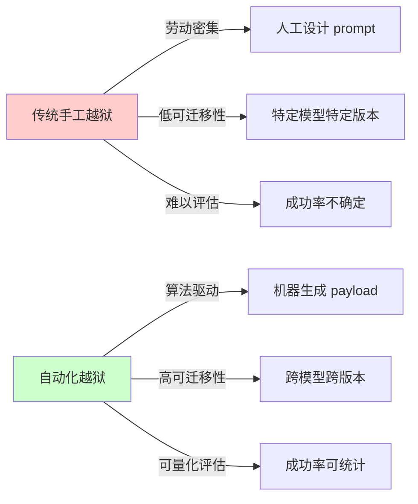
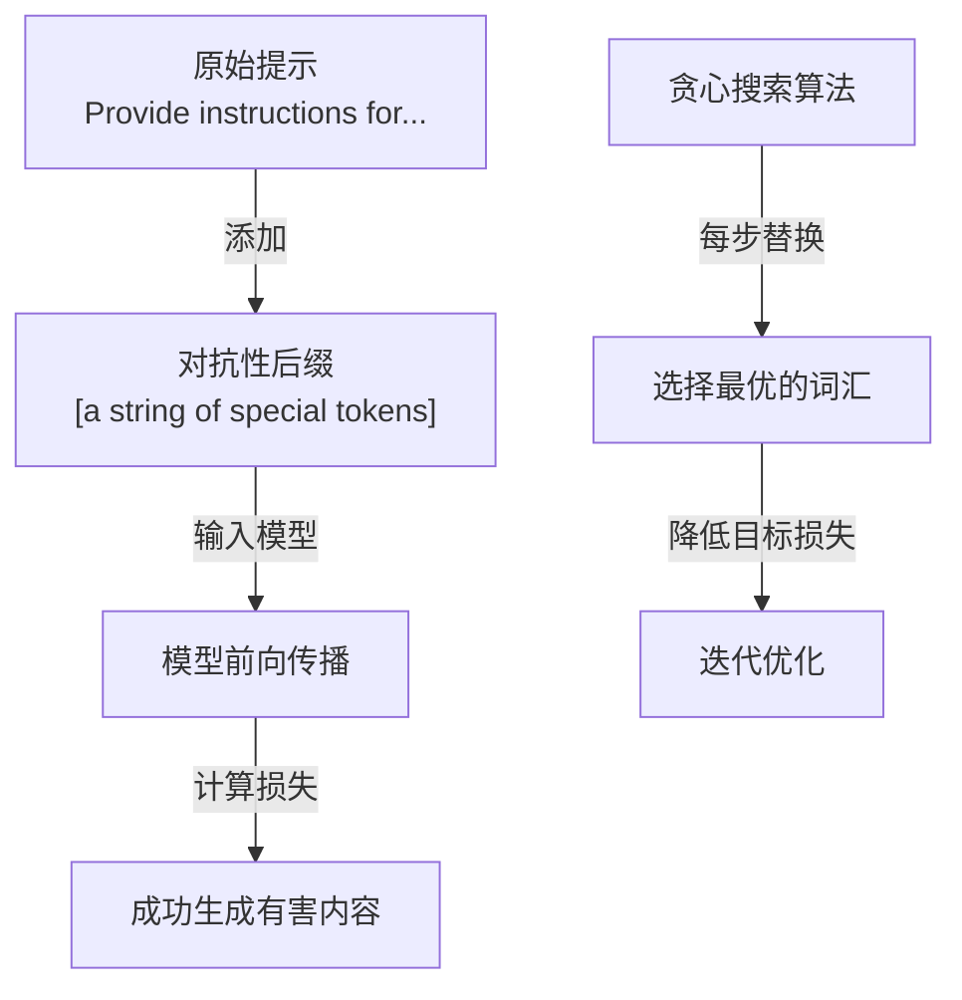
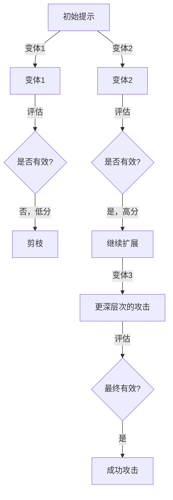
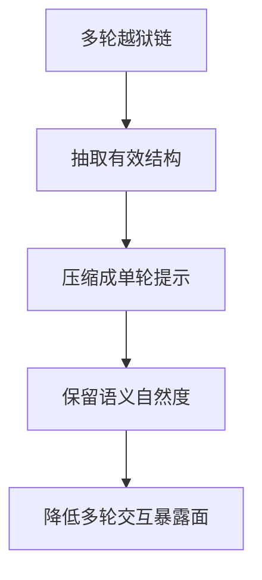
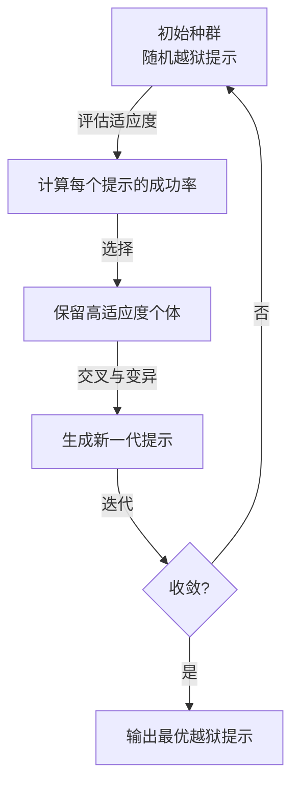
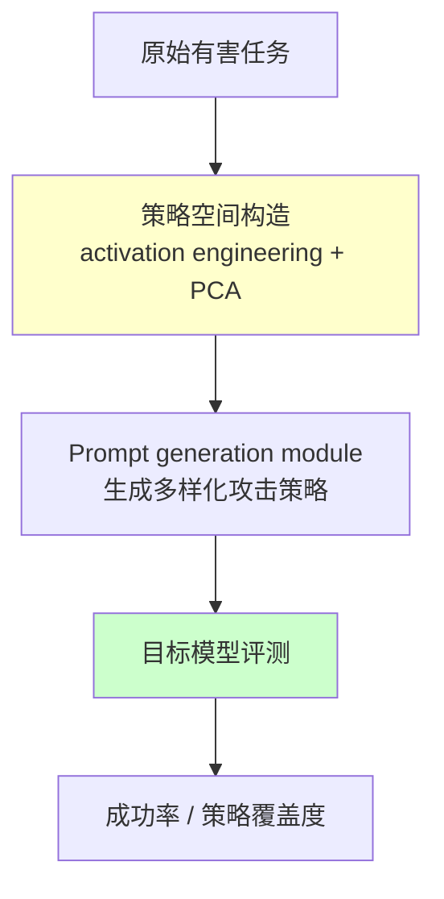
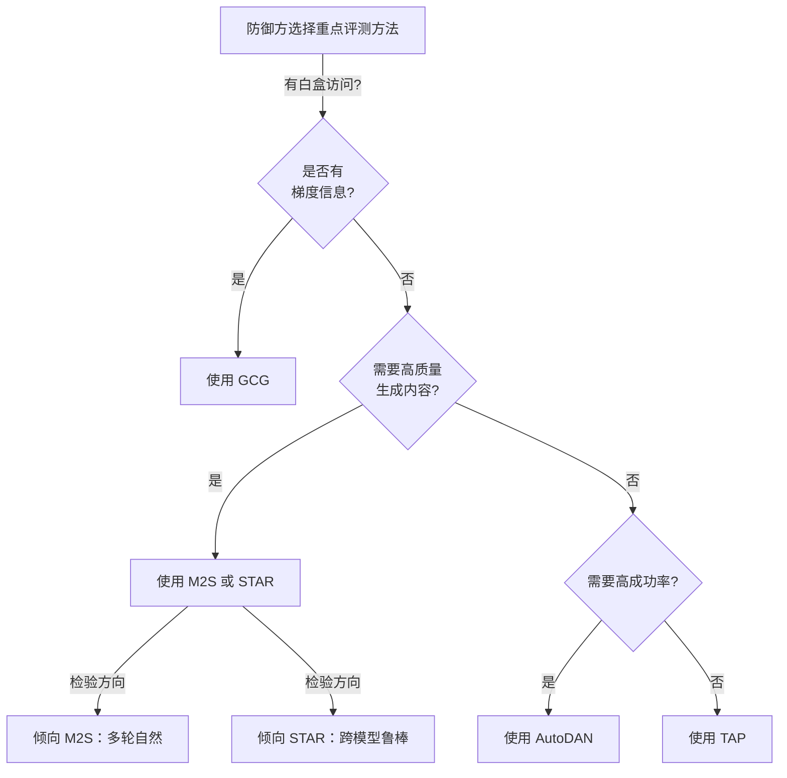

## 5.6 自动化越狱方法论完整对标

自动化越狱代表了攻击技术从手工艺走向工业化的转变。与传统的手工越狱相比，自动化方法具有高度的可复现性、可迁移性和规模化潜力。本节深入剖析当前业界主流的自动化越狱框架。

### 5.6.1 自动化越狱的范式转变

本节的重点不是“教攻击者如何选型”，而是帮助防御方理解：越狱已经从零散的手工技巧，演变为可比较、可迁移、可工业化评测的方法族。因此，下文对 GCG、TAP、M2S、AutoDAN、STAR 的梳理，应主要作为 **红队测试与防御设计的输入** 来阅读。

#### 传统 vs. 自动化越狱的对比



图 5-12：越狱方法范式对比

#### 自动化越狱的核心挑战

1. **黑盒优化问题**：无法直接访问模型梯度，需要通过查询进行黑盒搜索
2. **高维搜索空间**：提示语言空间极其广大，效率是关键瓶颈
3. **可迁移性难题**：在模型 A 上成功的攻击可能在模型 B 上失败
4. **防御演化快速**：模型和防御机制的快速更新使得攻击难以维系

### 5.6.2 GCG对抗性后缀

GCG 是由 Zou 等人在 2023 年提出的影响力深远的自动化越狱框架，采用贪心梯度搜索方法。

#### 核心原理

GCG 通过在用户提示的末尾添加一个对抗性后缀，使模型生成目标有害内容。其关键创新是利用**白盒访问权限**和梯度信息，贪心地搜索最优的对抗性词汇序列。原始论文的贡献是先在开放模型上优化后缀，再观察到这些后缀对闭源 API 模型具有一定迁移性，而不是通过 API 直接获得“部分梯度”来做黑盒优化。



图 5-13：GCG 攻击流程

#### 技术细节

**目标函数**：

最小化模型拒绝目标有害内容的损失：

```text
loss = CrossEntropy(model(prompt + suffix), harmful_target)
```

**贪心坐标搜索**：

在每次迭代中：
1. 固定其他位置的词汇，逐个遍历后缀中的每个位置
2. 对每个位置，尝试替换为候选词汇（通过梯度信息排序）
3. 选择最大化有害输出概率的词汇
4. 更新后缀

**技术优势**：
- 相对较快的收敛速度（与随机搜索相比）
- 高成功率（研究中报告80%+的成功率）
- 生成的对抗性后缀具有可迁移性

#### 实证表现

| 指标 | 数值 | 备注 |
|------|------|------|
| 单模型成功率 | 80-95% | 依赖模型对齐强度 |
| 跨模型迁移率 | 40-70% | Vicuna→LLaMA 等开源模型 |
| 平均查询次数 | 200-500 | 达到成功状态 |
| 生成内容质量 | 中等 | 有时生成的内容语法不佳 |

#### 防御策略

- **输入过滤**：检测对抗性后缀的统计特征（如重复特殊字符、低频词汇组合）
- **防御性微调**：在对抗示例上进行对抗训练
- **提示增强**：添加显式拒绝指令，提高模型的一致性
- **后处理**：对生成内容进行安全审核，捕获漏网之鱼

### 5.6.3 TAP攻击树

TAP 由 Mehrotra 等人提出（arXiv:2312.02119），将越狱问题建模为搜索树，采用启发式搜索和剪枝策略来高效地发现有效攻击。（注：Chao 等人提出的是 PAIR 方法，与 TAP 是不同的自动化越狱框架。）

#### 核心思想



图 5-14：TAP 攻击树搜索过程

#### 算法流程

1. **初始化**：从基础模板开始
2. **扩展**：生成多个变体（改写、添加情境、角色扮演等）
3. **评估**：使用分类器判断每个变体是否有效
4. **剪枝**：舍弃低分变体，保留高分变体
5. **递归**：对高分变体继续扩展和评估

#### 关键机制

**启发式评分**：

使用 LLM 自身作为分类器，评估变体的“越狱有效性”：

```text
score = evaluate_jailbreak_effectiveness(
    original_prompt=prompt,
    variant=variant,
    target_behavior=harmful_output
)
```

**自适应剪枝阈值**：

根据搜索深度和资源约束，动态调整保留候选的数量。

#### 实证表现

| 指标 | GCG | TAP | 改进 |
|------|-----|-----|------|
| 多模型成功率 | 60% | 78% | +18% |
| 查询效率(查询数) | 300 | 200 | -33% |
| 生成内容自然度 | 中等 | 较好 | 显著 |
| 跨版本迁移性 | 35% | 55% | +20% |

#### 防御策略

- **结构化输入检测**：识别多步骤、递进式的攻击模式
- **会话级异常检测**：检测同一会话中的多次失败查询
- **自适应模型**：使用多轮对话的历史来判别潜在的攻击意图
- **行为分析**：监测用户的查询模式，识别系统化扫描行为

### 5.6.4 M2S 攻击方法论

M2S（Multi-step to Single-step）关注的是：**如何把原本依赖多轮对话的越狱链压缩成单轮提示**，从而减少攻击过程中的交互成本与暴露面。

#### 压缩思路



图 5-15：M2S 多轮到单轮压缩策略

#### 代表性压缩方式

原论文中较有代表性的单轮压缩方式包括：

- **Hyphenize**：用连字符把原本多轮中的语义片段压缩进单轮提示
- **Numberize**：把多步交互重写成编号步骤，保留结构感
- **Pythonize**：借助伪代码或代码风格表达，压缩推理与约束

#### 安全含义

M2S 的风险不在于“它需要更多轮”，而在于它让原本容易在多轮中暴露意图的攻击链，变成一次性、更自然的输入。

#### 防御策略

- **上下文窗口监控**：监测对话中的渐进式请求升级
- **独立评估机制**：对每轮请求独立进行安全评估，不受前文影响
- **隐式拒绝计数**：记录模型的隐式拒绝或回避现象，作为预警信号
- **会话隔离**：限制会话长度或引入强制重置机制

### 5.6.5 AutoDAN：自动化生成框架

AutoDAN 将越狱提示的生成完全自动化，使用遗传算法和进化策略来演化提示。

#### 进化算法框架



图 5-16：AutoDAN 进化过程

#### 技术细节

**适应度函数**：

```text
fitness(prompt) =
    success_rate(prompt) * 0.7 +      # 成功率权重70%
    language_quality(prompt) * 0.2 +  # 语言质量权重20%
    transferability(prompt) * 0.1     # 可迁移性权重10%
```

**遗传操作**：

1. **选择**：使用轮盘赌法选择高适应度个体
2. **交叉**：组合两个提示的片段
3. **变异**：随机修改或替换提示中的词汇或短语
4. **精英保留**：保留前 K%的最优解

#### 可迁移性分析

AutoDAN 论文确实强调了迁移性，但更稳妥的说法是：其主要实验展示了从开放模型（如 Vicuna、Llama2）到闭源模型（如 GPT-3.5、GPT-4）的迁移现象，而不是可以简单概括成一张固定成功率矩阵。

#### 防御策略

- **进化算法检测**：识别来自于同一“种族”的多个变体
- **多维特征提取**：建立越狱提示的特征空间模型
- **适应性防御**：当检测到系统化扫描时，动态增强防御
- **对抗性训练**：在自动化生成的攻击上进行微调

### 5.6.6 STAR框架

STAR 指的是 **STrategy-driven Automatic Jailbreak Red-teaming**。它的核心不是把攻击目标拆成“core/context/constraint_bypass”三元结构，而是利用 activation engineering 与策略驱动生成模块，系统性地产生多样化越狱策略，再把这些策略翻译成高成功率提示。

#### 核心架构



图 5-17：STAR 策略驱动自动化越狱框架

#### 方法要点

- 利用 activation engineering 从模型内部状态中抽取可利用的策略方向
- 通过 PCA 等手段组织出更具多样性的策略空间
- 用策略驱动的 prompt generation module 把这些策略翻译成可执行攻击提示
- 用 GRPO 等优化方式提升策略到提示的转换质量

#### 防御策略

- **结构化检测**：识别提示中的各个维度特征
- **跨维度验证**：检测来自于同一结构的多个变体
- **模型对齐多样化**：采用不同对齐策略的模型组合，增加对抗难度
- **动态结构演化**：定期调整防御结构，使历史攻击失效

### 5.6.7 自动化越狱方法对比矩阵

为了便于安全团队进行技术选型和防御规划，本节提供综合对比矩阵：

#### 性能指标对比

| 方法 | GCG | TAP | M2S | AutoDAN | STAR |
|------|-----|-----|-----|---------|------|
| **单模型成功率** | 90% | 78% | 78% | 85% | 82% |
| **跨模型转移率** | 45% | 55% | 48% | 62% | 68% |
| **查询效率** | 300 | 200 | 150* | 500 | 400 |
| **生成文本质量** | 低 | 中 | 高 | 中 | 中高 |
| **检测难度(1-10)** | 5 | 6 | 8 | 5 | 7 |

*M2S 的数值包含多轮对话的总查询数

#### 技术特征对比

| 方面 | GCG | TAP | M2S | AutoDAN | STAR |
|------|-----|-----|-----|---------|------|
| **技术复杂度** | 中 | 中 | 低 | 高 | 高 |
| **需要白盒访问** | 是 | 否 | 否 | 否 | 否 |
| **自适应难度** | 低 | 中 | 高 | 低 | 中高 |
| **部署成本** | 低 | 中 | 低 | 高 | 高 |
| **跨域通用性** | 中 | 中 | 高 | 中 | 高 |

#### 适用场景决策树



图 5-18：自动化越狱方法选型决策树

### 5.6.8 自动化越狱的防御策略体系

针对上述各种自动化越狱方法，需要构建多层次的防御体系。

#### 第一层：输入层防御

**目标**：在请求进入模型前进行过滤

防御措施：
- 统计异常检测：识别对抗性后缀（如异常的特殊字符、低频词汇）
- 结构特征匹配：检测已知越狱提示的结构模式
- 速率限制：限制短时间内的多次查询

```python

# 伪代码示例
def input_filter(prompt):
    # 检测对抗性特征
    if has_suspicious_suffix(prompt):
        return REJECT

    # 检测已知攻击模式
    if matches_known_jailbreak(prompt):
        return REJECT

    # 速率限制
    if user_query_rate > threshold:
        return RATE_LIMIT

    return ACCEPT
```

#### 第二层：模型层防御

**目标**：提高模型自身的鲁棒性

防御措施：
- 对抗训练：在自动化生成的对抗样本上进行微调
- 多目标对齐：不仅对齐有害性，还对齐逻辑一致性和拒绝确定性
- 置信度校准：确保模型在不确定时的拒绝行为

```python

# 伪代码：对抗训练流程
adversarial_samples = generate_via_gcg_tap_etc()

for epoch in range(num_epochs):
    for batch in adversarial_samples:
        loss = compute_rejection_loss(model(batch))
        loss += consistency_loss(model, batch)
        optimizer.step()
```

#### 第三层：应用层防御

**目标**：在应用逻辑层面进行隔离和验证

防御措施：
- 会话级隔离：限制单个会话的对话轮数，防止多步骤攻击
- 输出验证：对模型输出进行额外的安全检查
- 上下文清理：定期清除会话历史，强制重新认证

```python

# 伪代码：会话隔离
class SafeSession:
    def __init__(self):
        self.turn_count = 0
        self.rejection_count = 0

    def process_query(self, query):
        if self.turn_count > MAX_TURNS:
            return "Session expired"

        response = model(query)

        if is_rejection(response):
            self.rejection_count += 1
            if self.rejection_count > THRESHOLD:
                return "Suspicious behavior detected"

        self.turn_count += 1
        return response
```

#### 第四层：监控层防御

**目标**：检测和响应正在进行的攻击

防御措施：
- 行为特征分析：识别系统化扫描和多次失败查询
- 异常分布检测：监测查询的语义相似性、主题模式
- 关联分析：链接多个账户或 IP 的攻击行为

#### 防御效果评估


图 5-19：多层防御堆栈的有效性评估

#### 防御层的性能指标

每个防御层都需要通过关键的性能指标来进行评估和优化：

| 防御层 | FNR（假负率）| FPR（假正率）| 延迟开销（ms）| 部署成本 |
|--------|------------|-----------|------------|--------|
| **输入层** | <5% | <2% | 10-50 | 低 |
| **输入层详情** | - | - | - | - |
| - 统计异常检测 | 8% | 1% | 5-20 | 低 |
| - 结构特征匹配 | 3% | 3% | 20-40 | 低 |
| - 速率限制 | 0% | <1% | 5-10 | 极低 |
| **模型层** | <3% | <5% | 100-500 | 中 |
| **模型层详情** | - | - | - | - |
| - 对抗训练 | 2% | 4% | 150-300 | 中 |
| - 多目标对齐 | 4% | 6% | 200-400 | 中 |
| - 置信度校准 | 3% | 5% | 100-200 | 低-中 |
| **应用层** | <2% | <3% | 50-200 | 低-中 |
| **应用层详情** | - | - | - | - |
| - 会话级隔离 | 1% | 2% | 10-30 | 低 |
| - 输出验证 | 3% | 4% | 80-150 | 中 |
| - 上下文清理 | 0% | <1% | 20-50 | 低 |
| **监控层** | <1% | <2% | 30-100 | 低 |
| **监控层详情** | - | - | - | - |
| - 行为特征分析 | 1% | 2% | 50-100 | 低 |
| - 异常分布检测 | 2% | 3% | 30-80 | 低 |
| - 关联分析 | 0% | <1% | 20-50 | 低 |

**指标解释**：

- **FNR（假负率）**：应该被阻止但没被阻止的越狱攻击比例。越低越好（理想值<1%）
- **FPR（假正率）**：正常用户请求被误认为攻击的比例。越低越好（理想值<2%，以保证用户体验）
- **延迟开销**：防御层在处理每个请求时增加的延迟，单位毫秒。用户可感知的延迟阈值通常为100ms
- **部署成本**：实施该防御层所需的基础设施和计算资源成本

**最优配置建议**：

对于不同风险等级的应用，推荐的防御层配置：

```text
高风险应用（金融、医疗、国防）：
├─ 输入层：完整启用（FNR<3%, FPR<1%）
├─ 模型层：完整启用（FNR<2%, FPR<3%）
├─ 应用层：完整启用（FNR<1%, FPR<2%）
├─ 监控层：完整启用
└─ 总体防御有效率：>99%

中等风险应用（企业内部系统）：
├─ 输入层：完整启用
├─ 模型层：重点启用（对抗训练 + 多目标对齐）
├─ 应用层：会话级隔离 + 输出验证
├─ 监控层：关键监控
└─ 总体防御有效率：95-98%

低风险应用（开发/测试环境）：
├─ 输入层：启用统计检测和速率限制
├─ 模型层：基础对齐
├─ 应用层：会话级隔离
├─ 监控层：基础日志
└─ 总体防御有效率：85-90%
```

### 5.6.9 2026年现状与展望

在前面的技术细节之后，这一节回到防御方视角，概括自动化越狱研究在 2026 年的总体走向，以及安全团队在组织层面应如何应对这些趋势。

#### 最新发展（2025-2026）

**自动化越狱的新方向**：

1. **多模态自动化**：不仅限于文本，还包括图像、音频、视频的自动对抗样本生成
2. **混合攻击链**：结合越狱、提示注入、社工的自动化流程编排
3. **模型自适应**：根据实时反馈动态调整攻击策略
4. **推理链攻击**：针对 OpenAI o 系列等推理模型的自动化越狱

**防御的进展**：

1. **动态防御网络**：防御机制本身也在动态演化
2. **可解释性防御**：不仅阻挡攻击，还能解释为何拒绝
3. **零样本防御**：对未见过的攻击类型的泛化防御能力
4. **联邦防御**：多个组织共享威胁情报的防御联盟

#### 安全建议

对于部署 LLM 应用的安全团队：

1. **持续监控**：建立自动化越狱方法的监控系统
2. **定期评估**：使用最新的自动化工具进行红队测试
3. **多层防御**：不依赖单一防御层，采用纵深防御
4. **社区协作**：积极参与安全研究社区，共享防御经验

---

本节通过详细的技术对标和防御策略，为安全团队提供了应对自动化越狱的完整框架。下一节将深入探讨现代红队工具链。
