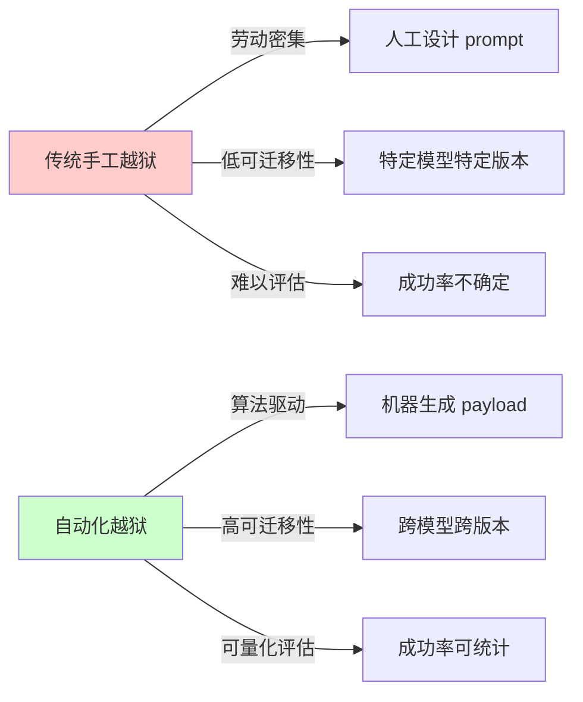
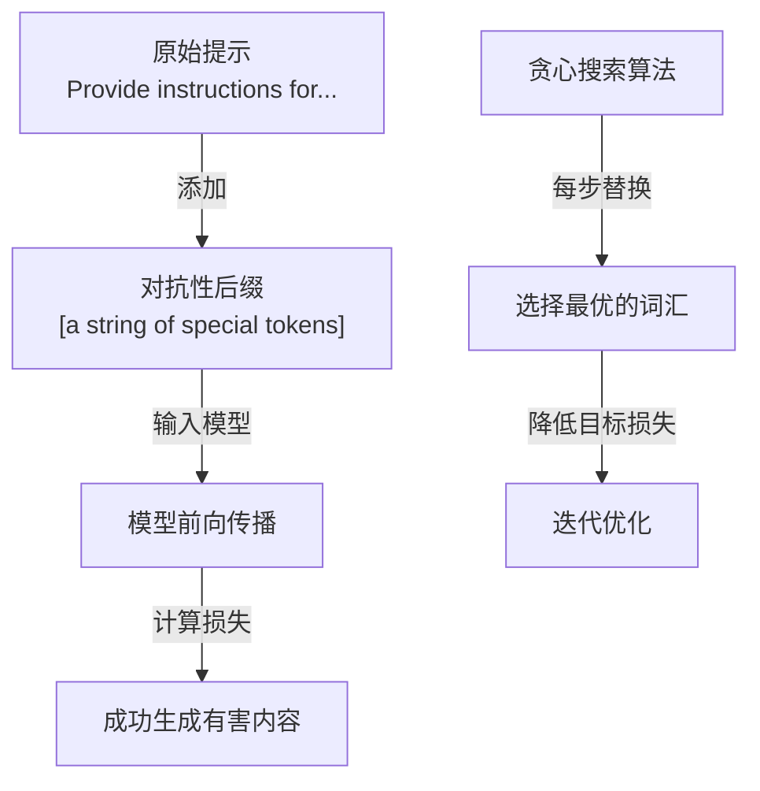
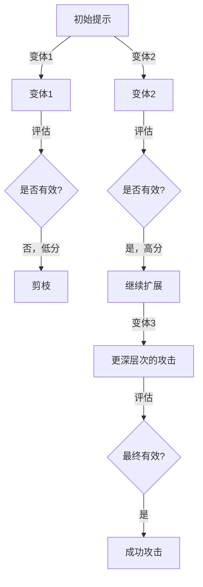
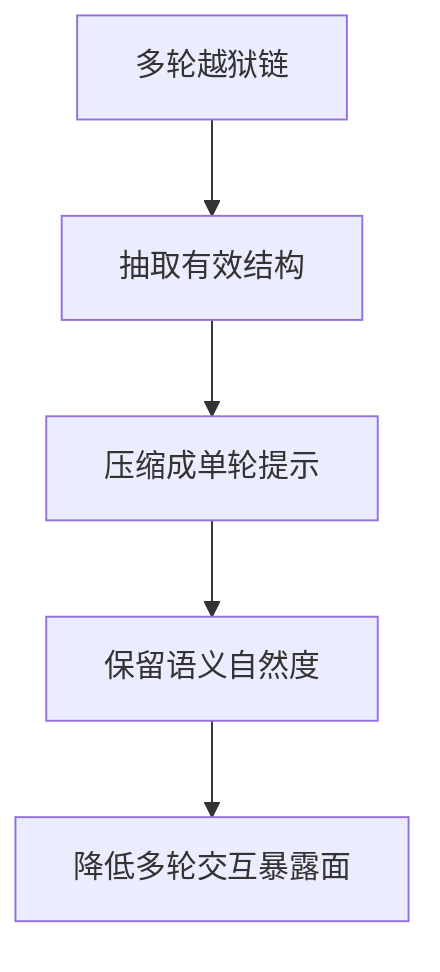
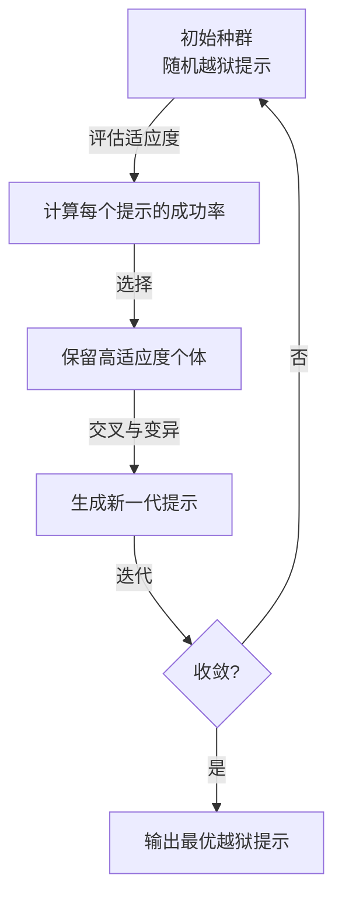
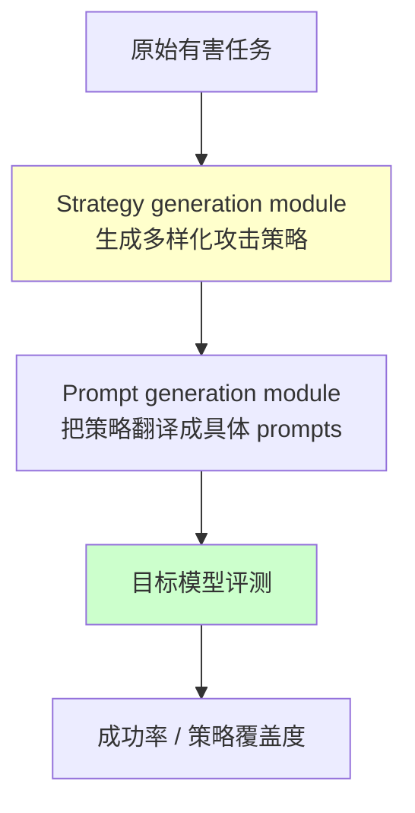
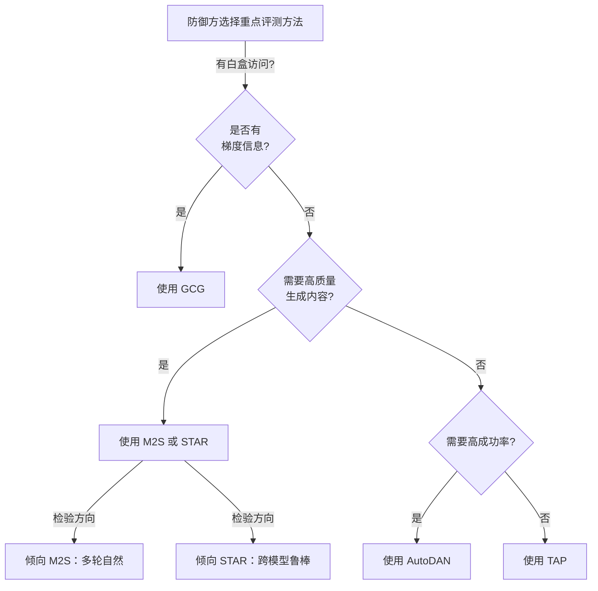
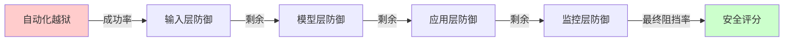

## 5.6 自动化越狱方法论完整对标

自动化越狱代表了攻击技术从手工艺走向工业化的转变。与传统的手工越狱相比，自动化方法具有高度的可复现性、可迁移性和规模化潜力。本节深入剖析当前业界主流的自动化越狱框架。

### 5.6.1 自动化越狱的范式转变

本节的重点不是“教攻击者如何选型”，而是帮助防御方理解：越狱已经从零散的手工技巧，演变为可比较、可迁移、可工业化评测的方法族。因此，下文对 GCG、TAP、M2S、AutoDAN、STAR 的梳理，应主要作为 **红队测试与防御设计的输入** 来阅读。

#### 传统 vs. 自动化越狱的对比



图 5-12：越狱方法范式对比

#### 自动化越狱的核心挑战

1. **黑盒优化问题**：无法直接访问模型梯度，需要通过查询进行黑盒搜索
2. **高维搜索空间**：提示语言空间极其广大，效率是关键瓶颈
3. **可迁移性难题**：在模型 A 上成功的攻击可能在模型 B 上失败
4. **防御演化快速**：模型和防御机制的快速更新使得攻击难以维系

### 5.6.2 GCG对抗性后缀

GCG 是由 Zou 等人在 2023 年提出的影响力深远的自动化越狱框架，采用贪心梯度搜索方法。

#### 核心原理

GCG 通过在用户提示的末尾添加一个对抗性后缀，使模型生成目标有害内容。其关键创新是利用**白盒访问权限**和梯度信息，贪心地搜索最优的对抗性词汇序列。原始论文的贡献是先在开放模型上优化后缀，再观察到这些后缀对闭源 API 模型具有一定迁移性，而不是通过 API 直接获得“部分梯度”来做黑盒优化。



图 5-13：GCG 攻击流程

#### 技术细节

**目标函数**：

最小化模型拒绝目标有害内容的损失：

```text
loss = CrossEntropy(model(prompt + suffix), harmful_target)
```

**贪心坐标搜索**：

在每次迭代中：
1. 固定其他位置的词汇，逐个遍历后缀中的每个位置
2. 对每个位置，尝试替换为候选词汇（通过梯度信息排序）
3. 选择最大化有害输出概率的词汇
4. 更新后缀

**技术优势**：
- 相对较快的收敛速度（与随机搜索相比）
- 高成功率（研究中报告80%+的成功率）
- 生成的对抗性后缀具有可迁移性

#### 实证表现

原始论文最重要的发现不是某个固定成功率数字，而是两点：

- 在白盒开放模型上，GCG 能稳定找到有效的对抗性后缀
- 在此基础上得到的后缀，对若干闭源 API 模型也表现出一定迁移性

具体成功率会随目标模型、提示集合、过滤策略和评测口径变化，不适合在导论式章节里写成固定常数。

#### 防御策略

- **输入过滤**：检测对抗性后缀的统计特征（如重复特殊字符、低频词汇组合）
- **防御性微调**：在对抗示例上进行对抗训练
- **提示增强**：添加显式拒绝指令，提高模型的一致性
- **后处理**：对生成内容进行安全审核，捕获漏网之鱼

### 5.6.3 TAP攻击树

TAP 由 Mehrotra 等人提出（arXiv:2312.02119），将越狱问题建模为搜索树，采用启发式搜索和剪枝策略来高效地发现有效攻击。（注：Chao 等人提出的是 PAIR 方法，与 TAP 是不同的自动化越狱框架。）

#### 核心思想



图 5-14：TAP 攻击树搜索过程

#### 算法流程

1. **初始化**：从基础模板开始
2. **扩展**：由 attacker LLM 生成多个变体（改写、添加情境、角色扮演等）
3. **评估**：由 evaluator LLM 对候选进行两阶段打分与筛选
4. **剪枝**：舍弃低分变体，保留高分变体
5. **递归**：对高分变体继续扩展和评估，最终把候选发送给 target LLM

#### 关键机制

**启发式评分**：

TAP 的关键不是“目标模型给自己分类”，而是引入独立的 evaluator LLM，评估候选变体的“越狱有效性”：

```text
score = evaluate_jailbreak_effectiveness(
    original_prompt=prompt,
    variant=variant,
    target_behavior=harmful_output
)
```

**自适应剪枝阈值**：

根据搜索深度和资源约束，动态调整保留候选的数量。

#### 实证表现

TAP 的论文重点在于：它只需要黑盒访问，通过树搜索与剪枝减少无效查询，并在论文中的实验设置下对多个强模型实现了较高成功率。更稳妥的理解方式是把 TAP 视为 **“高查询效率的黑盒自动化越狱”**，而不是把它和 GCG 的结果压缩成一张通用数值表。

#### 防御策略

- **结构化输入检测**：识别多步骤、递进式的攻击模式
- **会话级异常检测**：检测同一会话中的多次失败查询
- **自适应模型**：使用多轮对话的历史来判别潜在的攻击意图
- **行为分析**：监测用户的查询模式，识别系统化扫描行为

### 5.6.4 M2S 攻击方法论

M2S（Multi-turn to Single-turn）关注的是：**如何把原本依赖多轮对话的越狱链压缩成单轮提示**，从而减少攻击过程中的交互成本与暴露面。

#### 压缩思路



图 5-15：M2S 多轮到单轮压缩策略

#### 代表性压缩方式

原论文讨论的关键不在于某几个固定模板名称，而在于**把原本依赖多轮铺垫的攻击链，重写成单轮、结构更紧凑但语义仍自然的提示**。常见压缩思路包括：

- 把多轮铺垫改写成单轮叙事
- 把交互式过程改写成编号步骤
- 借助伪代码或结构化文本压缩原本分散的上下文

#### 安全含义

M2S 的风险不在于“它需要更多轮”，而在于它让原本容易在多轮中暴露意图的攻击链，变成一次性、更自然的输入。

#### 防御策略

- **结构化单轮检测**：重点审查看似自然、但内部包含编号步骤、伪代码或压缩叙事的单轮高风险输入
- **语义一致性评估**：识别“表面正常、内部仍在推进有害目标”的重写请求
- **独立安全评估**：不要因为它是单轮输入就默认风险更低，仍需进行独立判定

### 5.6.5 AutoDAN：自动化生成框架

AutoDAN 将越狱提示的生成完全自动化，使用遗传算法和进化策略来演化提示。

#### 进化算法框架



图 5-16：AutoDAN 进化过程

#### 技术细节

AutoDAN 这一类方法的共同特点是：把越狱提示当作“种群”来演化，通过选择、改写、变异和保留高分个体，不断生成更有效的候选攻击。原始 AutoDAN 论文强调的是 **hierarchical genetic algorithm**、roulette 选择、多点交叉、以及 momentum word scoring；不同实现对适应度函数和评估器的设计并不完全相同，因此这里更适合把它理解为 **“进化式自动化越狱”**，而不是固定某一个公式实现。

#### 可迁移性分析

AutoDAN 相关论文确实强调了迁移性，但更稳妥的说法是：其主要实验展示了从开放模型到若干闭源模型的迁移现象，而不是可以简单概括成一张固定成功率矩阵。

#### 防御策略

- **进化算法检测**：识别来自于同一“种族”的多个变体
- **多维特征提取**：建立越狱提示的特征空间模型
- **适应性防御**：当检测到系统化扫描时，动态增强防御
- **对抗性训练**：在自动化生成的攻击上进行微调

### 5.6.6 STAR框架

STAR 指的是 **STrategy-driven Automatic Jailbreak Red-teaming**。它的重点不是手工枚举固定模板，而是先系统性地产生多样化攻击策略，再把这些策略翻译成可执行提示，用于自动化红队测试。

#### 核心架构



图 5-17：STAR 策略驱动自动化越狱框架

#### 方法要点

- 先由 strategy generation module 组织出多样化的策略空间，而不是只围绕单一模板反复变体
- 再由 prompt generation module 把抽象策略翻译成可执行攻击提示，形成自动化红队样本
- 最终关注的不是单次成功，而是策略覆盖度、攻击多样性与跨模型鲁棒性

#### 防御策略

- **结构化检测**：识别提示中的各个维度特征
- **跨维度验证**：检测来自于同一结构的多个变体
- **模型对齐多样化**：采用不同对齐策略的模型组合，增加对抗难度
- **动态结构演化**：定期调整防御结构，使历史攻击失效

### 5.6.7 自动化越狱方法对比矩阵

为了便于安全团队进行技术选型和防御规划，本节提供一个**定性**对比矩阵。这里刻意不写统一成功率数字，因为不同论文的评测集、模型、拒答判定和查询预算并不一致。

#### 技术特征对比

| 方面 | GCG | TAP | M2S | AutoDAN | STAR |
|------|-----|-----|-----|---------|------|
| **核心范式** | 白盒对抗后缀搜索 | 黑盒树搜索与剪枝 | 多轮攻击压缩 | 进化式生成 | 策略驱动自动化红队 |
| **需要白盒访问** | 是 | 否 | 否 | 否 | 通常否 |
| **主要优势** | 后缀优化直接、迁移性强 | 黑盒可用、查询效率较高 | 更自然、暴露面更小 | 自动探索能力强 | 策略多样性高 |
| **主要弱点** | 依赖白盒与代理模型 | 查询成本仍不低 | 评测口径容易混入人工技巧 | 搜索过程成本高 | 实现复杂、评测依赖策略质量 |
| **更适合的防御视角** | 后缀检测与对抗训练 | 会话级检测与限流 | 语义自然度检测 | 变体族识别 | 策略覆盖型红队评测 |

#### 适用场景决策树



图 5-18：自动化越狱方法选型决策树

### 5.6.8 自动化越狱的防御策略体系

针对上述各种自动化越狱方法，需要构建多层次的防御体系。

#### 第一层：输入层防御

**目标**：在请求进入模型前进行过滤

防御措施：
- 统计异常检测：识别对抗性后缀（如异常的特殊字符、低频词汇）
- 结构特征匹配：检测已知越狱提示的结构模式
- 速率限制：限制短时间内的多次查询

```python

# 伪代码示例
def input_filter(prompt):
    # 检测对抗性特征
    if has_suspicious_suffix(prompt):
        return REJECT

    # 检测已知攻击模式
    if matches_known_jailbreak(prompt):
        return REJECT

    # 速率限制
    if user_query_rate > threshold:
        return RATE_LIMIT

    return ACCEPT
```

#### 第二层：模型层防御

**目标**：提高模型自身的鲁棒性

防御措施：
- 对抗训练：在自动化生成的对抗样本上进行微调
- 多目标对齐：不仅对齐有害性，还对齐逻辑一致性和拒绝确定性
- 置信度校准：确保模型在不确定时的拒绝行为

```python

# 伪代码：对抗训练流程
adversarial_samples = generate_via_gcg_tap_etc()

for epoch in range(num_epochs):
    for batch in adversarial_samples:
        loss = compute_rejection_loss(model(batch))
        loss += consistency_loss(model, batch)
        optimizer.step()
```

#### 第三层：应用层防御

**目标**：在应用逻辑层面进行隔离和验证

防御措施：
- 会话级隔离：限制单个会话的对话轮数，防止多步骤攻击
- 输出验证：对模型输出进行额外的安全检查
- 上下文清理：定期清除会话历史，强制重新认证

```python

# 伪代码：会话隔离
class SafeSession:
    def __init__(self):
        self.turn_count = 0
        self.rejection_count = 0

    def process_query(self, query):
        if self.turn_count > MAX_TURNS:
            return "Session expired"

        response = model(query)

        if is_rejection(response):
            self.rejection_count += 1
            if self.rejection_count > THRESHOLD:
                return "Suspicious behavior detected"

        self.turn_count += 1
        return response
```

#### 第四层：监控层防御

**目标**：检测和响应正在进行的攻击

防御措施：
- 行为特征分析：识别系统化扫描和多次失败查询
- 异常分布检测：监测查询的语义相似性、主题模式
- 关联分析：链接多个账户或 IP 的攻击行为

#### 防御效果评估



图 5-19：多层防御堆栈的有效性评估

#### 防御层的性能指标

每个防御层都需要通过关键指标来评估和优化，但这些指标必须由组织按自身业务、语料和攻击基线自行测得，而不是直接套用行业统一阈值。更稳妥的做法是至少监控：

- **漏报率（FNR）**：本应阻止但未阻止的越狱比例
- **误报率（FPR）**：正常请求被误判为攻击的比例
- **延迟开销**：防御链路带来的平均与尾部延迟
- **运营成本**：模型调用、审核、人审和日志成本

高风险系统通常会牺牲更多可用性来压低漏报率，而低风险系统则更强调误报和延迟控制。关键不在于套用某个“标准表”，而在于为本组织建立持续可复现的红队和回归基线。

### 5.6.9 现状与展望

在前面的技术细节之后，这一节回到防御方视角，概括自动化越狱研究在 2026 年的总体走向，以及安全团队在组织层面应如何应对这些趋势。

#### 最新发展

自动化越狱的总体方向已经比较清楚：

1. 从单一模板转向搜索、进化和策略生成
2. 从单轮文本攻击扩展到多轮、多模态和复合攻击链
3. 从“演示单次成功”转向“可量化评测、可迁移和可复用”的红队方法

防御方对应的变化则是：

1. 更强调基于基准和回归集的持续评测
2. 更强调输入层、模型层、应用层、监控层的组合门控
3. 更强调把自动化攻击方法当成红队资产，而不是只当成研究样例

#### 安全建议

对于部署 LLM 应用的安全团队：

1. **持续监控**：建立自动化越狱方法的监控系统
2. **定期评估**：使用最新的自动化工具进行红队测试
3. **多层防御**：不依赖单一防御层，采用纵深防御
4. **社区协作**：积极参与安全研究社区，共享防御经验

---

本节通过详细的技术对标和防御策略，为安全团队提供了应对自动化越狱的完整框架。下一节将深入探讨现代红队工具链。
