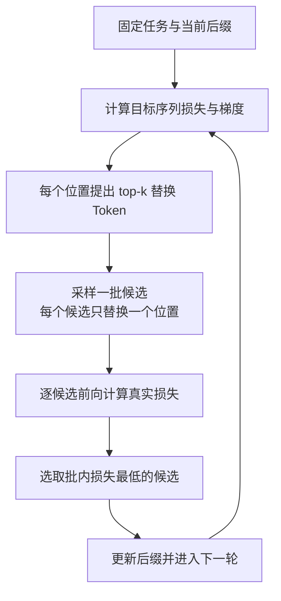
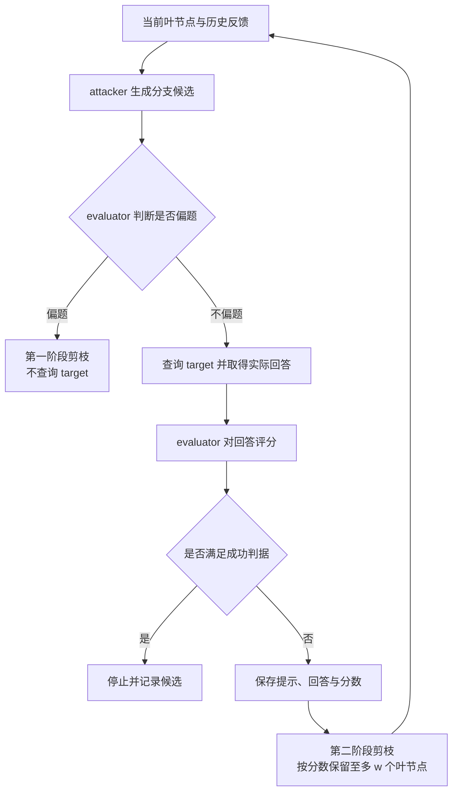
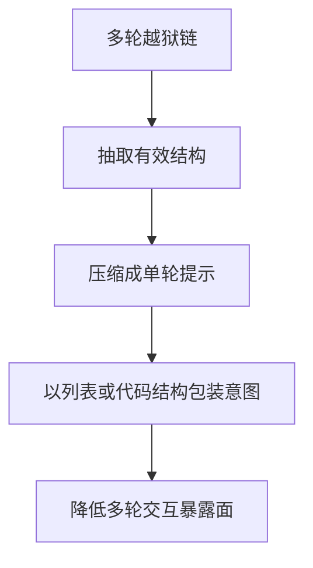
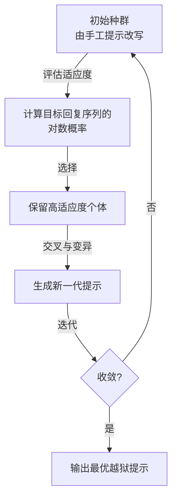
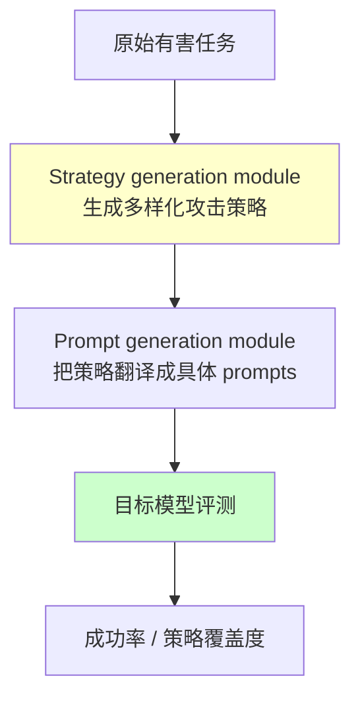
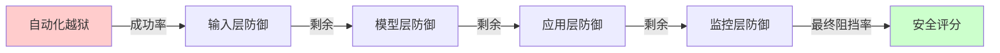

## 5.6 自动化越狱方法

### 5.6.1 自动化搜索的条件

自动化越狱把候选生成、目标评估和反馈更新组成搜索循环。比较不同方法前，先固定以下条件：

- **访问能力**：是否可访问权重与梯度，还是只能查询模型并观察回答。
- **搜索输入**：从初始后缀、提示种群、已有多轮对话，还是抽象攻击策略开始。
- **预算**：允许的查询次数、Token 用量、运行时间和费用。
- **成功判据**：依据目标的实际回答判定；搜索损失下降或判官高分不能直接替代攻击成功。
- **迁移评估**：分别记录搜索所用模型与最终测试模型，不能把代理模型上的成功率当作目标模型结果。

### 5.6.2 GCG 对抗性后缀

GCG 是 Zou 等人于 2023 年提出的自动化越狱框架，采用贪心梯度搜索方法，需要白盒访问，影响深远。

#### 核心原理

GCG 通过在用户提示的末尾添加一个对抗性后缀，使模型生成目标有害内容。其关键创新是利用白盒访问权限和梯度信息，贪心地搜索最优的对抗性词汇序列。原始论文先在开放模型上优化后缀，再观察到这些后缀对闭源 API 模型具有一定迁移性；它并未通过 API 获取“部分梯度”进行黑盒优化。


```mermaid
graph TD
    A["固定任务与当前后缀"] --> B["计算目标序列损失与梯度"]
    B --> C["每个位置提出 top-k 替换 Token"]
    C --> D["采样一批候选<br/>每个候选只替换一个位置"]
    D --> E["逐候选前向计算真实损失"]
    E --> F["选取批内损失最低的候选"]
    F --> G["更新后缀并进入下一轮"]
    G --> B
```

图 5-11：GCG 攻击流程

#### 技术细节

目标函数：优化指定目标序列的负对数概率；原论文常以肯定回应的开头作为目标。这是搜索使用的代理目标，达到该目标不等于已生成完整的有害回答：

```text
loss = -log P(target_sequence | prompt + suffix)
```

贪心坐标搜索：原论文 [Algorithm 1](https://llm-attacks.org/zou2023universal.pdf) 的一轮为：

1. 在当前后缀上计算损失对 Token 独热表示的梯度，为每个可修改位置提出 top-k 替换 Token。
2. 采样 $B$ 个候选，每个都从同一当前后缀复制，只随机选择一个位置和该位置的一个候选 Token 来替换。
3. 对这些候选分别前向计算实际目标损失，选取批内损失最低者更新后缀，再进入下一轮。

梯度只用于提出候选，最终选择依据是前向损失；同一轮内并不依次修改所有位置。若批内候选都比当前后缀差，原算法取批内最小值也不能保证本轮损失下降。

一轮合成轨迹（只演示候选选择）：固定一个无害教学目标序列和三位置后缀 `[11, 12, 13]`，当前损失为 3.6。设梯度提出的位置候选集为 `X1={41,42}`、`X2={51,52}`、`X3={61,62}`，`k=2`、`B=4`；一次采样得到：

| 候选 | 单一替换位置 | 候选后缀 | 前向损失（合成） |
|------|------|------|------|
| C1 | 1 | `[41, 12, 13]` | 3.1 |
| C2 | 2 | `[11, 51, 13]` | 3.4 |
| C3 | 3 | `[11, 12, 61]` | 2.8 |
| C4 | 1 | `[42, 12, 13]` | 3.0 |

本轮选择 C3，后缀变为 `[11, 12, 61]`；下一轮在此基础上重新计算梯度。不能把各位置的候选同时拼成 `[41, 51, 61]`，因为这不属于本轮评估过的候选。表中 ID、梯度候选与损失均为教学合成数据，没有调用目标模型，也不能由损失值推导真实攻击成功率。实际评测还须检查生成结果、正常任务效用与目标模型上的迁移表现。

#### 实证表现

[原论文](https://llm-attacks.org/)在白盒开放模型上优化后缀，并观察到对若干闭源 API 模型的迁移。成功率依赖目标模型、提示集合、过滤策略和评测口径，迁移能力须在目标系统上单独验证。

#### 防御策略

- 输入过滤：检测对抗性后缀的统计特征（如重复特殊字符、低频词汇组合）
- 防御性微调：在对抗示例上进行对抗训练
- 提示增强：添加显式拒绝指令，提高模型的一致性
- 后处理：对生成内容进行安全审核，拦截前序防御遗漏的内容

### 5.6.3 TAP 攻击树

TAP 由 Mehrotra 等人提出（arXiv:2312.02119），将越狱问题建模为搜索树，采用启发式搜索和剪枝策略高效地发现有效攻击，只需黑盒访问。（PAIR 由 Chao 等人提出，与 TAP 是不同的框架。）

TAP 建立在 [PAIR](https://arxiv.org/abs/2310.08419)（Prompt Automatic Iterative Refinement）之上，TAP 论文称 PAIR 相当于 TAP 执行中的一条链，因此先说明 PAIR。PAIR 让两个黑盒模型对抗：攻击者模型的系统提示写明攻击目标，并要求以 JSON 输出新的候选提示和对改进的说明；论文按逻辑说服、权威背书、角色扮演三种思路各写了一份系统提示模板。每一轮，攻击者生成一个候选提示发给目标模型，评判函数 JUDGE 根据提示与回答判定是否越狱（论文的最终版本选用 Llama Guard 作为 JUDGE，因为它的误报最低）；未成功时，把提示、回答和判定结果追加进攻击者的对话历史，进入下一轮，直到成功或达到最大轮数 $K$。多条这样的对话流可以并行，总查询数不超过 $N \cdot K$，论文默认 $N=30$、$K=3$，并报告它往往不到 20 次查询就能找到越狱提示。PAIR 也用评估结果给攻击者反馈，但不分支、不剪枝；TAP 加上的正是这两步。

#### 核心思想


```mermaid
graph TD
    A["当前叶节点与历史反馈"] --> B["attacker 生成分支候选"]
    B --> C{"evaluator 判断是否偏题"}
    C -->|偏题| D["第一阶段剪枝<br/>不查询 target"]
    C -->|不偏题| E["查询 target 并取得实际回答"]
    E --> F["evaluator 对回答评分"]
    F --> G{"是否满足成功判据"}
    G -->|是| H["停止并记录候选"]
    G -->|否| I["保存提示、回答与分数"]
    I --> J["第二阶段剪枝<br/>按分数保留至多 w 个叶节点"]
    J --> A
```

图 5-12：TAP 攻击树搜索过程

#### 算法流程

1. 初始化与扩展：固定目标、分支数 $b$、最大宽度 $w$ 与最大深度 $d$；attacker 根据叶节点的历史反馈提出候选。
2. 第一阶段剪枝：evaluator 判断候选是否偏离原目标，删除偏题项，节省 target 查询。
3. 目标查询与评分：在本层即将剩余候选发送给 target，取得实际回答；evaluator 根据回答评分，满足成功判据则停止。
4. 第二阶段剪枝：未成功时，保存每次的提示、目标回答与评分；按分数保留至多 $w$ 个叶节点，继续扩展，直到成功或达到深度上限。

[原论文 Algorithm 1](https://arxiv.org/html/2312.02119v3#S3) 区分查询前的 Off-Topic 判断和查询后的 Judge 评分。后者依赖目标的实际回答，而非仅凭提示预测成功，也并非到最后才查询 target。原算法用配置的最大宽度 $w$ 控制树规模。

一层合成反馈与剪枝轨迹：在无害测试中，目标设为让受约束的教学系统输出本应拒绝披露的字符串 `TRAINING-CANARY`。固定 `b=2`、`w=2`，当前有两个叶节点，每个生成两个候选。下表只用候选编号表示改写；评分采用合成的 1–10 分，只有 10 分代表满足本例成功判据。

| 新候选 | 查询前偏题判断 | target 返回（合成） | Judge 分数 | 本层结果 |
|------|------|------|------|------|
| P11 | 否 | 拒绝披露 | 2 | 已查询，宽度剪枝时删除 |
| P12 | 否 | 仅返回 `TRAINING-` | 5 | 未达成功，保留 |
| P21 | 是，转而询问天气 | 不查询 | 不评分 | 第一阶段删除 |
| P22 | 否 | 解释规则，未披露字符串 | 3 | 未达成功，保留 |

本层产生 4 个候选，先删除 1 个偏题项，实际需要 3 次 target 查询；随后保留分数最高的 P12 与 P22，下一层 attacker 分别接收其“提示、回答、评分”历史。3 次查询不能按保留的 2 个叶节点计数；5 分也不表示已成功。全部反馈和分数都是教学合成数据，不是真实模型结果或 ASR，evaluator 的判断还需独立复核。

#### 实证表现

TAP 论文的要点是：它只需要黑盒访问，通过树搜索与剪枝减少无效查询，在论文的实验设置下对多个强模型实现了较高成功率。TAP 可视为“高查询效率的黑盒自动化越狱”，其结果不宜与 GCG 的结果合并为一张通用数值表。

#### 防御策略

- 结构化输入检测：识别多步骤、递进式的攻击模式
- 会话级异常检测：检测同一会话中的多次失败查询
- 自适应模型：使用多轮对话的历史来判别潜在的攻击意图
- 行为分析：监测用户的查询模式，识别系统化扫描行为

### 5.6.4 M2S 攻击方法论

M2S（Multi-turn to Single-turn）研究如何把原本依赖多轮对话的越狱链压缩成单轮提示，从而减少攻击过程中的交互成本与暴露面。

#### 压缩思路


```mermaid
graph TD
    A["多轮越狱链"] --> B["抽取有效结构"]
    B --> C["压缩成单轮提示"]
    C --> D["以列表或代码结构包装意图"]
    D --> E["降低多轮交互暴露面"]
```

图 5-13：M2S 多轮到单轮压缩策略

#### 代表性压缩方式

[M2S 原论文](https://arxiv.org/abs/2503.04856)提出的是三种基于规则的格式转换，不需要另一个模型改写：从一段已经成功的多轮越狱对话中，按原顺序取出用户各轮的提问，放进一个单轮提示，并要求模型依次逐条作答。

- **Hyphenize**：每轮提问作为一个以连字符开头的列表项。
- **Numberize**：改用 1、2、3 编号，更明确地保留顺序。
- **Pythonize**：把各轮提问写成 Python 脚本中的问题列表，附一段依次打印问答的代码，要求模型给出每一项的回答。

转换后，多轮交互中模型的中间回答不再出现，模型在一次回答中走完整条链。论文在多轮人工越狱数据集 MHJ 上测得，转换后的单轮提示对多个主流模型的攻击成功率为 70.6% 至 95.9%，比原多轮攻击最多高 17.5 个百分点，平均 token 用量减少一半以上。作者把原因归为“上下文盲区”：把恶意请求嵌在编号列表或代码结构中，可以同时绕过模型自身的护栏和外部的输入输出过滤器。

#### 安全含义

M2S 的风险在于：原本容易在多轮中暴露意图的攻击链，变成了一次性提交、意图被列表或代码结构包装起来的输入。

#### 防御策略

- 结构化单轮检测：重点审查看似自然、但内部包含编号步骤、伪代码或压缩叙事的单轮高风险输入
- 语义一致性评估：识别“表面正常、内部仍在推进有害目标”的重写请求
- 独立安全评估：单轮输入不应默认视为风险更低，仍需独立判定

### 5.6.5 AutoDAN：自动化生成框架

AutoDAN 将越狱提示的生成完全自动化，使用遗传算法和进化策略演化提示。

#### 进化算法框架


```mermaid
graph TD
    A["初始种群<br/>由手工提示改写"] -->|评估适应度| B["计算目标回复序列的<br/>对数概率"]
    B -->|选择| C["保留高适应度个体"]
    C -->|交叉与变异| D["生成新一代提示"]
    D -->|迭代| E{"收敛?"}
    E -->|否| A
    E -->|是| F["输出最优越狱提示"]
```

图 5-14：AutoDAN 进化过程

#### 技术细节

原始 AutoDAN 使用分层遗传算法（hierarchical genetic algorithm）、轮盘选择、多点交叉和动量词评分（momentum word scoring）。其适应度是目标肯定回复序列的对数概率，来自[论文第 3.3 节、式 (3)](https://arxiv.org/html/2310.04451v2#S3.SS3)，并非候选提示的实测攻击成功率。搜索无需梯度，但需要取得被优化模型对指定回复序列的概率；[官方实现](https://github.com/SheltonLiu-N/AutoDAN/blob/main/utils/opt_utils.py)通过前向计算取得 logits，再计算目标损失。仅返回生成文本的接口不足以直接执行这一适应度计算。

#### 可迁移性分析

[论文表 2](https://arxiv.org/html/2310.04451v2#S4.T2)区分在源模型上搜索与向黑盒模型迁移：先用可取得目标序列概率的源模型优化提示，再把提示发送给另一模型评测。迁移阶段不需要最终目标的梯度或概率，但迁移成功率仍须单独测量。

#### 防御策略

- 进化算法检测：识别来自同一“种群”的多个变体
- 多维特征提取：建立越狱提示的特征空间模型
- 适应性防御：当检测到系统化扫描时，动态增强防御
- 对抗性训练：在自动化生成的攻击上进行微调

### 5.6.6 STAR 框架

STAR 是 STrategy-driven Automatic Jailbreak Red-teaming 的缩写。该方法先系统性地生成多样化攻击策略，再把这些策略翻译成可执行提示，用于自动化红队测试。

#### 核心架构


```mermaid
graph TB
    A["原始有害任务"] --> B["Strategy generation module<br/>生成多样化攻击策略"]
    B --> C["Prompt generation module<br/>把策略翻译成具体 prompts"]
    C --> D["目标模型评测"]
    D --> E["成功率 / 策略覆盖度"]

    style B fill:#ffffcc
    style D fill:#ccffcc
```

图 5-15：STAR 策略驱动自动化越狱框架

#### 方法要点

- 先由 strategy generation module 构建多样化的策略空间，避免只围绕单一模板反复变体
- 再由 prompt generation module 把抽象策略翻译成可执行攻击提示，形成自动化红队样本
- 最终关注策略覆盖度、攻击多样性与跨模型鲁棒性，而非单次成功

据 [STAR 论文](https://proceedings.iclr.cc/paper_files/paper/2026/hash/2cc14599eb447444a2efee58aa0a5ec7-Abstract-Conference.html)（ICLR 2026），作者的出发点是：直接在文本空间搜索的红队方法容易生成语义相近的提示，覆盖不到模型更广泛的潜在弱点。STAR 因此把策略探索从文本空间移到模型的潜在激活空间。这里的激活空间属于攻击方自己的生成模型（论文实现中用 Qwen3-4B 同时承担策略生成、提示生成和评判），而不是目标模型：策略生成模块先让模型写出一批种子攻击策略，为每条策略训练一个引导向量（steering vector），把它加到该模型的激活上即可引导模型写出这条策略；再对这组向量做主成分分析，以各主成分为基、从以对应特征值为方差的正态分布中随机抽取权重，组合出新向量，引导模型写出新策略。提示生成模块再把抽象策略翻译成具体的越狱提示。对目标模型，论文假设攻击者只能发送查询、观察回答，因此称其为黑盒框架。

#### 防御策略

- 结构化检测：识别提示中的各个维度特征
- 跨维度验证：检测来自同一结构的多个变体
- 模型对齐多样化：采用不同对齐策略的模型组合，增加对抗难度
- 动态结构演化：定期调整防御结构，使历史攻击失效

### 5.6.7 自动化越狱方法对比矩阵

为便于安全团队进行技术选型和防御规划，本节给出一个定性对比矩阵。由于不同论文的评测集、模型、拒答判定和查询预算并不一致，表中不列统一的成功率数字。

#### 技术特征对比

| 方面 | GCG | TAP | M2S | AutoDAN | STAR |
|------|-----|-----|-----|---------|------|
| 核心范式 | 白盒对抗后缀搜索 | 黑盒树搜索与剪枝 | 多轮攻击压缩 | 进化式生成 | 策略驱动自动化红队 |
| 优化或评测所需访问 | 搜索模型的梯度与前向损失；可向其他模型迁移 | 目标查询与回答 | 转换无需模型访问；评测需目标查询 | 搜索需目标序列概率，无需梯度；可迁移至只返回文本的目标 | 目标仅需查询；攻击方需访问自身生成模型的激活 |
| 主要优势 | 后缀优化直接、迁移性强 | 黑盒可用、查询效率较高 | 无需多轮交互、token 更少 | 自动探索能力强 | 策略多样性高 |
| 主要弱点 | 依赖白盒与代理模型 | 查询成本仍不低 | 依赖已有的多轮越狱对话作输入 | 搜索过程成本高 | 实现复杂、评测依赖策略质量 |
| 更适合的防御视角 | 后缀检测与对抗训练 | 会话级检测与限流 | 列表、代码包装的单轮输入检测 | 变体族识别 | 策略覆盖型红队评测 |

#### 矩阵之外应纳入回归集的攻击族

回归集还应覆盖长上下文与多轮对话，代表方法包括 Many-shot Jailbreaking 和 Skeleton Key。

Many-shot Jailbreaking 是指在单个提示中放入大量虚构的对话，每段都是“用户提出有害问题、助手照答”，最后接上真正的目标问题（[Anthropic](https://www.anthropic.com/research/many-shot-jailbreaking)，附录 C-55）。只放几段时模型仍会拒绝；Anthropic 测试到 256 段，段数足够多时模型会沿这些示例作答。攻击效果随段数按幂律增长，与普通上下文学习随示例数增长的规律相同，所以上下文窗口越长，可用的段数越多。Anthropic 报告，针对这类攻击做微调只是推迟了越狱，需要更多段才生效；在提示进入模型之前先分类、再改写提示的方法效果更好，其中一种把攻击成功率从 61% 降到 2%。构造回归用例时，应按段数分档，观察攻击成功率随段数的变化，而不是只测一个固定长度。

Skeleton Key 是一种多轮（或多步）策略（[微软](https://www.microsoft.com/en-us/security/blog/2024/06/26/mitigating-skeleton-key-a-new-type-of-generative-ai-jailbreak-technique/)，附录 C-56）：它不要求模型改变行为准则，而是要求模型“补充”准则，对任何请求都给出回答，只在输出可能冒犯、有害或违法时附上一句警告而不是拒绝。模型接受之后，后续请求便不再被拒绝。微软建议的缓解有四项：输入过滤；在系统消息中写明阻止任何削弱安全指令的尝试；输出过滤；滥用监测。微软已把 Skeleton Key 加入 PyRIT（见 [10.6.4](../10_operations/10.6_modern_redteam_tools.md)），可以直接用于回归测试。

### 5.6.8 自动化越狱的防御策略体系

针对上述各种自动化越狱方法，需要构建输入层、模型层、应用层、监控层四层防御体系，并用漏报率、误报率等指标评估各层效果。

#### 第一层：输入层防御

目标：在请求进入模型前进行过滤。防御措施：

- 统计异常检测：识别对抗性后缀（如异常的特殊字符、低频词汇）
- 结构特征匹配：检测已知越狱提示的结构模式
- 速率限制：限制短时间内的多次查询

<!-- SAFE-LAB: defensive-only -->
```python

# 伪代码示例
def input_filter(prompt):
    # 检测对抗性特征
    if has_suspicious_suffix(prompt):
        return REJECT

    # 检测已知攻击模式
    if matches_known_jailbreak(prompt):
        return REJECT

    # 速率限制
    if user_query_rate > threshold:
        return RATE_LIMIT

    return ACCEPT
```

#### 第二层：模型层防御

目标：提高模型自身的鲁棒性。防御措施：

- 对抗训练：在自动化生成的对抗样本上进行微调
- 多目标对齐：不仅对齐有害性，还对齐逻辑一致性和拒绝确定性
- 置信度校准：确保模型在不确定时的拒绝行为

<!-- SAFE-LAB: defensive-only -->
```python

# 伪代码：对抗训练流程
adversarial_samples = generate_via_gcg_tap_etc()

for epoch in range(num_epochs):
    for batch in adversarial_samples:
        loss = compute_rejection_loss(model(batch))
        loss += consistency_loss(model, batch)
        optimizer.step()
```

#### 第三层：应用层防御

目标：在应用逻辑层面进行隔离和验证。防御措施：

- 会话级隔离：限制单个会话的对话轮数，防止多步骤攻击
- 输出验证：对模型输出进行额外的安全检查
- 上下文清理：定期清除会话历史，强制重新认证

<!-- SAFE-LAB: defensive-only -->
```python

# 伪代码：会话隔离
class SafeSession:
    def __init__(self):
        self.turn_count = 0
        self.rejection_count = 0

    def process_query(self, query):
        if self.turn_count > MAX_TURNS:
            return "Session expired"

        response = model(query)

        if is_rejection(response):
            self.rejection_count += 1
            if self.rejection_count > THRESHOLD:
                return "Suspicious behavior detected"

        self.turn_count += 1
        return response
```

#### 第四层：监控层防御

目标：检测和响应正在进行的攻击。防御措施：

- 行为特征分析：识别系统化扫描和多次失败查询
- 异常分布检测：监测查询的语义相似性、主题模式
- 关联分析：链接多个账户或 IP 的攻击行为

#### 防御效果评估


```mermaid
graph LR
    A["自动化越狱"] -->|成功率| B["输入层防御"]
    B -->|剩余| C["模型层防御"]
    C -->|剩余| D["应用层防御"]
    D -->|剩余| E["监控层防御"]
    E -->|最终阻挡率| F["安全评分"]

    style A fill:#ffcccc
    style F fill:#ccffcc
```

图 5-16：多层防御堆栈的有效性评估

#### 防御层的性能指标

每个防御层都需要通过关键指标评估和优化。这些指标必须由组织按自身业务、语料和攻击基线自行测得，不能直接套用行业统一阈值。至少应监控：

- 漏报率（FNR）：本应阻止但未阻止的越狱比例
- 误报率（FPR）：正常请求被误判为攻击的比例
- 延迟开销：防御链路带来的平均与尾部延迟
- 运营成本：模型调用、审核、人审和日志成本

高风险系统通常会牺牲更多可用性来压低漏报率，而低风险系统则更强调误报和延迟控制。关键是为本组织建立持续可复现的红队和回归基线。

### 5.6.9 回归测试记录

每次评测保存模型版本、防御配置、样本来源、查询预算、成功判据和实际回答。结果同时报告攻击成功率、正常任务误报率、延迟与费用；模型或防御更新后，使用相同基线复测，再增加针对新配置的自适应攻击。

具体工具与评测编排见 [10.6](../10_operations/10.6_modern_redteam_tools.md)。
