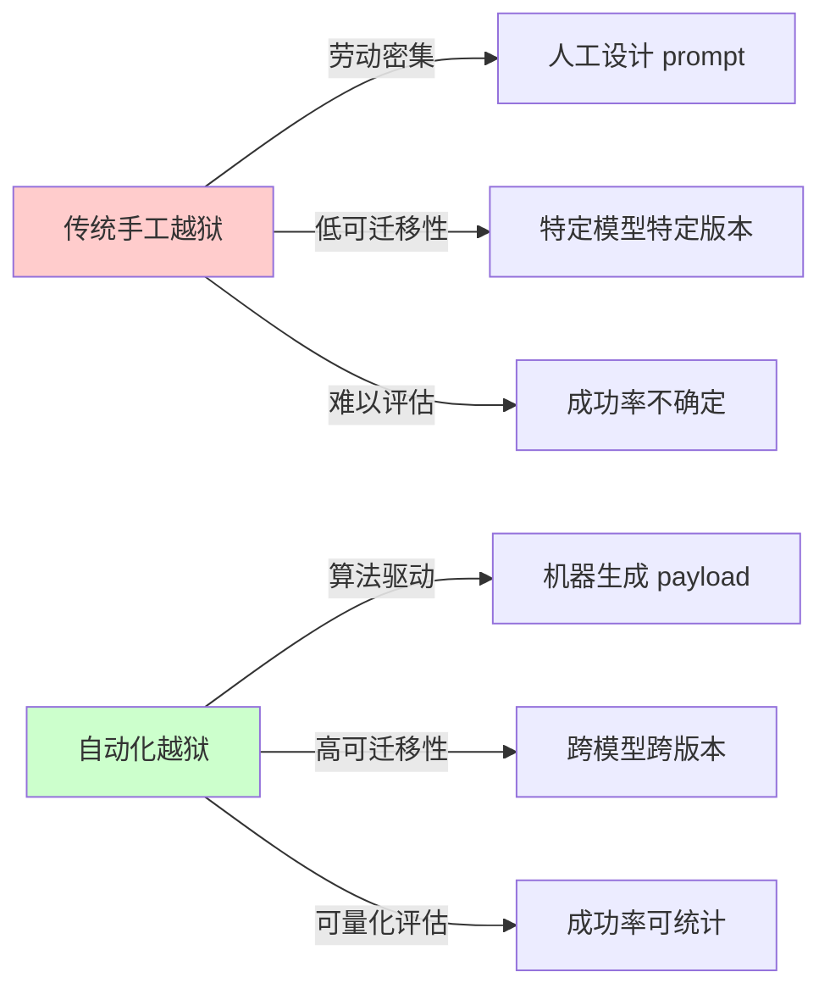
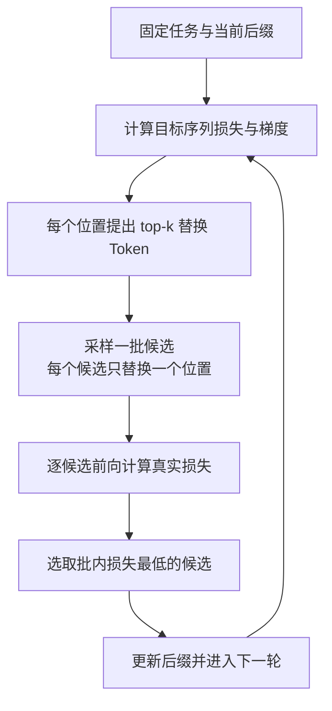
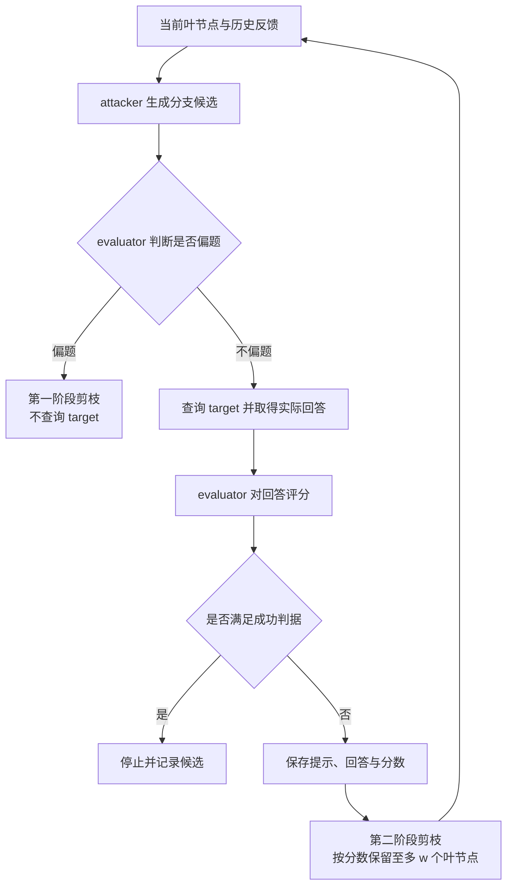
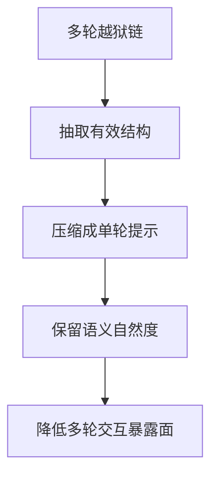
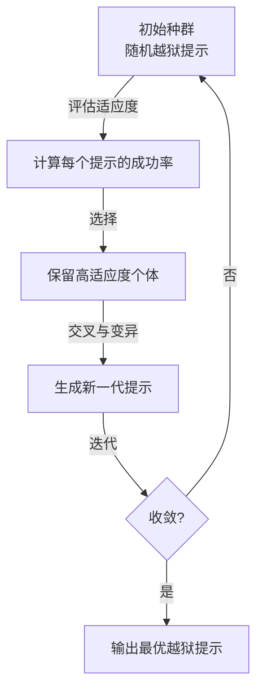
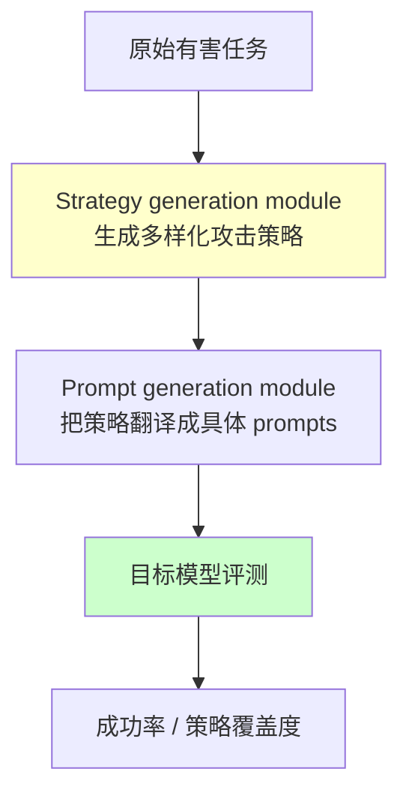
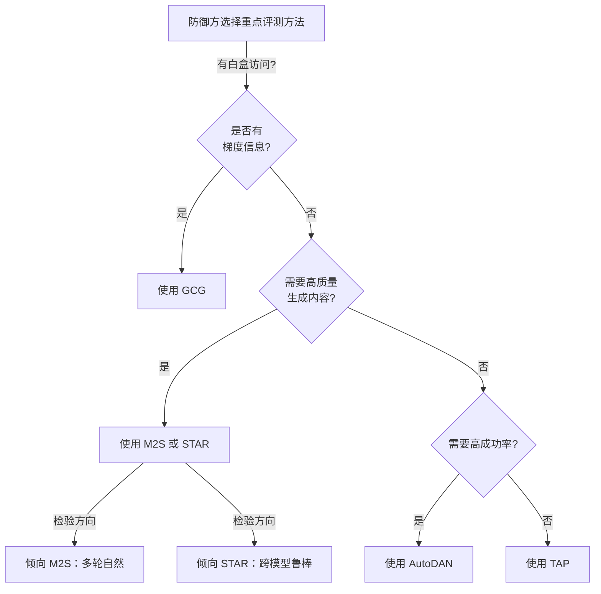
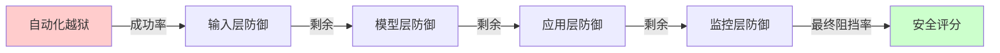

## 5.6 自动化越狱方法

自动化越狱标志着攻击技术从手工走向工业化。与传统的手工越狱相比，自动化方法具有高度的可复现性、可迁移性和规模化潜力。本节分析当前主流的自动化越狱框架。

### 5.6.1 自动化越狱的范式转变

本节面向防御方，帮助其理解：越狱已从零散的手工技巧演变为可比较、可迁移、可工业化评测的方法族。下文对 GCG、TAP、M2S、AutoDAN、STAR 的梳理，主要作为红队测试与防御设计的输入。

#### 传统 vs. 自动化越狱的对比


```mermaid
graph LR
    A["传统手工越狱"] -->|劳动密集| B["人工设计 prompt"]
    A -->|低可迁移性| C["特定模型特定版本"]
    A -->|难以评估| D["成功率不确定"]

    E["自动化越狱"] -->|算法驱动| F["机器生成 payload"]
    E -->|高可迁移性| G["跨模型跨版本"]
    E -->|可量化评估| H["成功率可统计"]

    style A fill:#ffcccc
    style E fill:#ccffcc
```

图 5-12：越狱方法范式对比

#### 自动化越狱的核心挑战

1. **黑盒优化问题**：无法直接访问模型梯度，需要通过查询进行黑盒搜索
2. **高维搜索空间**：提示语言空间极其广大，效率是关键瓶颈
3. **可迁移性难题**：在模型 A 上成功的攻击可能在模型 B 上失败
4. **防御演化快速**：模型和防御机制的快速更新使得攻击难以维系

### 5.6.2 GCG 对抗性后缀

GCG 是 Zou 等人于 2023 年提出的自动化越狱框架，采用贪心梯度搜索方法，影响深远。

#### 核心原理

GCG 通过在用户提示的末尾添加一个对抗性后缀，使模型生成目标有害内容。其关键创新是利用**白盒访问权限**和梯度信息，贪心地搜索最优的对抗性词汇序列。原始论文先在开放模型上优化后缀，再观察到这些后缀对闭源 API 模型具有一定迁移性；它并未通过 API 获取“部分梯度”进行黑盒优化。


```mermaid
graph TD
    A["固定任务与当前后缀"] --> B["计算目标序列损失与梯度"]
    B --> C["每个位置提出 top-k 替换 Token"]
    C --> D["采样一批候选<br/>每个候选只替换一个位置"]
    D --> E["逐候选前向计算真实损失"]
    E --> F["选取批内损失最低的候选"]
    F --> G["更新后缀并进入下一轮"]
    G --> B
```

图 5-13：GCG 攻击流程

#### 技术细节

**目标函数**：

优化指定目标序列的负对数概率；原论文常以肯定回应的开头作为目标。这是搜索使用的代理目标，达到该目标不等于已生成完整的有害回答：

```text
loss = -log P(target_sequence | prompt + suffix)
```

**贪心坐标搜索**：

原论文 [Algorithm 1](https://llm-attacks.org/zou2023universal.pdf) 的一轮为：

1. 在当前后缀上计算损失对 Token 独热表示的梯度，为每个可修改位置提出 top-k 替换 Token。
2. 采样 $B$ 个候选，每个都从同一当前后缀复制，只随机选择一个位置和该位置的一个候选 Token 来替换。
3. 对这些候选分别前向计算实际目标损失，选取批内损失最低者更新后缀，再进入下一轮。

梯度只用于提出候选，最终选择依据是前向损失；同一轮内并不依次修改所有位置。若批内候选都比当前后缀差，原算法取批内最小值也不能保证本轮损失下降。

**一轮合成轨迹（只演示候选选择）**

固定一个无害教学目标序列和三位置后缀 `[11, 12, 13]`，当前损失为 3.6。设梯度提出的位置候选集为 `X1={41,42}`、`X2={51,52}`、`X3={61,62}`，`k=2`、`B=4`；一次采样得到：

| 候选 | 单一替换位置 | 候选后缀 | 前向损失（合成） |
|------|------|------|------|
| C1 | 1 | `[41, 12, 13]` | 3.1 |
| C2 | 2 | `[11, 51, 13]` | 3.4 |
| C3 | 3 | `[11, 12, 61]` | 2.8 |
| C4 | 1 | `[42, 12, 13]` | 3.0 |

本轮选择 C3，后缀变为 `[11, 12, 61]`；下一轮在此基础上重新计算梯度。不能把各位置的候选同时拼成 `[41, 51, 61]`，因为这不属于本轮评估过的候选。表中 ID、梯度候选与损失均为教学合成数据，没有调用目标模型，也不能由损失值推导真实攻击成功率。实际评测还须检查生成结果、正常任务效用与目标模型上的迁移表现。

**技术优势**：
- 相对较快的收敛速度（与随机搜索相比）
- 高成功率（白盒设置下可稳定找到有效后缀，具体口径见下文“实证表现”）
- 生成的对抗性后缀具有可迁移性

#### 实证表现

原始论文最重要的发现有两点：

- 在白盒开放模型上，GCG 能稳定找到有效的对抗性后缀
- 在此基础上得到的后缀，对若干闭源 API 模型也表现出一定迁移性

具体成功率随目标模型、提示集合、过滤策略和评测口径而变化，因此这里不给出固定数值。

#### 防御策略

- **输入过滤**：检测对抗性后缀的统计特征（如重复特殊字符、低频词汇组合）
- **防御性微调**：在对抗示例上进行对抗训练
- **提示增强**：添加显式拒绝指令，提高模型的一致性
- **后处理**：对生成内容进行安全审核，拦截前序防御遗漏的内容

### 5.6.3 TAP 攻击树

TAP 由 Mehrotra 等人提出（arXiv:2312.02119），将越狱问题建模为搜索树，采用启发式搜索和剪枝策略高效地发现有效攻击。（PAIR 由 Chao 等人提出，与 TAP 是不同的框架。）

#### 核心思想


```mermaid
graph TD
    A["当前叶节点与历史反馈"] --> B["attacker 生成分支候选"]
    B --> C{"evaluator 判断是否偏题"}
    C -->|偏题| D["第一阶段剪枝<br/>不查询 target"]
    C -->|不偏题| E["查询 target 并取得实际回答"]
    E --> F["evaluator 对回答评分"]
    F --> G{"是否满足成功判据"}
    G -->|是| H["停止并记录候选"]
    G -->|否| I["保存提示、回答与分数"]
    I --> J["第二阶段剪枝<br/>按分数保留至多 w 个叶节点"]
    J --> A
```

图 5-14：TAP 攻击树搜索过程

#### 算法流程

1. **初始化与扩展**：固定目标、分支数 $b$、最大宽度 $w$ 与最大深度 $d$；attacker 根据叶节点的历史反馈提出候选。
2. **第一阶段剪枝**：evaluator 判断候选是否偏离原目标，删除偏题项，节省 target 查询。
3. **目标查询与评分**：在本层即将剩余候选发送给 target，取得实际回答；evaluator 根据回答评分，满足成功判据则停止。
4. **第二阶段剪枝**：未成功时，保存每次的提示、目标回答与评分；按分数保留至多 $w$ 个叶节点，继续扩展，直到成功或达到深度上限。

[原论文 Algorithm 1](https://arxiv.org/html/2312.02119v3#S3) 区分查询前的 Off-Topic 判断和查询后的 Judge 评分。后者依赖目标的实际回答，而非仅凭提示预测成功，也并非到最后才查询 target。原算法用配置的最大宽度 $w$ 控制树规模。

**一层合成反馈与剪枝轨迹**

在无害测试中，目标设为让受约束的教学系统输出本应拒绝披露的字符串 `TRAINING-CANARY`。固定 `b=2`、`w=2`，当前有两个叶节点，每个生成两个候选。下表只用候选编号表示改写；评分采用合成的 1–10 分，只有 10 分代表满足本例成功判据。

| 新候选 | 查询前偏题判断 | target 返回（合成） | Judge 分数 | 本层结果 |
|------|------|------|------|------|
| P11 | 否 | 拒绝披露 | 2 | 已查询，宽度剪枝时删除 |
| P12 | 否 | 仅返回 `TRAINING-` | 5 | 未达成功，保留 |
| P21 | 是，转而询问天气 | 不查询 | 不评分 | 第一阶段删除 |
| P22 | 否 | 解释规则，未披露字符串 | 3 | 未达成功，保留 |

本层产生 4 个候选，先删除 1 个偏题项，实际需要 3 次 target 查询；随后保留分数最高的 P12 与 P22，下一层 attacker 分别接收其“提示、回答、评分”历史。3 次查询不能按保留的 2 个叶节点计数；5 分也不表示已成功。全部反馈和分数都是教学合成数据，不是真实模型结果或 ASR，evaluator 的判断还需独立复核。

#### 实证表现

TAP 论文的要点是：它只需要黑盒访问，通过树搜索与剪枝减少无效查询，在论文的实验设置下对多个强模型实现了较高成功率。TAP 可视为“高查询效率的黑盒自动化越狱”，其结果不宜与 GCG 的结果合并为一张通用数值表。

#### 防御策略

- **结构化输入检测**：识别多步骤、递进式的攻击模式
- **会话级异常检测**：检测同一会话中的多次失败查询
- **自适应模型**：使用多轮对话的历史来判别潜在的攻击意图
- **行为分析**：监测用户的查询模式，识别系统化扫描行为

### 5.6.4 M2S 攻击方法论

M2S（Multi-turn to Single-turn）研究如何把原本依赖多轮对话的越狱链压缩成单轮提示，从而减少攻击过程中的交互成本与暴露面。

#### 压缩思路


```mermaid
graph TD
    A["多轮越狱链"] --> B["抽取有效结构"]
    B --> C["压缩成单轮提示"]
    C --> D["保留语义自然度"]
    D --> E["降低多轮交互暴露面"]
```

图 5-15：M2S 多轮到单轮压缩策略

#### 代表性压缩方式

原论文的关键是把原本依赖多轮铺垫的攻击链，重写成单轮、结构更紧凑但语义仍自然的提示。常见压缩思路包括：

- 把多轮铺垫改写成单轮叙事
- 把交互式过程改写成编号步骤
- 借助伪代码或结构化文本压缩原本分散的上下文

#### 安全含义

M2S 的风险在于：原本容易在多轮中暴露意图的攻击链，变成了一次性、更自然的输入。

#### 防御策略

- **结构化单轮检测**：重点审查看似自然、但内部包含编号步骤、伪代码或压缩叙事的单轮高风险输入
- **语义一致性评估**：识别“表面正常、内部仍在推进有害目标”的重写请求
- **独立安全评估**：单轮输入不应默认视为风险更低，仍需独立判定

### 5.6.5 AutoDAN：自动化生成框架

AutoDAN 将越狱提示的生成完全自动化，使用遗传算法和进化策略演化提示。

#### 进化算法框架


```mermaid
graph TD
    A["初始种群<br/>随机越狱提示"] -->|评估适应度| B["计算每个提示的成功率"]
    B -->|选择| C["保留高适应度个体"]
    C -->|交叉与变异| D["生成新一代提示"]
    D -->|迭代| E{"收敛?"}
    E -->|否| A
    E -->|是| F["输出最优越狱提示"]
```

图 5-16：AutoDAN 进化过程

#### 技术细节

AutoDAN 这类方法把越狱提示当作“种群”演化，通过选择、改写、变异和保留高分个体，不断生成更有效的候选攻击。原始 AutoDAN 论文强调 **hierarchical genetic algorithm**、roulette 选择、多点交叉以及 momentum word scoring；不同实现对适应度函数和评估器的设计不完全相同，因此宜将其理解为“进化式自动化越狱”，而非某一个固定的公式实现。

#### 可迁移性分析

AutoDAN 相关论文强调了迁移性，其主要实验展示了从开放模型到若干闭源模型的迁移现象，不宜简单概括为一张固定的成功率矩阵。

#### 防御策略

- **进化算法检测**：识别来自同一“种群”的多个变体
- **多维特征提取**：建立越狱提示的特征空间模型
- **适应性防御**：当检测到系统化扫描时，动态增强防御
- **对抗性训练**：在自动化生成的攻击上进行微调

### 5.6.6 STAR 框架

STAR 是 **STrategy-driven Automatic Jailbreak Red-teaming** 的缩写。该方法先系统性地生成多样化攻击策略，再把这些策略翻译成可执行提示，用于自动化红队测试。

#### 核心架构


```mermaid
graph TB
    A["原始有害任务"] --> B["Strategy generation module<br/>生成多样化攻击策略"]
    B --> C["Prompt generation module<br/>把策略翻译成具体 prompts"]
    C --> D["目标模型评测"]
    D --> E["成功率 / 策略覆盖度"]

    style B fill:#ffffcc
    style D fill:#ccffcc
```

图 5-17：STAR 策略驱动自动化越狱框架

#### 方法要点

- 先由 strategy generation module 构建多样化的策略空间，避免只围绕单一模板反复变体
- 再由 prompt generation module 把抽象策略翻译成可执行攻击提示，形成自动化红队样本
- 最终关注策略覆盖度、攻击多样性与跨模型鲁棒性，而非单次成功

#### 防御策略

- **结构化检测**：识别提示中的各个维度特征
- **跨维度验证**：检测来自同一结构的多个变体
- **模型对齐多样化**：采用不同对齐策略的模型组合，增加对抗难度
- **动态结构演化**：定期调整防御结构，使历史攻击失效

#### 需要补充纳入的公开攻击族

自动化越狱评估还应覆盖两类公开高影响攻击：**Many-shot Jailbreaking** 利用长上下文中的大量示例触发 in-context learning，使模型沿着有害示例分布继续回答；**Skeleton Key** 则是微软披露的多轮 guardrail bypass，会逐步诱导模型忽略安全护栏。二者都不适合仅靠单轮关键词过滤验证，应纳入长上下文、多轮对话和会话级检测的回归集。

### 5.6.7 自动化越狱方法对比矩阵

为便于安全团队进行技术选型和防御规划，本节给出一个定性对比矩阵。由于不同论文的评测集、模型、拒答判定和查询预算并不一致，表中不列统一的成功率数字。

#### 技术特征对比

| 方面 | GCG | TAP | M2S | AutoDAN | STAR |
|------|-----|-----|-----|---------|------|
| **核心范式** | 白盒对抗后缀搜索 | 黑盒树搜索与剪枝 | 多轮攻击压缩 | 进化式生成 | 策略驱动自动化红队 |
| **需要白盒访问** | 是 | 否 | 否 | 否 | 通常否 |
| **主要优势** | 后缀优化直接、迁移性强 | 黑盒可用、查询效率较高 | 更自然、暴露面更小 | 自动探索能力强 | 策略多样性高 |
| **主要弱点** | 依赖白盒与代理模型 | 查询成本仍不低 | 评测口径容易混入人工技巧 | 搜索过程成本高 | 实现复杂、评测依赖策略质量 |
| **更适合的防御视角** | 后缀检测与对抗训练 | 会话级检测与限流 | 语义自然度检测 | 变体族识别 | 策略覆盖型红队评测 |

#### 适用场景决策树


```mermaid
flowchart TD
    A["防御方选择重点评测方法"] -->|有白盒访问?| B{是否有<br/>梯度信息?}

    B -->|是| C["使用 GCG"]
    B -->|否| D{需要高质量<br/>生成内容?}

    D -->|是| E["使用 M2S 或 STAR"]
    D -->|否| F{需要高成功率?}

    F -->|是| G["使用 AutoDAN"]
    F -->|否| H["使用 TAP"]

    E -->|检验方向| I["倾向 M2S：多轮自然"]
    E -->|检验方向| J["倾向 STAR：跨模型鲁棒"]
```

图 5-18：自动化越狱方法选型决策树

### 5.6.8 自动化越狱的防御策略体系

针对上述各种自动化越狱方法，需要构建多层次的防御体系。

#### 第一层：输入层防御

**目标**：在请求进入模型前进行过滤

防御措施：
- 统计异常检测：识别对抗性后缀（如异常的特殊字符、低频词汇）
- 结构特征匹配：检测已知越狱提示的结构模式
- 速率限制：限制短时间内的多次查询

<!-- SAFE-LAB: defensive-only -->
```python

# 伪代码示例
def input_filter(prompt):
    # 检测对抗性特征
    if has_suspicious_suffix(prompt):
        return REJECT

    # 检测已知攻击模式
    if matches_known_jailbreak(prompt):
        return REJECT

    # 速率限制
    if user_query_rate > threshold:
        return RATE_LIMIT

    return ACCEPT
```

#### 第二层：模型层防御

**目标**：提高模型自身的鲁棒性

防御措施：
- 对抗训练：在自动化生成的对抗样本上进行微调
- 多目标对齐：不仅对齐有害性，还对齐逻辑一致性和拒绝确定性
- 置信度校准：确保模型在不确定时的拒绝行为

<!-- SAFE-LAB: defensive-only -->
```python

# 伪代码：对抗训练流程
adversarial_samples = generate_via_gcg_tap_etc()

for epoch in range(num_epochs):
    for batch in adversarial_samples:
        loss = compute_rejection_loss(model(batch))
        loss += consistency_loss(model, batch)
        optimizer.step()
```

#### 第三层：应用层防御

**目标**：在应用逻辑层面进行隔离和验证

防御措施：
- 会话级隔离：限制单个会话的对话轮数，防止多步骤攻击
- 输出验证：对模型输出进行额外的安全检查
- 上下文清理：定期清除会话历史，强制重新认证

<!-- SAFE-LAB: defensive-only -->
```python

# 伪代码：会话隔离
class SafeSession:
    def __init__(self):
        self.turn_count = 0
        self.rejection_count = 0

    def process_query(self, query):
        if self.turn_count > MAX_TURNS:
            return "Session expired"

        response = model(query)

        if is_rejection(response):
            self.rejection_count += 1
            if self.rejection_count > THRESHOLD:
                return "Suspicious behavior detected"

        self.turn_count += 1
        return response
```

#### 第四层：监控层防御

**目标**：检测和响应正在进行的攻击

防御措施：
- 行为特征分析：识别系统化扫描和多次失败查询
- 异常分布检测：监测查询的语义相似性、主题模式
- 关联分析：链接多个账户或 IP 的攻击行为

#### 防御效果评估


```mermaid
graph LR
    A["自动化越狱"] -->|成功率| B["输入层防御"]
    B -->|剩余| C["模型层防御"]
    C -->|剩余| D["应用层防御"]
    D -->|剩余| E["监控层防御"]
    E -->|最终阻挡率| F["安全评分"]

    style A fill:#ffcccc
    style F fill:#ccffcc
```

图 5-19：多层防御堆栈的有效性评估

#### 防御层的性能指标

每个防御层都需要通过关键指标评估和优化。这些指标必须由组织按自身业务、语料和攻击基线自行测得，不能直接套用行业统一阈值。至少应监控：

- **漏报率（FNR）**：本应阻止但未阻止的越狱比例
- **误报率（FPR）**：正常请求被误判为攻击的比例
- **延迟开销**：防御链路带来的平均与尾部延迟
- **运营成本**：模型调用、审核、人审和日志成本

高风险系统通常会牺牲更多可用性来压低漏报率，而低风险系统则更强调误报和延迟控制。关键是为本组织建立持续可复现的红队和回归基线。

### 5.6.9 现状与展望

本小节从防御方视角概括自动化越狱研究在 2026 年的总体走向，以及安全团队在组织层面的应对方式。

#### 最新发展

自动化越狱的总体方向如下：

1. 从单一模板转向搜索、进化和策略生成
2. 从单轮文本攻击扩展到多轮、多模态和复合攻击链
3. 从“演示单次成功”转向“可量化评测、可迁移和可复用”的红队方法

防御方的相应变化是：

1. 更强调基于基准和回归集的持续评测
2. 更强调输入层、模型层、应用层、监控层的组合门控
3. 更强调把自动化攻击方法当成红队资产，而不是只当成研究样例

#### 安全建议

对于部署 LLM 应用的安全团队：

1. **持续监控**：建立自动化越狱方法的监控系统
2. **定期评估**：使用最新的自动化工具进行红队测试
3. **多层防御**：不依赖单一防御层，采用纵深防御
4. **社区协作**：积极参与安全研究社区，共享防御经验

---

现代红队工具链见[第十章](../10_operations/README.md) [10.6](../10_operations/10.6_modern_redteam_tools.md) 节。
