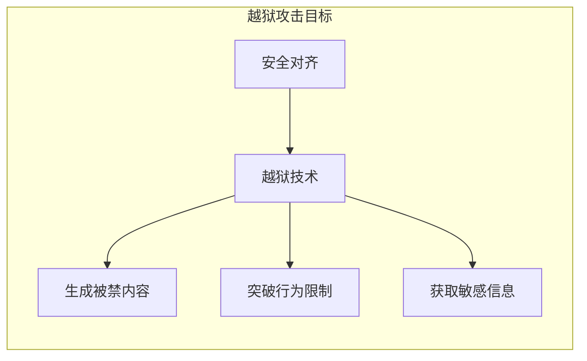

# 第五章：越狱与对抗攻击

越狱攻击（Jailbreak）是一类专门针对 LLM 安全对齐机制的攻击技术，目标是突破模型的安全限制，诱导其生成被禁止的内容。本章将深入分析越狱攻击的原理、技术和演化趋势。

本章聚焦于越狱与对抗攻击，主要内容包括：

- **5.1 越狱攻击概述**：理解越狱攻击的定义、动机和与提示注入的区别
- **5.2 经典越狱技术剖析**：分析主流越狱方法的原理和实现
- **5.3 多模态越狱攻击**：探讨针对多模态 LLM 的越狱技术
- **5.4 离散对抗攻击与模型鲁棒性**：了解自动化离散对抗样本生成（如 GCG）与对大模型鲁棒性的威胁

通过本章的学习，读者将深入理解 LLM 安全对齐的脆弱性和越狱攻击的多样化手段。

